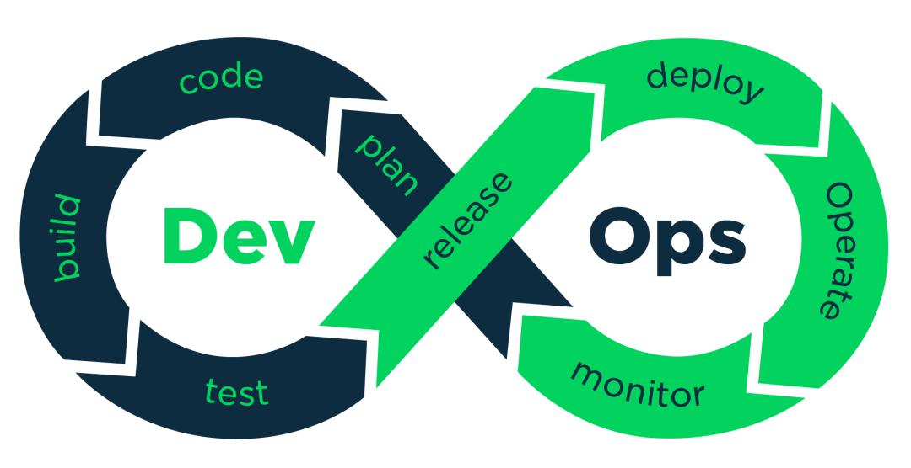

[TOC]


# DevOps_DevSecOps 项目管理


# DevOps 

## DevOps 简介

DevOps（Development和Operations的组合词）是一组过程、方法与系统的统称。DevOps 是一种联结产品经理、架构师、开发人员、QA、IT 运维、信息安全团队，以实现共同目标的方法。通过将质量保障（QA）、IT 运维、信息安全等方面的专业人员共同融入到交付团队，来构建自动化的自助工具、平台、自动部署，建立从产品计划直至功能上线的端到端的快速服务交付流水线。透过自动化“ 软件交付” 和 “架构变更” 的流程，来使得构建、测试、发布软件能够更加地快捷、频繁和可靠。


DevOps 包括组织文化、自动化、精益、反馈和分享等不同方面。组织架构、企业文化与理念等，需要自上而下设计，用于促进开发部门、运维部门和质量保障部门之间的沟通、协作与整合，简单而言组织形式类似于系统分层设计。

DevOps 强调的是高效组织团队之间如何通过自动化的工具协作和沟通来完成软件的生命周期管理，从而更快、更频繁地交付更稳定的软件。DevOps 是把人员、流程、产品进行结合，给用户提供持续价值的一个过程，既涉及到人员、流程、工具，也涉及到产品。

DevOps 最终目的是给客户提供持续交付的价值，流程包括：产品的规划跟踪、软件开发、构建测试、产品部署、运维、监控和优化。
通常把 DevOps 这些流程通过一个流水线的方式串联起来称为一个 DevOps 的流水线，其核心目标就是持续给用户交付有价值的产品。

DevOps 已经从开发运维一体化，扩大到“端到端”的概念。

越来越多的开发人员，从开发者角色，转变为 DevOps。


DevOps = 人（People）+ 流程（Process）+ 平台（Platform）


DevOps “三步工作法”：

- 流动原则：加速开发、运维到交付给客户的正向流程。
- 反馈原则：使组织构建安全、可靠的工作体系、并获得反馈。
- 执持学习与实验原则：打造一种高度信任的文化，并将改进和创新融入日常工作中。

DevOps  的准则：总有更好的方法，精益求精。


## DevOps 好处与价值

对于业务与产品而言，DevOps的好处更多基于持续部署与交付。

从组织结构而言，DevOps是部门间沟通协作的一组流程和方法，有助于改善公司组织文化、提高员工的参与感。主要包括代码管理、持续集成、自动化测试、自动化部署、基础设施自动化管理等方面的工程能力。

- 代码的提交直接触发：消除等待时间，快速反馈。
- 每个变化对应一个交付管道：使问题定位和调试变得简单。
- 全开发流程高效自动化：
  - 自动化是指所有的操作都不需要人工参与，全部依赖系统自动完成，持续交付过程必须自动化才有可能完成快速迭代。
  - 稳定，快速，交付结果可预测。
  - 简化重复性工作和减少不必要的等待。
  - 建设自动化、可重复、可靠的持续交付流水线（IT服务供应链）。
- 持续进行自动化回归测试：提升交付质量。
  - 每次代码提交都需要经过流水线验证.
  - 每次部署的版本都经过多环境验证
- 设施共享并按需提供：资源利用最大化。
  - 部署频率可以得到提升
  - 周期时间（从代码提交到部署上线）的时间可以到分钟级

## DevOps 能力环



# DevOps 与 敏捷、精益


## 瀑布式开发

- 来源于生产和工程领域，这些领域适合线性化的流程：正如房屋封顶之前需要先盖好支撑墙。
- 相似地，软件开发问题被认为可以通过提前做好计划来解决。从头到尾，开发流程均由路线图清晰地定义，沿着路线图就可以得到最终交付的产品。
- 最终，瀑布模型被认为对软件开发是不利的而且违反人的直觉，因为通常直到开发流程的最后才能体现出项目的价值，这导致许多项目最终都以失败告终。而且，在项目结束前客户看不到任何可以工作的软件。

## 敏捷开发（Agile）

- 敏捷 (Agile) 采用了一种不同的方法，它抛弃了规划整个项目，承诺估计的时间点，简单的遵循计划。

- “敏捷开发”以用户的需求进化为核心，采用迭代、循序渐进的方法进行软件开发。在敏捷开发中，软件项目在构建初期被切分成多个子项目，各个子项目的成果都经过测试，具备可视、可集成和可运行使用的特征。

- 与瀑布流程相反，它假设和拥抱不确定性。它的理念是以响应变化代替讨论过去，它认为变更是客户需求的一部分。

- 看板 是一个敏捷框架，有时也叫工作流管理系统，它能帮助团队可视化他们的工作从而最大化效率（因而变得敏捷）。看板通常由数字或物理展示板来呈现。团队的工作在展示板上随着进度而移动，例如从未启动到进行中，一直到测试中、已完成。看板使得每个团队成员可以随时查看到所有工作的状态。

  

## DevOps

- DevOps 是一种文化，是一种思维状态，是一种软件开发的方式或者基础设施的方式，也是一种构建和部署软件和应用的方式。
- DevOps 基于其它两个领域的实践: 精益和敏捷。DevOps 不是一个公司内的岗位或角色；它是一个组织或团队对持续交付、持续部署和持续集成的坚持不懈的追求。
- DevOps 与敏捷相比较
  - 两者的差异在于软件开发完成后发生的事情。
    - 在 DevOps 和敏捷中，都有软件开发、测试和部署的阶段。然而，敏捷流程在这三个阶段之后会终止。相反，DevOps 包括后续持续的运维。因此，DevOps 会持续的监控软件运行情况和进行持续的开发。
    - 敏捷中，不同的人负责软件的开发、测试和部署。而 DevOps 工程角色负责所有活动，开发即运维，运维即开发。
    - DevOps 更关注于削减成本，而敏捷则是精益和减少浪费的代名词，侧重于像敏捷项目会计和最小可行产品的概念。
    - 敏捷专注于并体现了经验主义（适应、透明和检查），而不是预测性措施。


# DevOps 与 持续集成、持续交付（CD/CD）

DevOps的应用场景往往是一个庞大复杂的背景和流程的场景，大都包含一个持续交付流水线。

DevOps 是一个完整的面向 IT 运维的工作流，以 IT 自动化以及持续集成（CI）、持续部署（CD）为基础，来优化程式开发、测试、系统运维等所有环节。

- 开发人员：IDE、Git 等开发和编译工具
- 版本控制系统：分支策略、语义化版本
- 构建服务器：持续集成、代码质量检查
- 工件库：存放二进制包
- 系统的包管理器：编译或测试环境系统上管理二进制包
- 环境一致性
- 预发布或生产：预发布环境与生产环境互换（蓝绿发布）
- 发布管理：在高程度自动化测试的基础上实践自动化或半自动化（人工介入）部署
- 问题管理系统


## 典型的 CI/CD 流水线过程

- 项目开发编写代码，然后把代码推送到 GitLab 里存储，通过 GitLab 的 hook 使 Jenkins 执行一些 CI 的过程，比如做一些单元测试，构建 Docker image。
- 再把这个 Docker image 调用 helm 部署到开发环境或测试环境。
- 在测试环境里通过 Jenkins 触发一个集成测试的功能。
- 完成后就可以把它部署到生产环境。
- 通过 Kubernetes addon 的方式，把 Prometheus、Grafana 等监控组件部署到集群里，实现一整套从 CI 到 CD 的监控过程。


# DevOps 完整过程

## 一个完整的过程

- 开发团队接到任务，需要完成一个变更
- 为了更加顺利地开发，将这个变更分拆为几个小变更
- 开发人员在本地开发并且测试，如果使用了测试驱动开发，在编写功能代码之前会先编写测试，然后编写能够让测试通过的实际代码
- 开发人员将代码提交到企业内部的Git版本控制系统上
- 构建服务器获取这个变更并初始化构建流程，单元测试之后，变更可以被发布到二进制库里
- 配置管理系统根据“策略”，在测试环境中安装应用了新的变更
- 新安装触发自动化回归测试，测试成功后，质量保证团队开始做人工测试
- 人工测试通过后，质量保证团队将“已通过”标识给予这个变革
- 变更在预发布环境中进行验收测试
- 验收测试完成后，预发布环境被切换成生产环境，而生产环境变为新的预发布环境


# DevOps 工具集


## DevOps 平台搭建工具项目管理（PM）: Jira、Asana、Taiga、Trello、Basecamp、Pivotal Tracker

运营可以上去提问题，可以看到各个问题的完整的工作流，待解决未解决等；代码管理：gitlab。jenkins或者K8S都可以集成gitlab，进行代码管理，上线，回滚等。

## 配置管理：Ansible、Chef、Puppet、SaltStack、ScriptRock GuardRail


## 代码管理（SCM）：GitHub、GitLab、BitBucket、SubVersion

## 构建工具：Ant、Gradle、maven

## 持续集成CI（Continuous Integration）：GitLab CI、Bamboo、Hudson、Jenkins

开发人员提交了新代码之后，立刻进行构建、（单元）测试。根据测试结果，我们可以确定新代码和原有代码能否正确地集成在一起。

## 持续交付CD（Continuous Delivery）：GitLab CD

## 压力测试：JMeter、Blaze Meter、loader.io

## 自动部署：Capistrano、CodeDeploy


## 编排：Kubernetes、Core、Apache Mesos、DC/OS

## 容器：Docker、LXC、第三方厂商如AWS

## 镜像仓库：VMware Harbor


## 日志管理：Cat+Sentry，还有种常用的是ELK

## 公司内部文档：Confluence

## 平台： Rancher

## 服务注册与发现：Zookeeper、etcd、Consul

## 系统监控：Prometheus、Datadog、Graphite、Icinga、Nagios

## 性能监控：AppDynamics、New Relic、Splunk

## 预警：PagerDuty、pingdom、厂商自带如AWS SNS

## 日志管理：Cat+Sentry、ELK、Logentries

## 负载均衡：Nginx

## 网关：Kong，zuul

## 应用服务器：Tomcat、JBoss

## Web服务器：Apache、Nginx、IIS

## 数据库：MySQL、Oracle、PostgreSQL等关系型数据库；cassandra、mongoDB、redis等NoSQL数据库

## 产品和UI图：蓝湖

## 脚本语言：Python、ruby、shell


# DevOps 注意事项

DevOps 绝不是推荐一定要在某一方面达到极致，而是从“整体”入手，充分激发“体系”的最佳效率。

DevOps 的有效实施需要依赖一定的土壤，即敏捷的基础设施服务，现实只有云计算的模式才能满足整体要求。

DevOps  涉及多个技术支撑：敏捷开发、持续集成&部署、微服务、容器、云环境等。


# DevSecOps

DevSecOps从单词上来看可以分为 Dev（开发）、Sec（安全）、Ops（运维）三个部分，是用来实现企业代码的安全开发的。

DevSecOps 是一种把安全的最佳实战集成到DevOps的流程里面，一种全新的安全理念与模式，从DevOps的概念延伸和演变而来，其核心理念为安全是整个IT团队（包括开发、运维及安全团队）每个人的责任，需要贯穿从开发到运营整个业务生命周期的每一个环节。

DevSecOps包括创立一种 安全即代码（‘Security as Code’ ）的文化，从而在发布开发工程师和安全团队之间，建立一种可以持续的，灵活合作的机制和流程，从而把在传统软件开发流程里面最后由安全测试团队把关扫描的安全工作，左移到整个软件开发的全流程，从而大大降低了应用在上线后出现的安全隐患，也大大加快了上线的速度.

同时也让其他非安全团队的软件人员在开发，测试，发布的全过程中，有安全意识，而不是时候补救，甚至大大修改框架。


# DevSecOps 安全代码扫描

一般来说，安全代码的扫描主要分成静态扫描，动态扫描以及交互式扫描。

## 静态扫描

静态扫描就是工具直接扫描代码的源文件或者二进制文件，是白盒测试，测试者从内部开始测试，通过查看源代码里面的条件从而显示其是否有安全漏洞。

## 动态应用安全测试

动态应用安全测试是黑盒测试，测试这主要从外部进行测试，比如模拟黑客工具，一般针对Web应用程序。

## 交互式应用安全测试

交互式应用安全测试就是通过把安全工具的代理嵌入到应用程序里面，从而在测试应用程序的时候，这个安全代码能够监控到应用系统的网络内容，堆栈等信息，从而嗅探出系统在动态行为下的安全漏洞。


```bash

```


