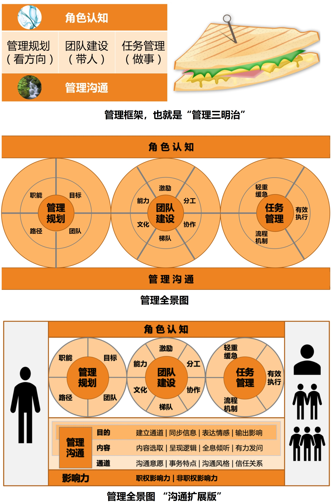
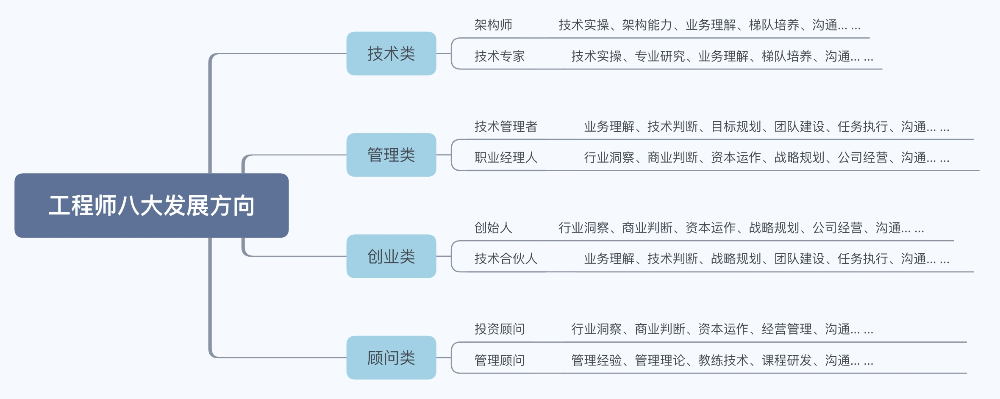
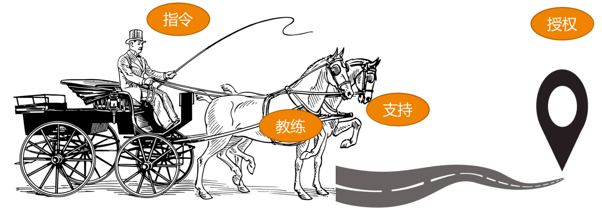
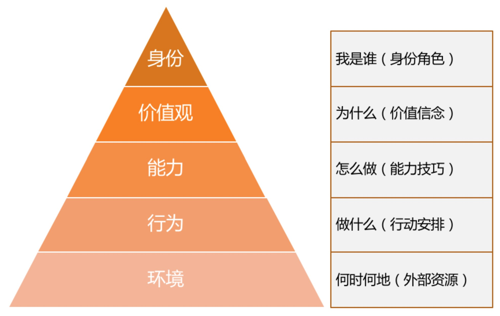
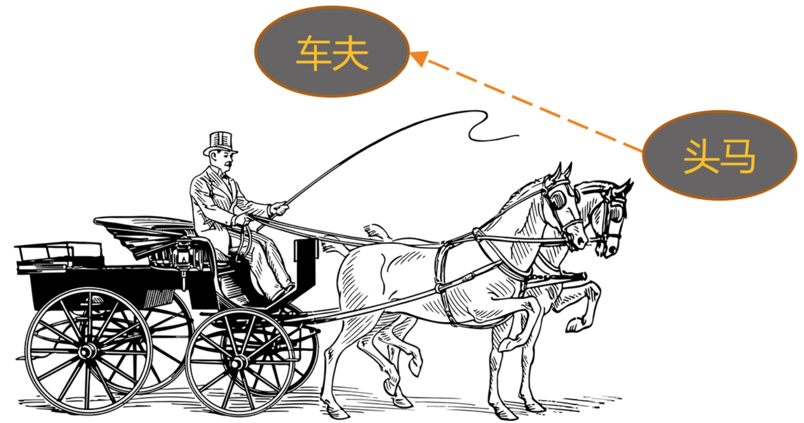

# Technical Management 技术型 管理

“管理” 这个概念太复杂了，且随着时代背景、社会环境的改变而不断变化，直到今天也没有人能够给 “管理” 下一个被普遍认同的定义。

- 古典管理理论的代表人物亨利·法约尔认为，“管理是由五项要素组成的一种普遍的人类活动，这五个要素是：计划、组织、指挥、协调和控制。”由此可以看出他特别关注管理的过程性，强调“做事”。

- 科学管理之父”弗雷德里克·泰勒认为，“管理就是确切地知道你要别人干什么，并使他用最好的方法去干。” 他关注的焦点在于干什么，以及怎么干，有明显的目标性和方法性，强调 “目标” 和 “做事”。
- “现代管理学之父”彼得·德鲁克认为，“管理是一种实践，其本质不在于‘知’，而在于‘行’；其验证不在于逻辑，而在于成果。其唯一权威就是成就。”他这个说法的焦点在于实践性和结果性，尤其强调“目标”。
- 当代管理大师斯蒂芬·罗宾斯给管理的定义是：“所谓管理，是指同别人一起，或通过别人使活动完成得更有效的过程。”这个说法的背后蕴含着管理的三个要素：人、过程和有效，用正式一点的词汇叫组织性、过程性和目标性，强调了“带人”“做事”和“目标”。

如果让我对管理做一个形象而又生动的比喻的话，把做管理看作是：一位马车夫驾驭着一辆多匹马拉的马车赶往目的地。这个比喻也体现了前面的两大要素：带人和做事，只不过这里的“人”是一群拉车的马，而“事”就是驾驶马车。

- 首先，要想驾驭马车，就得先跳上马车；无论你之前是什么角色，跳上马车后，你就成为一名马车夫了。这就是所谓的“角色认知”。对应到管理就是，从一位工程师到一个团队的管理者，也需要对“管理者”这个角色有充分的认知。
- 其次，在驾驶马车之前，一定要先看看目的地在哪里，该走哪条路，朝哪个方向行进。对应到管理中，就是得弄清楚团队的工作目标，以及战略选择。我们往往称之为“目标管理”，或者“管理规划”，它代表着工作的方向性问题。
- 再次，我们开始驾驶马车，至少需要做两件事：一边抓住马缰，关照好马的状态和组织分工；一边挥舞马鞭，协调好整个马队的前进方向和节奏，让马匹一起用力把车拉到一个个里程碑和目的地，完成一段一段的旅程。前者对应到管理中，很像是在做人和组织相关的工作，我们称为“带人”，或者“团队建设”；后者对应到管理中，很像是在完成一个个项目或一项项任务，我们称为“做事”，或者叫“任务管理”。
- 最后，由于驾驶马车过程中，车夫需要和马匹，以及马车之外的其他环境要素进行互动和沟通，这对应到管理工作中，就是“管理沟通”。

综合上面驾驭马车的五个要素，对应到管理工作中，便是角色认知、管理规划、团队建设、任务管理和管理沟通五个管理要素。

- 角色认知存在于管理工作的一言一行、一举一动，它无处不在，就好像空气一样，这是做好管理的基础和前提；
- 而管理沟通贯穿于所有管理工作之中，把所有相关的合作方都连接在一起，就好像水流一样，是做好各项工作的手段和载体。
- 管理规划、团队建设和任务管理，就是管理者的工作内容了，分别对应着看方向、带人和做事。
- 如果你要问我，管理都做哪些事呢？我会说：“主要做好三件事：带人、做事、看方向，当然，做好这些事都要基于良好的角色认知和管理沟通。”
- 我们把无所不在的空气般的认知作为“天”，把承载一切管理工作的沟通作为“地”，把管理者需要做的看方向、带人、做事放在中间，就组成了管理者的管理框架，由于看上去像一块三明治，我把它形象地称为“管理三明治”。
- 管理框架，称为“管理三明治”。有三根“火腿肠”，对应管理者的三项日常工作：“管理规划（看方向）”“团队建设（带人）”和“任务管理（做事）”。

## 工程师的职业发展：四个大类的八个方向

### 第 1 类：技术类

- 方向一：侧重于“广” 。
  - 着眼技术的整体性、架构性和业务解决方案。
  - 他们往往是一个产品或服务的技术方案的“总设计师”。例如，架构师。
  - 他们常见的作品包括社区类服务架构、云服务架构、搜索架构、电商服务架构、O2O 服务架构、数据平台架构等等，每一个产品背后都有一位或几位技术架构师。
- 方向二：侧重于“专”。
  - 着眼于某个专项技术的深度、专业度和精细度。例如，“某领域技术专家”或“科学家”。
  - 比如图像技术、语音技术、机器学习、推荐算法等等。
  - 他们往往是一个专业领域里的“武林高手”，他们的作品被广泛应用在每一个专业领域。  

### 第 2 类：管理类

- 方向一：技术管理者。
  - 这个方向很自然，就是从工程师到技术团队的一线经理，再慢慢做到部门经理等二线经理，然后是某个大技术体系或整个技术部的技术副总裁。
  - 如果还包括产品、设计等所有“产品交付”类团队，就成为了一个常规意义上的 CTO，但总体上，都是技术管理者  。
- 方向二：职业经理人。
  - 之所以叫职业经理人，是他不限于管理技术类团队，往往负责的是一个完整的业务，很像是这个业务的 CEO，有些公司也会叫 GM（general manager）。这个角色并不限定在具体一个业务，还可以根据公司需要去负责一个新业
    务，迁移性比较强，比较接近我们常说的“职业经理人”。这样的管理者会关心一个业务经营的方方面面，但本质还是公司高管，在公司整体框架下工作。  
  - 可以认为职业经理人是技术管理者的更成熟阶段  。

### 第 3 类：创业类

- 方向一：创始人牵头创业，做领头羊。  当前人工智能、大数据、区块链、云服务这些技术方向的大热，也催生出很多技术出身的 CEO。像李彦宏、马化腾、周鸿祎等，这都是技术人牵头创业的典范。  
- 方向二：技术合伙人或技术高管 。全盘负责公司的技术，以技术管理为公司“安邦定国”。几乎每一个成功的创业公司，都有这么一个强有力的角色，比如互联网第二梯队的 TMD 中， 头条（T）的杨震原、美团（M）的穆荣均、滴滴（D）的张博，都是这个方向上的优秀代表。  

### 第 4 类：顾问类

- 方向一：投资顾问，也就是做投资人 。有做投前的，也有做投后的，基于对一个创业团队和项目的完整判断，从外围以资本运作和投后服务来支持创业公司发展。他们在做投资人之前，往往都有相当丰富的企业经营管理经验、宽广的视野和敏锐的洞察力。  
- 方向二：管理顾问。也就是提供培训、咨询服务，偏人力发展和团队建设。这个方向是通过支持管理者和 HR 来支持公司的发展，往往以多年的管理经验、管理理论、教练技术和培训经验为依托。目前，这个方向的人是最少的。

## 为什么需要 “技术” 管理

对于互联网技术人来说，“带团队”不再是一个可选项，而是迟早都要面对的事儿。做技术和带团队，更像是职业发展的两条腿，而不是完全叉开的两条路。职业发展，都会围绕着技术和管理这两条腿在走路，一条腿是走不远的。就像开源和商务一样。

调研结果显示：竟然只有 10%~20% 的新经理是主动和上级表达希望做管理的，这也就意味着：超过 80% 的技术管理者，都是在没有明确表达管理意愿的情况下，被公司推到管理岗位的。而且，这个数字还不包括那些实际已经在带团队的高级工程师或架构师，他们虽然没有管理的头衔，但已经是一个实际上的 leader。

原因：
- 在很多传统的企事业单位，要晋升到管理者，需要 5~10 年甚至更久，这使他们有充分的时间去培养一位管理者。
- 而在新兴的泛互联网领域，这个时间会缩短为 2~5 年。
- 如果你服务于一家快速崛起的公司，这个时间会进一步缩短为 1~2 年，甚至更短。公司根本就等不到你掌握了管理技能之后再让你带团队，上级会推着你边做边学。

当然，你也可以：

- 不断拓展自己项目管理能力和带团队的能力，这样你会成为越来越高级的技术管理者。
- 也可以去创业公司做技术合伙人。
- 当你越来越关注行业发展、商业逻辑、公司经营，就慢慢拥有了职业经理人和公司创始人的视角。
- 当越来越关注资本运作和资本产生的价值，就会从投资人的角度去看待各行各业和整个社会。

但是，无论你走哪条路上，你都会发现有些能力是共通的，比如规划、带人、沟通、执行等管理能力覆盖了全部 8 个方向。

## 要不要做管理

团队和人是一样的，如果总是被外在需求牵着走，内心必然会充满焦虑，所以还需要弄清楚自己的内在追求。

考虑你自己的内在动力和真正诉求，需要重点了解三个重要问题。

- 第一个重要问题是关于 “管理的价值观” 的，即你是否认同管理的价值。
  - 有些管理者认为招聘面试、辅导员工、向上汇报、开会沟通、流程梳理、资源协调、进度推动、绩效评估等大部分管理工作，都是琐碎的“杂事”，认为经理是给高工和架构师打下手的，职责就是支持好架构师的工作。
  - 很难从这些工作中获得价值感和成就感，甚至还对于这些工作挤占了写代码的时间而不满。

- 第二个重要的问题是，你是否对管理充满热情，并享受这些工作。
  - 你是否主动地向自己的上级了解过团队的工作目标呢？
  - 你是否主动关心过新同事该怎么培养，以及如何更好地帮助他们成长呢？
  - 你是否享受去负责一个大项目的协调和推进？它的成功发布是否会给你带来强烈的成就感呢？
  - 你是否思考过什么样的流程和机制可以应对团队工作中的那些疏漏呢？

- 第三个重要问题是，你是否看重在管理方面的成长。
  - 做管理要扩充的认知和能力很多。
  - 每位管理者，都是从技术骨干或业务骨干开始起步的，在此之前并没有太多管理方面的学习和积累，这意味着你有很好的管理可塑性。

管理者也意味着你有太多的东西需要学习和训练：

- 更大的责任
  - 管理者带一个团队，更多是意味着要承担更大的期待和责任。
  - 即便有时看上去有一定权力，但归根结底，还是为了更好地实现团队目标。
- 更立体的视角
  - 在做工程师的时候，只要做好上级交代的任务就好了。
  - 而一旦做管理，为了带好整个团队，就需要考虑上级、下级、平级的期待和诉求，而且不能只是关心“眼前”，还得关心“从前”和“以后”，提升看待问题的系统性。
- 更灵活的思维方式
  - 多年的技术工作训练，你一定有很强的确定性的思维方式，讲究界限清晰、对错分明、言出必行、不出差错。
  - 而很多管理工作却是充满着不确定性的，有些工作的执行边界也是模糊的，甚至是非对错都很难界定清楚。
  - 在各种不确定因素中，却要去追求一个明确的目标，这对于很多新的技术管理者来说，思维方式会受到很大冲击。

## 管理能收获哪些东西

- 首先，你到了一个更大的平台上，你的能力和视野将得到大幅度提升。这会给你带来明显的成长感。
- 其次，你不但能力变强了，你还有团队了，你能搞定更大、更复杂的事情，做出更大的成绩。这会带给你更强的成就感。
- 再次，你可以带着团队做出越来越多的成就，你的团队也越来越优秀，团队成员都得到了成长，你甚至还会影响到合作团队。你的影响力显著提升了。
- 最后，你的能力、成绩、影响力全面提升，你得到了更多的精神和物质的回报。你所有的付出、成长和积累，都将或早或晚地换回等值的回馈。你的获得感也将得到满足。

## 要不要转回去做技术

### 现象

经历从工程师到团队 leader 这个转变，你最大的感受是什么？

- 管理的事儿太杂，都没时间写代码了，越来越心虚……
- 做管理最大的挑战是，要舍弃技术，特别难。
- 管理和技术到底该怎么平衡？
- 突然不写代码了，感觉吃饭的家伙没了，哈哈。
- 管理工作太琐碎，感觉离技术越来越远，现在特别担心个人发展。
- 可能，甚至，还会有人忿忿地觉得：“管理是一个有违人性的事情，自己的技术专业性越来越差，但是却要带领整个团队。”

### 问题的根源

新经理（管理者）此时的状态：“患得”“患失”，也是一种青黄不接的状态。总之，技术转管理的纠结，归根结底是“对管理的患得和对技术的患失”。  

- 转管理之前没有仔细了解过管理。
  - 技术人员，常常会沉浸在代码或者技术细节当中，在职业发展方向的思考上，整体偏被动。
  - 他们往往是被领导推到管理岗位上去的，而在此之前对怎么做管理并没有深入了解。
  - 因此，对很多技术新经理来说，管理几乎是一个全新事物。
  - 在全新事物面前，因为无法掌控而感到或恐慌、或焦虑就在所难免了，时不时就会冒出一个念头：万一做不好怎么办？退路在哪里？
- 才开始做管理，还无法靠管理“安身立命”。
  - 至少在他们自己心中，管理能力并不能让自己安心，更不能让自己依靠，就好像还没有完全驯服的野马，还不确信能骑好，想来这也是人之常情。

- 认为技术才是自己的“大本营”。
  - 由于技术作为自己依存的资本，在过去的工作中已经得到了很好的证明，因此非常值得信赖。
  - 所谓“成功路径依赖”，每个人都大抵如此，尤其是做事特别讲究精确与可靠的技术人，自然在所难免。

### 如何解决这些问题、烦恼

#### 第一个药方，专门针对“患失”来开

做技术管理，你并没有放弃技术，而且也不能放弃技术，放弃了技术是做不好技术管理的，你只是在一定程度上，放弃了编码而已。

那么，都没时间编码，怎样才能做到不放弃技术呢？

- 首先，把技术提到更高视角来看待。
  - 做技术的时候，把技术做好就是最大的目标。
  - 而做了管理之后，你会把技术作为一个手段来看待，看它究竟能为目标带来什么。
  - 但这并不意味着你就不再关心技术，只是关心的层次不同了，你开始需要借助每个人的技术能力去做更大的事情了。
  - 技术转管理并不意味着不关心技术，只是更关心更大的目标和整体结果了。

- 其次，换一种学习方式来掌握技术。
  - 你要深刻地认识到，亲自写代码固然是很好的学习技术的方式。
  - 但是作为 leader，你需要快速掌握更多的技术，并且快速判断该如何搭配使用。
  - 所以你一定得有更高效的学习方式才行。

更高效的学习方式,三个行之有效的做法：

- **建立你的学习机制。**你可以想想在团队内建立什么样的学习机制，可以帮助你借助团队的力量来提升技术判断力，并结合自己的情况来创建。

- **请教专家。**在了解某一个领域的情况时，借助你的平台，找你能找到的最厉害的专家高手进行请教，他们之所以成为高手，一般都能给出高屋建瓴、醍醐灌顶的认知。

- **共创。**在这个知识型工作者的时代，和自己埋头思考相比，共创成果往往会出乎你想象，特别能增长见识，你可以看看在团队中如何建立共创机制。

最后，关于“患失”，还有一个视角，如果你是真心热爱技术，擅长用技术的思路和方案解决问题，你可以做技术型管理者。

无论从哪个方面讲，你都并没有放弃技术，只是换了一种方式去学习和运用技术。所以，你不会失去什么，也不需要 “患失”。

打造出自己的管理风格：

- 有的技术管理者已经带几百人的团队了，还是一副技术极客范儿。
- 有的管理者擅长带人，有的管理者则执行力特别强。
- 而有的管理者资源整合能力特别强，等等。
- 不一而同，只要和自己团队的核心职能具有一致性就好。
- 如果技术本身就是你的优势，你完全可以结合自己的兴趣和优势，打造出自己的管理风格。

#### 第二个药方，专门针对“患得”开出  

这里的“患得”其实是患“不得”，那么怎样才能不再担心做不好管理：

- 首先，做管理对个人成长和个人发展来说，不会失败。
  - 因为管理总体上是一项修炼，只要你持续不断地实践、练习，你的造诣就会越来越高，最后你一定可以胜任某个规模或某个职能的团队。
  - 我们通常所谓的“不胜任”，只是说不匹配，而不是说你就完全做不了管理。
  - 而且，管理是很个性化的工作，你完全可以使用自己擅长的方式，去达成管理效果。

- 其次，一线技术管理者，即便“做不好”也并非没有“回头路”。
  - 刚刚从工程师岗位转到管理者岗位时，离技术很近，如果尝试下来，感觉管理工作确实不是自己想要的，那么，回过头来继续做工程师，几乎是没有门槛的。
  - 所以，如果当下不知道自己适不适合做管理，不如全力以赴去尝试一段时间，你其实还有充足的时间来慢慢做这个决定，不需要有后顾之忧。

- 最后，做管理所积累的能力，完全可以迁移到做“技术带头人”或“技术 leader”这个角色上。
  - 所以，你都不用担心管理的工作会白做，或者本来可以做技术的时间被耽误了。
  - 因为，即便你再回头去做工程师，也需要练习去做高级工程师或架构师，需要尝试去负责一个完整的技术方向。
  - 此时，你做管理时锻炼的全局视野、规划能力、结果导向意识、项目管理方法、沟通协调能力等等，都会派上用场。

故，第二个药方就是：你一定会有所得，会在做管理过程中有丰富的收获，既然一定能“得到”，所以不需要去“患得”。

#### 第三个药方，有点猛，叫做“认清现实”。

如果你把“编码时间减少”叫做放弃技术，那么更残酷的现实：无论你做不做管理，这事都不可避免。

现实是，你要么做技术管理，用更高的视角来看待技术；要么你继续做工程师，也要用更高的视角去看待技术。

俗话说：“人穷则反本”，当人们遇到困难和挫折的时候，就想回到老路上去，这是人之常情。

只是，你不得不面对的一个现实就是，即便回头去继续做技术，也不再是原来那个听指挥听安排就好、做好执行就 OK 的一线工程师。

工作“升维”已不可避免。所以，无论是做技术管理，还是做技术架构师，开启一条技术升维之路，都在所难免。

一方面，每个人的内心都有成长的诉求；另外一方面，公司和团队也需要你承担更复杂、更具挑战性的任务。

即便不做技术管理者，要做好一位技术带头人或架构师，工作视角也要做如下的升级：

- 首先，从目标出发去看待技术。只有目标明确，才能选择最佳的技术方案，做出最好的技术决策。
- 其次，从评估的角度去看待技术。
  - 做工程师的时候，把一个技术方案设计好、实现出来就好了。
  - 而做了架构师之后，你需要非常清楚一个技术方案是通过哪些维度来评估其好坏优劣的。
  - 并且，当一个技术问题暴露出来之后，得迅速判断会造成什么影响，损失的边界在哪里，有多紧急，以决定要不要放下手头的项目去立一个紧急项目。
- 最后，从借助自己的技术到借助大家的技术。
  - 做技术的时候，了解自己能做什么就好了。
  - 但是无论是做管理者还是架构师，你都需要带人做事了。
  - 这个时候你就需要熟悉团队里每个人的技术情况，知道谁能胜任做什么事情，适合做什么事，然后借助大家的技术去做事。

所以，第三个药方就是：既然你避无可避，不如奋力向前。你要做的并不是要免除“后顾之忧”，而是需要意识到，你已经没有机会“后顾”了。

## 作为技术管理者，如何保持技术判断力

转型做管理后，你可以用在技术上的时间会越来越少，尤其是写代码的机会越来越少，手越来越生。
但是要做的技术评审和技术决策却有增无减，对技术判断力的要求反而也越来越高。这是因为你的决策产生的影响比之前更大了。

新经理的技术判断力，基本都来自于之前技术上的实际操作，来自于自己的经验积累。而做管理之后，技术评估方面的要求更高了，研究技术的时间和精力却减少了，这该怎么破。

### 技术管理者和普通管理者的区别

技术管理者，和普通管理者最大的区别，就是“技术”二字，这也是技术管理者最鲜明的标签和最大的竞争力，它是如此重要，但又令人不知所措，困扰着众多的技术新经理。

### 技术工程师和技术管理者的区别

从技术工程师到技术管理者的转型，有很多做事的思路和方法都需要转变。

其中一个重要的转变就是你和技术的关系，也就是技术对你来说，意味着什么。

对于技术工程师：

- 当你还是一位工程师时，你是技术的操作者和实现者，所有的技术服务都从你的手中诞生。
- 对于技术实现者来说，程序设计能力、编码实现能力、技术攻坚能力和技术评估能力，都是需要具备的，主要关心的是“怎么做”，属于“how”的范畴。

对于技术管理者：

- 而在成为一个越来越成熟的管理者的过程中，你越来越少地直接去实操，慢慢变成了技术的应用者，你需要的是把这些技术服务装配成更大的服务和产品。
- 而对于技术应用者来说，技术评估能力变得尤其重要，因为技术管理者主要关心的是“要不要做”“做什么”，属于“why” 和 “what” 的范畴，是要在综合评估之后，做出决策和判断的。
- 由此可见，当工作角色对你的要求，从一个技术实现者变为一个技术应用者时，你和技术的关系就发生了变化，“技术能力”这个词的含义也悄悄发生了转变。

### 技术判断力的理解

技术判断力，其实就是指对技术的评估能力。

#### 第一个维度是结果评估。

即，你要回答“要不要做”，希望拿到什么结果，你要从哪几个维度去衡量结果，从哪几个技术指标去验收成果。

对结果的评估能力最为关键。虽然结果验收都是放在项目完成后，但是在事先就要明确如何验收。

无论如何，你心里都需要很清楚，用什么技术指标来衡量团队的某项技术工作，而不只是完成一个个项目。

#### 第二个维度是可行性评估。

可行性有两层含义：一是“能不能做”，二是 “值不值得”。

- 能不能和值不值得，是两码事。
- 不懂技术的管理者一般问的都是“能不能做”。
- 而有经验的技术管理者和资深工程师，考虑的是 “值不值得”。
- 所谓 “值不值得”，就是成本收益问题。

收益，往往是显而易见的；而成本，就有很多方面需要考虑了，这正是体现技术判断力的地方。

- 首先是 “人财物时” 等资源投入成本。
- 其次是维护成本，这是评估技术方案时要重点考虑的。
  - 由于我们考虑投入的时候，往往只考虑到项目发布，而发布后的维护成本很容易被忽略。
  - 考虑维护成本是技术管理者和架构师视野宽阔、能力成熟的体现。
  - 常见的技术维护成本有如下四个方面，依次是：
    - 技术选型成本。指在做技术选型的时候，选择不成熟的技术所带来的成本。越成熟的技术，其技术实现成本和人力成本都是相对要低的。但是并不是说，选择新技术就一定不划算，只要考虑到成本和风险，才能做出合理决策。
    - 技术升级成本。这是指在评估技术方案的时候，其兼容性和扩展性水平带来的后期升级的难度和成本。
    - 问题排查成本。在做技术实现的时候，要特别关注后续的问题排查。好的技术实现，分分钟可以排查出问题原因。
    - 代码维护成本。在编写代码的时候，要记得代码是要有可读性的。这体现在别人升级代码要花多长时间才能看明白，修改起来是否简单、安全。

- 再次是机会成本，这是技术管理者做决策时要意识到的。
  - 即，当你把人力、时间花在这件事上，同时就等于放弃了另外一件事，而没有做另外这件事将带来什么样的影响。
  - 就是你要考虑的机会成本，你可能会因为这个思考而调整技术方案的选择。

- 最后，希望你还能意识到协作成本、沟通成本，即多人协作所增加的时间精力开销。
  - 一个方案的协作方越多，需要沟通协调的成本也就越高，可控度越低。
  - 如果可能的话，尽量减少不同团队和人员之间的耦合，这样会大大降低协作成本。

#### 第三个评估维度，即风险评估。

技术风险评估，也叫技术风险判断力。

即，有哪些技术风险需要未雨绸缪，考虑该技术方案带来最大损失的可能性和边界，以及在什么情形下会发生。

这项评估工作很考验技术管理者的技术经验和风险意识，而且需要借助全团队的技术力量来做出准确判断。

### 如何保持并提升技术管理者的技术判断力

自从你带团队的那一天起，你就已经不是一个人在战斗。

你可以依靠团队和更广的人脉，去拓展技术视野和技术判断力。

你会发现，技术管理人的技术水准的提升和保持，主要看能从周围人的身上汲取到多少信息和知识，而不再只是靠自学。

常见的几个方式如下：

#### 建立技术学习机制。

盘点你负责的业务，需要哪些方面的技术，成立一个或几个核心的技术小组，让团队对各个方向的技术保持敏感，要求小组定期做交流和分享，这样你就可以保持技术的敏感度。

#### 专项技术调研项目化。

如果某项技术对团队的业务有重要的价值，可以专门立项做技术调研，并要求项目负责人做调研汇报。

#### 和技术大牛交流。

越是厉害的技术人，越能深入浅出地把技术讲明白，所以针对某项技术找大牛取经，也是学习的好途径。

虽然实际操刀的时间少了，但是你和技术大牛的交流机会多了，一方面因为你有更大的影响力了，另一方面，你和大牛有了共同的诉求，就是把技术“变现”，让技术产生价值。

#### 听取工作汇报。

因为你带的是技术团队，大部分工作都和技术相关，在读员工的周报、季度汇报时，相互探讨，也是一种切磋和学习。

## 不同的管理风格

### 我这样的风格能做管理吗

- 我是个内向的人，不像 A 那么热情洋溢，让我慷慨激昂地给大家打鸡血会很有挑战？
- 也不像 B 那么强势和有威严，让大家都服我似乎并不容易？
- 我是个女生，不喜欢和大家抽烟喝酒扯闲篇，很难和大家打成一片，带团队对我来说太挑战了？
- 管理者是不是不能太 nice？亲和力太强的领导，下属会不敬重，因为不够威严？

类似这样的疑问还有很多，它们的共同模式是：先设置一个所谓“好”的管理方式和行为风格，然后发现自己做不到，于是很苦恼。

别把领导力的风格和领导力的高低划上等号，领导力风格的差异并不妨碍你成为一个优秀的管理者。

### 管理风格：你和团队的“位置关系”

管理风格，本质就是你和团队的协作方式，也就是你和团队的“位置关系”，即你站在团队的什么位置。

其位置关系大体可以有这样四类：

#### 第一类是发号施令型（称之为指导式管理）

- 重事不重人，关注目标和结果，喜欢发号施令但不亲力亲为。
- 管理者和团队的关系是：管理者发号施令，全程指挥，但不会亲力亲为去操作，团队成员只要按管理者说的执行，不需要问为什么。
- 命令式管理最适用于需要强执行的场景。

#### 第二类是以身作则型（称之为支持式管理）

- 重人不重事，希望带头冲锋亲力亲为，特别在意团队成员的感受，并替他们分担工作。
- 和指令式管理者很少亲力亲为的做法相反，以身作则的管理者凡事冲在最前面，是站在马匹中间，和大家一起奋力拉车的人。
- 这类管理者非常享受和团队打成一片，很像一位身先士卒的将军，战斗力很强，很受团队拥戴，所以往往团队凝聚力也很强。
- 他们非常在意团队成员的想法和感受，并愿意提供帮助和支持，分担他们的工作和困难。
- 对于这类管理者来说，重人不重事，不过他们并不会忽视做事，只是不太去指导员工做事，而是倾向于直接替员工做事。
- 这类管理者更像一个带头大哥，员工会特别有归属感，但是这类管理者往往带不了大规模团队。
- 支持式管理特别能带团队士气和凝聚力，在带动大家热情和积极性方面很有优势。

#### 第三类是激发辅导型（称之为教练式管理）

- 重人也重事，关注全局和方向，并在做事上给予教练式辅导和启发。
- 这类管理者不会亲力亲为去帮员工做事，但是会去辅导和启发员工怎么去完成工作，并且提供鼓励、支持和反馈。
- 换句话说，他们不会去替马拉车，但是会陪着马一起赶路，同时辅导马匹怎么样能够把路走好，以及要往哪里走。
- 这有点像球场上的教练，他们不上场，但会把握比赛节奏和方向，不断给球员提供指导和反馈。
- 教练式管理者既关心员工在做事的过程中有没有得到锻炼和成长，也关心事情本身有没有很好地完成，整体的步调和节奏如何，以及最后结果的好坏，属于重事也重人。
- 在这类管理者团队做事，个人成长是最显著的，团队梯队也能快速完善起来。
- 但是由于这类风格对于管理者精力消耗比较大，很难覆盖到全体成员，所以比较适用于核心梯队的培养。

#### 第四类是无为而治型（称之为授权式管理）

- 不重人也不重事，关注目标和结果，不关心过程和人员发展。
- 无为而治，似乎是很多管理者向往的境界，很多高级管理者都认为好的管理者应该是“没有我的时候，团队完全能自行运转”。
- 他们往往安排好任务就“撒手不管”了，把工作完全授权给了团队成员，只是在约定的时间去检查结果是否达成。
- 就任务执行过程来看，他们是不重人也不重事的。
- 这类管理者对团队成员做事表现得非常放心，甚至让大家感觉有点漠不关心。
- 对任务执行过程不关心，关心的只是他最在乎的目标和结果。
- 在这类管理者团队中做事，对于不成熟的团队，成员就会变成野蛮生长。
- 而对于成熟的团队，成员就会有很好的发挥空间和舞台，反而会得心应手。
- 当团队梯队很成熟，团队成员需要发挥空间的时候，一个授权式的你能提供最恰当的管理方式。

#### 这四种风格，哪种比较好？

不同的风格，在不同的场景下，的确会有不同的适用程度。
既然叫风格，就是手段层面的东西，评价手段我们往往是用有效无效来衡量，而不会用好坏来衡量，所以，这四类风格无所谓谁好谁坏。
一个成熟的管理者应该对这四类风格都能有很好的了解和认知，甚至是能驾驭。
当然，如果你能驾驭多种风格，那是非常厉害的。大部分管理者都还是以自己最拿手的风格来带团队，其他方式仅在必要时使用。

不管哪种风格，除了取得出色的业绩之外，更重要是还能打造出一个充满自驱力，和凝聚力的高效执行的团队。

## 如何消除问题根源，提升管理自信

在新经理的常见困惑中，“不自信”是普遍存在的一个情况。

### 第一，管理经验不足和能力欠缺。

原因现象：

- 对于很多管理事务不知道该怎么着手，在摸索前行中磕磕绊绊，于是怀疑自己没有能力做好管理。
- 这是每位管理者的必经阶段，其实也是学习所有新事物的必经阶段。 
- 只不过技术问题往往有比较标准的答案，通过查资料就能解决大部分问题。
- 而管理问题则很少有标准答案，很多经验和技巧是在不断实践的过程中积累起来的，掌握起来不像技术问题那样可以查查资料就快速解决。这也正是管理有挑战的地方。

解决方法：通过梳理自己可迁移的能力，提升能力自信。

可以从之前的工作经验和能力（虽以技术为主），迁移一些能力过来，有用到管理上。

先了解一下 能力层次模型，叫“能力三核”，这个模型把能力分为三个层次：知识、技能和才干。  

- 知识，是指你知道和理解的内容和信息，一般用深度和广度来衡量。
  - 这部分能力迁移性不好，也就是说你很难把技术知识直接迁移到管理中来。
  - 所以，关于管理的知识，是新经理要重点补习和加强的。
- 技能，是指你能操作和完成的技术，一般用熟练度来衡量。
  - 这个层次的能力就有一定的可迁移性了。
  - 如，快速学习的能力，如果你在做技术时积累了快速学习的良好方法和技能，你可以稍加调整运用到学习管理中。
  - 再比如，进度控制能力，你在做工程师时，如果对完成一个项目有很好的进度控制能力，就可以把控制进度的方法和要点，运用在管理工作中。
  - 再比如，沟通表达的逻辑能力、规划工作目标的能力等，都是可以迁移到管理工作中的。

- 才干，是你长期生活工作所积淀和锤炼出来的模式、特质和品格。
  - 这个层次的“能力”是迁移性最强的，换句话说，你想不迁移过来都难。
  - 比如自信，你是一个自信满满的人。
  - 再比如前瞻，如果你是一个前瞻性很强的人，你可能会很习惯性地去规划团队未来的图景，并用未来的图景去激励团队。
  - 再比如责任、热情、积极、果断、审慎、纪律、和谐、体谅、公正、完美等等。

那你都有哪些才干和品质呢？

- 一个常用的方法就是：从你之前的“成就事件”中去提取，或者从同事朋友对你的赞美中去归纳。
- 当你有意识地把你的才干和优势运用到管理中时，就会发现很多事情变得轻而易举、得心应手了。
- 同时，建立能力的分层意识，也会让你更加迅速而有效地积累管理经验。

### 第二，和团队成员对立比较。

原因现象：由于资历或能力不是团队里最突出的，担心团队里资历老或能力强的团队成员会不服自己，尤其是当这些人提出不同意见的时候，常常会引起新经理的挫败和颓丧。

解决方法：通过把自己从团队成员的对立面抽离，提升角色自信 。

- 所有的比较和竞争都是在同一个层次上才会发生，就好像你可能会和你的同学、同事比财富，但是不会和马云去比较一样。
- 故，你现在是团队的负责人，需要把自己从和任何团队成员的比较和竞争中抽离。
- 当你不把团队成员放在你的对立面的时候，你和他们就没有任何竞争关系。
- 此时，重点应该把目光投向远方，去看看你将带出一个什么样的团队，以及在这个过程中，你能为公司、团队和各位团队成员带来什么样的成绩和成长。
- 总之，你要做的不是管束和控制大家，不是和团队成员竞争、比较，也不是比团队每个人都强。
- 而是引导和支持大家，而是要考虑如何让大家把自己的才智都发挥出来，去达成一个共同的团队目标，用大家的力量，去做出更好的成果。
- 当你用引导方向和支持帮助的视角去看待你和那些老资格、高能力的员工时，你会因为自己的初心而不再有猜疑和恐惧。
- 因为只有当你真的能够为团队带来更好发展的时候，才能赢得员工发自内心的真正的信赖。

### 第三，背负着沉重的包袱。

原因现象：因为担心管理工作做不好会辜负上级的期望，所以带着很大的压力去工作。
解决方法：通过收集外部积极正向的反馈，提升自我认同 。

如果说前两类自信来源于自我能力和角色认知的提升，那么第三类自信的增强则来源于外部反馈，尤其是上级。

事实上，自信心的建立的确需要外部的正向反馈，这些正向反馈可以极大地提升你的自我认可度。

如何才能得到外部持续的正向反馈：

- 先把反馈通道建立起来，尤其是和上级的沟通通道，可以和上级约好一个例行的沟通机制，定期汇报团队工作，并就已经完成的一些重要工作征求上级的看法和评价。
- 这其中，改进建议固然是很宝贵的，但是你还需要寻求一些肯定性的反馈，比如你可以问：“在你看起来，我有哪一两点做得是不错的吗？”或者“你能感受到我明显有进步的地方吗？”
- 类似的问题，你也可以和合作伙伴去聊聊，除了请他们提意见，不要忘了问问他们有没有觉得你哪点做得好。
- 当你越来越清楚自己擅长的工作方式是什么的时候，你的自信会和这些正向反馈一起螺旋上升。

最后，你也许不是那个最强的人，但是你得相信，你是此时此刻做这事儿最合适的人。

# 角色转换与角色认知

罗伯特·迪尔茨的 “ NLP 逻辑层次图 ”，一个人的行为、能力、价值观，都源于一个最根本的认知，就是自我角色的设定。

## 管理到底都做哪些事儿
## 从工程师到管理者，角色都发生了哪些变化

新经理最需要提升的是管理认知，其中最核心的就是管理者角色的认知和理解。根源是认知还没有转变过来。所以，很多管理者的不职业，就集中体现在认知水平上。

事实上，角色认知的改变，并不是一蹴而就的，需要你不断自我觉察和有意识地纠偏。也正是它足够基础和稳定，才会成为价值观、能力和行为这些层次的源头。

当你是一名出色工程师转变成这个团队的管理者时，就好像马队里的“头马”，实现蜕变从“头马”转变为“车夫”。

工程师到管理者的角色转换会带来哪些变化？

| 维度     | 工程师                                                       | 管理者                                                       |
| -------- | ------------------------------------------------------------ | ------------------------------------------------------------ |
| 职责使命 | 拉好车——做好自己手头的工作即可。 完成好上级安排给你的工作就诸事大吉。 | 赶好车——引领整个团队往前走。 上级只是帮你设定一个目标，剩下做什么、怎么做，都是你要考虑的，所有对达成目标有帮助的工作都是份内的。 |
| 负责对象 | 对自己负责，"管好自己就可以了" 。 一个人吃饱全家不饿 。 | 由于团队是上级和公司给你的资源，你需要对上级负责。 你还得关心团队成员的发展和成长，对下级负责。 上有老下有小，更高的职位的确意味着更多的责任。 |
| 关注焦点 | 工程师一般是过程导向，需要盯着“脚下的路”，一步一步把工作执行到位。 | 管理者是目标和结果导向的，时时盯着“远方的目标”，关心目标和前进方向，因为他们得决定要带着团队去哪里。 |
| 工作内容 | 内容单纯，主要靠专业能力来产生业绩的，相对比较单一。         | 多维立体，所需能力维度大幅增加。 做成一项工作，除了技术判断力，还需要目标管理能力、团队规划能力、项目管理能力、沟通协调能力、团队建设能力等等。 需要看方向的、带人的、做事的更加多维和立体的能力。 |
| 任务来源 | 上级安排                                                     | 对上级工作的拆解和安排，自己主动规划&向上沟通。 从被动“等活儿”变为主动规划。 |
| 实施手段 | 主要靠自己，要亲力亲为的，因为工程师角色是个人贡献者角色。   | 主要靠团队。 管理者的工作清单涵盖了整体团队的工作，靠自己是无论如何都做不完的。 |
| 合作维度 | 平级合作为主，维度单一。 主要的合作内容就是和平级的伙伴共同做好执行。 | 360度合作，维度立体。合作的内容非常丰富。 比如，需要和上级合作规划好整个团队的目标，和下级合作做好落地执行，和平级管理者合作完成联合项目，需要和平级的上、下级去一起协调资源和进度。所以合作的维度变得非常立体。 |
| 合作关系 | 和团队成员是平级竞合关系。以合作为主，也有“竞”的成分。       | 和团队成员是全面合作关系。和之前的同事已经不在同一个层面上工作了。 不存在“竞”的关系，而是彼此间荣辱与共、成败与共的全面合作关系。 这一点新经理一定要认识到。 |
| 思维方式 | 工作内容和工作要求都是执行，所以是明显的“执行思维”。 特点是关注过程和细节，更重要的是关注风险和成本。 通过对风险排除和成本掌控，来保证交付的确定性。 技术出身的人在项目执行，尤其过程控制管理，有优势。 当然在估算排期也比较保守，因为需要确保能完成才愿意答应。 | 管理者，虽然也考虑风险和成本，但是更习惯关注做一件事能带来的可能性收益，并以此来判断是否值得投入资源去做，我们把这种叫“规划思维”。 所以在工程师的眼中，管理者时不时会提出一些“不靠谱”的期望和需求。 而这恰恰是一种很好的合作与互补：赶车的看方向选路径，而拉车的排除各种风险和困难，把车拉向前方。 |
| 技术视角 | 技术实施视角。 做工程师的时候，技术是用来做事情的，掌握好技术的目的就是为了做好实施，看待技术是从如何运用的角度出发。 | 技术评估视角。 对于管理者，技术是达成目标的手段之一，所以看待技术是从如何评估的角度出发，评估该项技术是否是最合理的手段，以及如何选择才合理。 并据此做出决策，因此常常被称为技术判断力。 |

# 管理规划

## 管理规划四个最核心的要素

管理规划拆解为四个最核心的要素：
- 职能，关于团队是干什么的。
- 目标，关于要带团队去哪里。
- 团队，关于依靠谁去达成目标。
- 路径，关于走哪条路以及投入哪些资源。
### 第一个必须要思考的问题：你需要先看一下这是辆什么车。
### 第二个必须要思考的问题：你要把这辆车拉到哪里去。
### 第三个必须要思考的问题：你得盘点一下你有哪些马，它们情况如何。
### 第四个必须要思考的问题：你选择走哪条路。
## 要素 1：如何明确界定一个团队的职能

团队职能的两个层次：基本的职责和升华的使命。

### 职责
### 使命
### 设定团队职责和使命的方法和步骤
## 要素 2：如何为团队设定合理的目标

### 目标的描述形式，大体分为两类
### 目标对于团队管理到底都意味着什么
### 什么样的目标才是合理的目标呢？
#### 目标的可达性原则
#### 目标的明确性和可衡量性
#### 目标的相关性原则
#### 目标的时限性原则
### 新经理在目标设定上，面临诸多问题（坑）和挑战
### 评判一个目标是否合理（SMART 原则）
### 企业 “专业目标” 与 “业务目标”
### 团队的关键维度
### 团队定力 的问题，再次检查自己是否做到？
## 要素 3：如何来做团队规划（组织结构）

### 第一个视角（团队规划）：根据团队目标的设定去梳理团队
### 第二个视角（团队规划）：从资源角度来审视团队  
### 第三个视角（团队规划）：从人才培养角度来看梯队规划  
### “团队消化能力”：关于新人的培养和引进  
### 如何估算团队消化能力  
### 如何提交一份合适的团队规划报告
## 要素 4：如何做团队的路径选择和资源申请

# 团队建设

## “团队”这个研究对象
### 第一个层次：马匹个体。让“马跑得快”
### 第二个层次：马匹之间。让“车跑得快”  
### 第三个层次：马队整体。让马车“一直跑得快、远”  
## 团队建设的要素（工作框架）
## 要素 1：如何提升员工的个人能力  

### 要提升员工的什么能力  
### 这些能力提升到什么水准 
### 7-2-1”法则，帮员工提升个人能力 
### 如何激发员工学习的动力和意愿  
### 关于提升员工的能力，有两个信念特别重要  
## 要素 2：如何提升员工的工作意愿和积极性

### 头疼的员工激励问题  
### 如何应对这些头疼的员工激励问题  
#### 马斯洛需求模型
#### 丹尼尔·平克的《驱动力 3.0》
#### 如何使用驱动力 3.0 的方法去激励员工  
#### 提升工作幸福感与激发员工的自驱力
### 关于员工激励，传递这样几个理念  
## 要素 3：如何兼顾团队分工的稳定性和灵活性

### 为什么要分工（分工能带来什么收益）  
### 组织结构的分工形式有哪些  
### 团队内部的分工
## 要素 4：如何有效提升团队凝聚力  

### 如何不断提升团队的协作水平  
### 如何来提升团队凝聚力  
## 要素 5：如何物色和培养核心人才  

### 梯队规划
### 梯队培养
### 选拨和物色培养对象  
### 人才物色出来了，要怎么培养呢？  
## 要素 6： 如何建设团队文化，营造团队氛围  

### 什么是团队文化？

### 团队的文化价值观  
### 鲜明的团队文化及价值观，究竟能给一个团队带来什么呢  
### 怎么打造自己团队的文化呢  
## 要素 7： 如何和员工谈绩效  

### 为什么和低绩效员工谈绩效令人头疼呢？  

### 良好的绩效沟通的意义和价值  
### 绩效具体要怎么来谈呢？  
## 要素 8：如何让团建活动不再“收效甚微”  

### 团建活动 “收效甚微” 的病根、误区

### 如何才能做出“收效显著”的团建活动  
# 管理沟通
## 管理沟通的 4 项目工作
### 第一，技术开发工作  
### 第二，项目管理工作  
### 第三，和下级合作  
### 第四，和上级合作  
## 管理沟通框架  
### 沟通的目的
### 沟通的内容  
### 沟通的通道    
### 沟通的影响力
## 沟通的 “稳定依靠” 四个因素  
## 沟通效率
### 沟通通道的品质
### 沟通的技能
#### 基于“3F”倾听的沟通
## 情绪管理  
### “情绪”是指什么  
### 三层脑结构
### 为什么从愤怒中抽离出来这么困难呢  
### 了解和正视 “愤怒”
### 建立对情绪的觉察  
### 如何建立觉察，强化这个觉察，从情绪中抽离出来  
## 向上沟通的问题、解决方法
## 横向沟通和非职权影响力  
### 影响力
#### 职权影响力  
#### 非职权影响力
### 非职权影响力的四维八因素
### 如何快速发挥影响力去说服和影响别人 
## 向下沟通的问题、及解决方法
### 第一类，“如何批评员工”。  
### 第二类，和下级员工沟通不顺畅。
### 第三类，和“牛人”下属之间的较量。
### 第四类，不知如何应对一些“刺头”员工。
## 管理沟通上有哪些常见的坑  
### 第 1 类误区，视角问题：沟通仅从自己出发，对管理者的角色和视角认知不够。
### 第 2 类误区，姿态问题：总是在防卫，随时准备战斗。
### 第 3 类误区，方式问题：先给人贴标签，对人不对事。
### 第 4 类误区，意识问题：沟通没有形成闭环。
### 第 5 类误区，初衷问题：只给抱怨不给建议。
