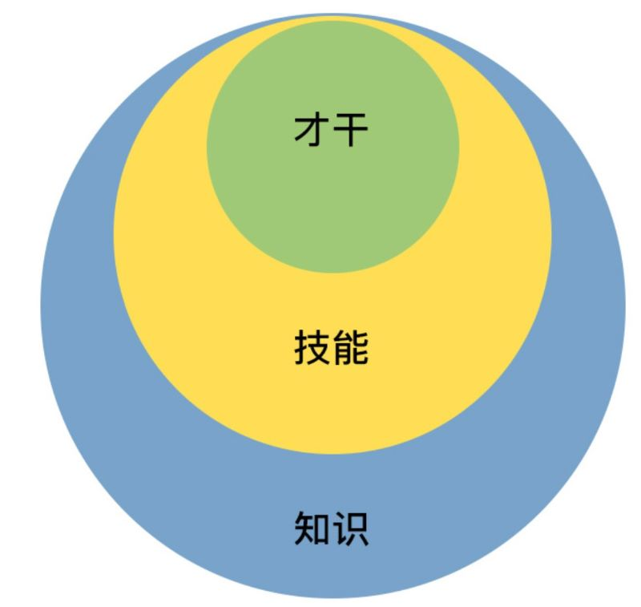

# Technical Management 技术型 管理

“管理” 这个概念太复杂了，且随着时代背景、社会环境的改变而不断变化。

当代管理大师斯蒂芬·罗宾斯给管理的定义是：“所谓管理，是指同别人一起，或通过别人使活动完成得更有效的过程。” 

如果让我对管理做一个形象而又生动的比喻的话，把做管理看作是：一位马车夫驾驭着一辆多匹马拉的马车赶往目的地。

- 这个比喻也体现了前面的两大要素：带人和做事，只不过这里的“人”是一群拉车的马，而“事”就是驾驶马车。

- 首先，要想驾驭马车，就得先跳上马车；无论你之前是什么角色，跳上马车后，你就成为一名马车夫了。这就是所谓的“角色认知”。
- 其次，在驾驶马车之前，一定要先看看目的地在哪里，朝哪个方向行进。对应到管理中，就是团队的工作目标，以及战略选择。我们往往称之为“目标管理”，或者“管理规划”，它代表着工作的方向性问题。
- 再次，我们开始驾驶马车，至少需要做两件事：一边抓住马缰，关照好马的状态和组织分工；一边挥舞马鞭，协调好整个马队的前进方向和节奏。前者对应到管理中，很像是在做人和组织相关的工作，我们称为“带人”，或者“团队建设”；后者对应到管理中，很像是在完成一个个项目或一项项任务，我们称为“做事”，或者叫“任务管理”。
- 最后，由于驾驶马车过程中，车夫需要和马匹，以及马车之外的其他环境要素进行互动和沟通。即，就是“管理沟通”。

综合上面驾驭马车的五个要素，对应到管理工作中，便是角色认知、管理规划、团队建设、任务管理和管理沟通五个管理要素。

- 角色认知存在于管理工作的一言一行、一举一动，这是做好管理的基础和前提；
- 管理沟通贯穿于所有管理工作之中，把所有相关的合作方都连接在一起，就好像水流一样，是做好各项工作的手段和载体。
- 管理规划、团队建设和任务管理，就是管理者的工作内容了，分别对应着看方向、带人和做事。
- 主要做好三件事：带人、做事、看方向，当然，做好这些事都要基于良好的角色认知和管理沟通。

管理框架，称为“管理三明治”。有三根“火腿肠”，对应管理者的三项日常工作：“管理规划（看方向）”“团队建设（带人）”和“任务管理（做事）”。

## 工程师的职业发展：四个大类的八个方向

### 第 1 类：技术类

- 方向一：侧重于“广” 。
- 方向二：侧重于“专”。

### 第 2 类：管理类

- 方向一：技术管理者。
- 方向二：职业经理人。

### 第 3 类：创业类

- 方向一：创始人牵头创业，做领头羊。  
- 方向二：技术合伙人或技术高管 。

### 第 4 类：顾问类

- 方向一：投资顾问，也就是做投资人 。
- 方向二：管理顾问。也就是提供培训、咨询服务，偏人力发展和团队建设。

## 为什么需要 “技术” 管理

对于互联网技术人来说，“带团队”不再是一个可选项，而是迟早都要面对的事儿。做技术和带团队，更像是职业发展的两条腿，而不是完全叉开的两条路。职业发展，都会围绕着技术和管理这两条腿在走路，一条腿是走不远的。就像开源和商务一样。

无论你走哪条路上，你都会发现有些能力是共通的，比如规划、带人、沟通、执行等管理能力覆盖了全部 8 个方向。

## 要不要做管理

团队和人是一样的，如果总是被外在需求牵着走，内心必然会充满焦虑，所以还需要弄清楚自己的内在追求。

考虑你自己的内在动力和真正诉求，需要重点了解三个重要问题。

- 第一个重要问题是关于 “管理的价值观” 的，即你是否认同管理的价值。

- 第二个重要的问题是，你是否对管理充满热情，并享受这些工作。

- 第三个重要问题是，你是否看重在管理方面的成长。

管理者也意味着你有太多的东西需要学习和训练：

- 更大的责任
- 更立体的视角
- 更灵活的思维方式

## 管理能收获哪些东西

- 首先，带来明显的成长感。你到了一个更大的平台上，你的能力和视野将得到大幅度提升。
- 其次，带给你更强的成就感。你不但能力变强了，你还有团队了，你能搞定更大、更复杂的事情，做出更大的成绩。
- 再次，影响力显著提升。你可以带着团队做出越来越多成就，团队越来越优秀，团队成员都得到了成长，甚至还会影响到合作团队。
- 最后，你的能力、成绩、影响力全面提升，你得到了更多的精神和物质的回报。你所有的付出、成长和积累，都将或早或晚地换回等值的回馈。

## 要不要转回去做技术

### 现象

经历从工程师到团队 leader 这个转变，你最大的感受是什么？

- 管理的事儿太杂，都没时间写代码了，越来越心虚……
- 做管理最大的挑战是，要舍弃技术，特别难。
- 管理和技术到底该怎么平衡？
- 突然不写代码了，感觉吃饭的家伙没了，哈哈。
- 管理工作太琐碎，感觉离技术越来越远，现在特别担心个人发展。
- 可能，甚至，还会有人忿忿地觉得：“管理是一个有违人性的事情，自己的技术专业性越来越差，但是却要带领整个团队。”

### 问题的根源

新经理（管理者）此时的状态：“患得”“患失”，也是一种青黄不接的状态。总之，技术转管理的纠结，归根结底是“对管理的患得和对技术的患失”。  

- 转管理之前没有仔细了解过管理。
- 才开始做管理，还无法靠管理“安身立命”。

- 认为技术才是自己的“大本营”。

### 如何解决这些问题、烦恼

#### 第一个药方，专门针对“患失”来开

做技术管理，你并没有放弃技术，而且也不能放弃技术，放弃了技术是做不好技术管理的，你只是在一定程度上，放弃了编码而已。

- 首先，把技术提到更高视角来看待。

- 其次，换一种学习方式来掌握技术。

更高效的学习方式，三个行之有效的做法：

- **建立你的学习机制。**

- **请教专家。**

- **建立共创机制。**

最后，关于“患失”，还有一个视角，如果你是真心热爱技术，擅长用技术的思路和方案解决问题，你可以做技术型管理者。

#### 第二个药方，专门针对“患得”开出  

这里的“患得”其实是患“不得”，那么怎样才能不再担心做不好管理：

- 首先，做管理对个人成长和个人发展来说，不会失败。

- 其次，一线技术管理者，即便“做不好”也并非没有“回头路”。

- 最后，做管理所积累的能力，完全可以迁移到做“技术带头人”或“技术 leader”这个角色上。

故，第二个药方就是：你一定会有所得，会在做管理过程中有丰富的收获，既然一定能“得到”，所以不需要去“患得”。

#### 第三个药方，有点猛，叫做“认清现实”。

如果你把“编码时间减少”叫做放弃技术，那么更残酷的现实：无论你做不做管理，这事都不可避免。

现实是，你要么做技术管理，用更高的视角来看待技术；要么你继续做工程师，也要用更高的视角去看待技术。

即便不做技术管理者，要做好一位技术带头人或架构师，工作视角也要做如下的升级：

- 首先，从目标出发去看待技术。只有目标明确，才能选择最佳的技术方案，做出最好的技术决策。
- 其次，从评估的角度去看待技术。
- 最后，从借助自己的技术到借助大家的技术。

所以，第三个药方就是：既然你避无可避，不如奋力向前。你要做的并不是要免除“后顾之忧”，而是你已经没有机会“后顾”了。

## 作为技术管理者，如何保持技术判断力

转型做管理后，你可以用在技术上的时间会越来越少，尤其是写代码的机会越来越少，手越来越生。
但是要做的技术评审和技术决策却有增无减，对技术判断力的要求反而也越来越高。这是因为你的决策产生的影响比之前更大了。

### 技术管理者和普通管理者的区别

技术管理者，和普通管理者最大的区别，就是“技术”二字，这也是技术管理者最鲜明的标签和最大的竞争力，它是如此重要，但又令人不知所措，困扰着众多的技术新经理。

### 技术工程师和技术管理者的区别

从技术工程师到技术管理者的转型，有很多做事的思路和方法都需要转变。

其中一个重要的转变就是你和技术的关系，也就是技术对你来说，意味着什么。

### 技术判断力的理解

技术判断力，其实就是指对技术的评估能力。

#### 第一个维度是结果评估。

即，你要回答“要不要做”，希望拿到什么结果，你要从哪几个维度去衡量结果，从哪几个技术指标去验收成果。

#### 第二个维度是可行性评估。

可行性有两层含义：一是“能不能做”，二是 “值不值得”。

收益，往往是显而易见的；而成本，就有很多方面需要考虑了，这正是体现技术判断力的地方。

#### 第三个评估维度，即风险评估。

技术风险评估，也叫技术风险判断力。

即，有哪些技术风险需要未雨绸缪，考虑该技术方案带来最大损失的可能性和边界，以及在什么情形下会发生。

### 如何保持并提升技术管理者的技术判断力

自从你带团队的那一天起，你就已经不是一个人在战斗。

你可以依靠团队和更广的人脉，去拓展技术视野和技术判断力。

你会发现，技术管理人的技术水准的提升和保持，主要看能从周围人的身上汲取到多少信息和知识，而不再只是靠自学。

常见的几个方式如下：

- 建立技术学习机制。
- 专项技术调研项目化。
- 和技术大牛交流。
- 听取工作汇报。

## 不同的管理风格

### 管理风格：你和团队的“位置关系”

管理风格，本质就是你和团队的协作方式，也就是你和团队的“位置关系”，即你站在团队的什么位置。

其位置关系大体可以有这样四类：

- 第一类是发号施令型（称之为指导式管理）
- 第二类是以身作则型（称之为支持式管理）
- 第三类是激发辅导型（称之为教练式管理）
- 第四类是无为而治型（称之为授权式管理）

#### 这四种风格，哪种比较好？

- 不同的风格，在不同的场景下，的确会有不同的适用程度。
- 这四类风格无所谓谁好谁坏。一个成熟的管理者应该对这四类风格都能有很好的了解和认知，甚至是能驾驭。
- 当然，如果你能驾驭多种风格，那是非常厉害的。大部分管理者都还是以自己最拿手的风格来带团队，其他方式仅在必要时使用。
- 不管哪种风格，除了取得出色的业绩之外，更重要是还能打造出一个充满自驱力，和凝聚力的高效执行的团队。

## 如何消除问题根源，提升管理自信

在新经理的常见困惑中，“不自信”是普遍存在的一个情况。

### 第一，管理经验不足和能力欠缺。

解决方法：通过梳理自己可迁移的能力，提升能力自信。

可以从之前的工作经验和能力（虽以技术为主），迁移一些能力过来，有用到管理上。

先了解一下 能力层次模型，叫“能力三核”，这个模型把能力分为三个层次：知识、技能和才干。  

- 知识，是指你知道和理解的内容和信息，一般用深度和广度来衡量。
- 技能，是指你能操作和完成的技术，一般用熟练度来衡量。

- 才干，是你长期生活工作所积淀和锤炼出来的模式、特质和品格。

### 第二，和团队成员对立比较。

解决方法：通过把自己从团队成员的对立面抽离，提升角色自信 。

### 第三，背负着沉重的包袱。

原因现象：因为担心管理工作做不好会辜负上级的期望，所以带着很大的压力去工作。
解决方法：通过收集外部积极正向的反馈，提升自我认同 。

# 角色转换与角色认知

罗伯特·迪尔茨的 “ NLP 逻辑层次图 ”，一个人的行为、能力、价值观，都源于一个最根本的认知，就是自我角色的设定。

## 管理到底都做哪些事儿
## 从工程师到管理者，角色都发生了哪些变化

当你是一名出色工程师转变成这个团队的管理者时，就好像马队里的“头马”，实现蜕变从“头马”转变为“车夫”。

工程师到管理者的角色转换会带来哪些变化？

| 维度     | 工程师                                                       | 管理者                                                       |
| -------- | ------------------------------------------------------------ | ------------------------------------------------------------ |
| 职责使命 | 拉好车——做好自己手头的工作即可。 完成好上级安排给你的工作就诸事大吉。 | 赶好车——引领整个团队往前走。 上级只是帮你设定一个目标，剩下做什么、怎么做，都是你要考虑的，所有对达成目标有帮助的工作都是份内的。 |
| 负责对象 | 对自己负责，"管好自己就可以了" 。 一个人吃饱全家不饿 。 | 由于团队是上级和公司给你的资源，你需要对上级负责。 你还得关心团队成员的发展和成长，对下级负责。 上有老下有小，更高的职位的确意味着更多的责任。 |
| 关注焦点 | 工程师一般是过程导向，需要盯着“脚下的路”，一步一步把工作执行到位。 | 管理者是目标和结果导向的，时时盯着“远方的目标”，关心目标和前进方向，因为他们得决定要带着团队去哪里。 |
| 工作内容 | 内容单纯，主要靠专业能力来产生业绩的，相对比较单一。         | 多维立体，所需能力维度大幅增加。 做成一项工作，除了技术判断力，还需要目标管理能力、团队规划能力、项目管理能力、沟通协调能力、团队建设能力等等。 需要看方向的、带人的、做事的更加多维和立体的能力。 |
| 任务来源 | 上级安排                                                     | 对上级工作的拆解和安排，自己主动规划&向上沟通。 从被动“等活儿”变为主动规划。 |
| 实施手段 | 主要靠自己，要亲力亲为的，因为工程师角色是个人贡献者角色。   | 主要靠团队。 管理者的工作清单涵盖了整体团队的工作，靠自己是无论如何都做不完的。 |
| 合作维度 | 平级合作为主，维度单一。 主要的合作内容就是和平级的伙伴共同做好执行。 | 360度合作，维度立体。合作的内容非常丰富。 比如，需要和上级合作规划好整个团队的目标，和下级合作做好落地执行，和平级管理者合作完成联合项目，需要和平级的上、下级去一起协调资源和进度。所以合作的维度变得非常立体。 |
| 合作关系 | 和团队成员是平级竞合关系。以合作为主，也有“竞”的成分。       | 和团队成员是全面合作关系。和之前的同事已经不在同一个层面上工作了。 不存在“竞”的关系，而是彼此间荣辱与共、成败与共的全面合作关系。 这一点新经理一定要认识到。 |
| 思维方式 | 工作内容和工作要求都是执行，所以是明显的“执行思维”。 特点是关注过程和细节，更重要的是关注风险和成本。 通过对风险排除和成本掌控，来保证交付的确定性。 技术出身的人在项目执行，尤其过程控制管理，有优势。 当然在估算排期也比较保守，因为需要确保能完成才愿意答应。 | 管理者，虽然也考虑风险和成本，但是更习惯关注做一件事能带来的可能性收益，并以此来判断是否值得投入资源去做，我们把这种叫“规划思维”。 所以在工程师的眼中，管理者时不时会提出一些“不靠谱”的期望和需求。 而这恰恰是一种很好的合作与互补：赶车的看方向选路径，而拉车的排除各种风险和困难，把车拉向前方。 |
| 技术视角 | 技术实施视角。 做工程师的时候，技术是用来做事情的，掌握好技术的目的就是为了做好实施，看待技术是从如何运用的角度出发。 | 技术评估视角。 对于管理者，技术是达成目标的手段之一，所以看待技术是从如何评估的角度出发，评估该项技术是否是最合理的手段，以及如何选择才合理。 并据此做出决策，因此常常被称为技术判断力。 |

# 管理规划

## 管理规划四个最核心的要素

管理规划拆解为四个最核心的要素：
- 职能，关于团队是干什么的。
- 目标，关于要带团队去哪里。
- 团队，关于依靠谁去达成目标。
- 路径，关于走哪条路以及投入哪些资源。
### 第一个必须要思考的问题：你需要先看一下这是辆什么车。
### 第二个必须要思考的问题：你要把这辆车拉到哪里去。
### 第三个必须要思考的问题：你得盘点一下你有哪些马，它们情况如何。
### 第四个必须要思考的问题：你选择走哪条路。

## 要素 1：如何明确界定一个团队的职能

团队职能的两个层次：基本的职责和升华的使命。

### 职责
### 使命
### 设定团队职责和使命的方法和步骤

## 要素 2：如何为团队设定合理的目标

### 目标的描述形式，大体分为两类
### 目标对于团队管理到底都意味着什么
### 什么样的目标才是合理的目标呢？
#### 目标的可达性原则
#### 目标的明确性和可衡量性
#### 目标的相关性原则
#### 目标的时限性原则
### 新经理在目标设定上，面临诸多问题（坑）和挑战
### 评判一个目标是否合理（SMART 原则）
### 企业 “专业目标” 与 “业务目标”
### 团队的关键维度
### 团队定力 的问题，再次检查自己是否做到？

## 要素 3：如何来做团队规划（组织结构）

### 第一个视角（团队规划）：根据团队目标的设定去梳理团队
### 第二个视角（团队规划）：从资源角度来审视团队  
### 第三个视角（团队规划）：从人才培养角度来看梯队规划  
### “团队消化能力”：关于新人的培养和引进  
### 如何估算团队消化能力  
### 如何提交一份合适的团队规划报告
## 要素 4：如何做团队的路径选择和资源申请

# 团队建设

## “团队”这个研究对象
### 第一个层次：马匹个体。让“马跑得快”
### 第二个层次：马匹之间。让“车跑得快”  
### 第三个层次：马队整体。让马车“一直跑得快、远”  
## 团队建设的要素（工作框架）
## 要素 1：如何提升员工的个人能力  

### 要提升员工的什么能力  
### 这些能力提升到什么水准 
### 7-2-1”法则，帮员工提升个人能力 
### 如何激发员工学习的动力和意愿  
### 关于提升员工的能力，有两个信念特别重要  

## 要素 2：如何提升员工的工作意愿和积极性

### 头疼的员工激励问题  
### 如何应对这些头疼的员工激励问题  
#### 马斯洛需求模型
#### 丹尼尔·平克的《驱动力 3.0》
#### 如何使用驱动力 3.0 的方法去激励员工  
#### 提升工作幸福感与激发员工的自驱力
### 关于员工激励，传递这样几个理念  

## 要素 3：如何兼顾团队分工的稳定性和灵活性

### 为什么要分工（分工能带来什么收益）  
### 组织结构的分工形式有哪些  
### 团队内部的分工
## 要素 4：如何有效提升团队凝聚力  

### 如何不断提升团队的协作水平  
### 如何来提升团队凝聚力  
## 要素 5：如何物色和培养核心人才  

### 梯队规划
### 梯队培养
### 选拨和物色培养对象  
### 人才物色出来了，要怎么培养呢？  

## 要素 6： 如何建设团队文化，营造团队氛围  

### 什么是团队文化？

### 团队的文化价值观  
### 鲜明的团队文化及价值观，究竟能给一个团队带来什么呢  
### 怎么打造自己团队的文化呢  

## 要素 7： 如何和员工谈绩效  

### 为什么和低绩效员工谈绩效令人头疼呢？  

### 良好的绩效沟通的意义和价值  
### 绩效具体要怎么来谈呢？  

## 要素 8：如何让团建活动不再“收效甚微”  

### 团建活动 “收效甚微” 的病根、误区

### 如何才能做出“收效显著”的团建活动  

# 管理沟通
## 管理沟通的 4 项目工作
### 第一，技术开发工作  
### 第二，项目管理工作  
### 第三，和下级合作  
### 第四，和上级合作  

## 管理沟通框架  
### 沟通的目的
### 沟通的内容  
### 沟通的通道    
### 沟通的影响力

## 沟通的 “稳定依靠” 四个因素  
## 沟通效率
### 沟通通道的品质
### 沟通的技能
#### 基于“3F”倾听的沟通

## 情绪管理  
### “情绪”是指什么  
### 三层脑结构
### 为什么从愤怒中抽离出来这么困难呢  
### 了解和正视 “愤怒”
### 建立对情绪的觉察  
### 如何建立觉察，强化这个觉察，从情绪中抽离出来  

## 向上沟通的问题、解决方法

## 横向沟通和非职权影响力  
### 影响力
#### 职权影响力  
#### 非职权影响力
### 非职权影响力的四维八因素
### 如何快速发挥影响力去说服和影响别人 

## 向下沟通的问题、及解决方法
### 第一类，“如何批评员工”。  
### 第二类，和下级员工沟通不顺畅。
### 第三类，和“牛人”下属之间的较量。
### 第四类，不知如何应对一些“刺头”员工。

## 管理沟通上有哪些常见的坑  
### 第 1 类误区，视角问题：沟通仅从自己出发，对管理者的角色和视角认知不够。
### 第 2 类误区，姿态问题：总是在防卫，随时准备战斗。
### 第 3 类误区，方式问题：先给人贴标签，对人不对事。
### 第 4 类误区，意识问题：沟通没有形成闭环。
### 第 5 类误区，初衷问题：只给抱怨不给建议。

# 任务执行
## 任务优先级：多任务并行该如何应对  
### 任务管理三要素
### 如何判断其是否重要紧急  
### 应对策略：轻重缓急四象限
### 任务优先级的安排，重要的原则   

## 如何确保项目的有效执行  
### 项目的有效执行的两个角度  
### 项目执行过程中最常见的四类问题  
#### 第 1 大类问题：目标不清（不明确具体、没有传达清楚、变更没有同步）
#### 第 2 大类问题：责任不明（责任理解不一致、总负责人的“缺位”）
#### 第 3 大类问题：推进不力（缺乏流程和机制、无监督、被动）
#### 第 4 大类问题：沟通不畅（沟通不够主动、通报意识不足、闭环意识不足 ）
### 项目有效执行四要素  

## 如何让流程机制得到有效的执行  
### 流程机制未有效执行：问题、分析、解决方案
### 机制、流程的理解
### 如何建立流程机制
#### 授权机制的建立过程  
#### 如何让流程机制具有可执行性，并有效执行
