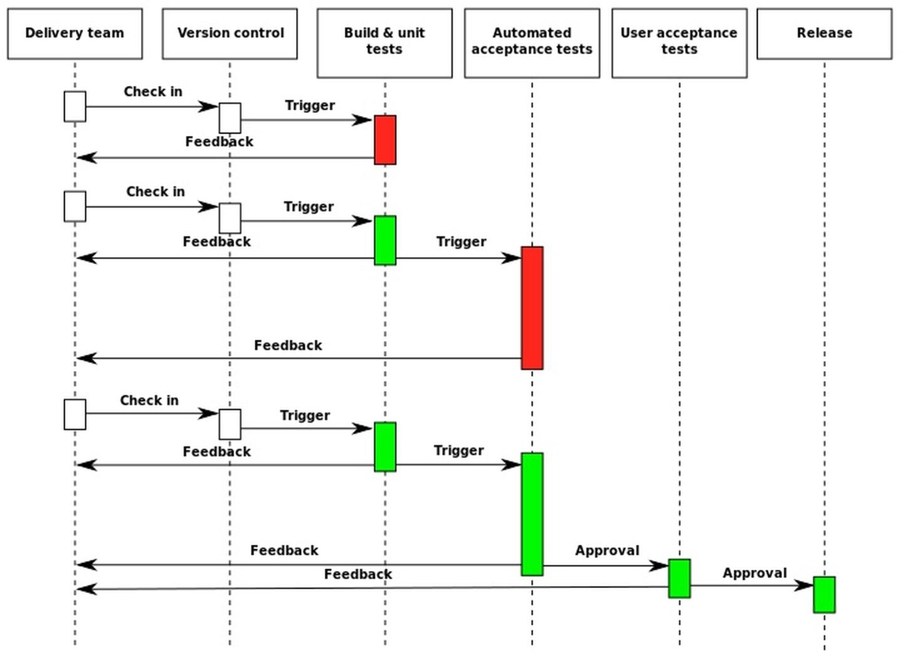

# Project Management 项目管理

# Git Flow 开发流程

Git Flow 是以部署为中心的开发流程（不建议以发布中心的开发模式）。项目开发的整个流程大致如下：

1. 令 master 分支，时常保持可以部署的状态。
2. 开发新的功能模块时，要从 master 分支创建新的分支（Branch），新的分支名称要具有描述性（即，通过分支的名字，就可以了解到该分支正在进行什么工作）。
3. 在 2. 新建的本地仓库分支中，进行修改和提交。
4. 在远程仓库，创建同名分支，定期 push 提交改动。
5. 需要帮助、反馈、或合并到 master 分支时，创建 Pull Request，用 Pull Request 进行交流。
6. 让其他开发者进行审查（Review），确认作业完成后，与 master 分支合并。
7. 与 master 分支合并后，立刻部署。
8. 到一定阶段（达到基线），创建标签（Tag），进行发布。

## 随时部署，不存在发布的概念

这个流程必须遵守 “令 master 分支随时保持可以部署的状态” 这一规则。

每隔几个小时进行一次部署，可以有效防止同时出现多个严重 Bug。因此，不会出现让 HEAD 返回去指向很久之前的提交。

master 分支时常保持着可以部署的状态，所以开发者可以随时创建新的分支。

注意：没有测试过或测试未通过的代码绝不可以合并到 master 分支。故后面就需要持续集成的一些方法（如 CI）。

## 开发新的功能时，要从 master 分支创建新的分支

当出现 Bug 时，方便追溯是从哪个节点（master 分支），不容易产生混乱，便于比较测试。

同时，master 分支集成所有的功能，并包含最新的、稳定的代码。故，在从 master 分支建新的分支，可以减少冲突，以及减少一些不必要的反复工作。

##  在新建的分支中，进行多次本地仓库的提交

在这一阶段，开发者要在提交的粒度上多花些心思。开发时间越长、代码量越大，代码审查时的成本就越高，审查者难以了解开发该功能的背景，过大的代码量会让审查者难以阅读到代码的每个细节，这样就会弱化了 review 的作用。其结果便是产生不必要的混乱，导致整个开发速度减缓。

- 有意识地减小每次提交的规模。将自己分支的功能，再进行细分。
- 一方面，便于清楚地表达目的。
- 另一方面，有助于其他开发者对 pull request 进行审查。
- 例如，将一个工作，不同时间点，进行多次提交。方便了解每次提交之间的差别。

## 定期 push 到远程仓库

开发者定期 push 到远程 Git 仓库，不仅可以备份代码，还会定期给开发者团队，创造交流的机会。

通过远程 Git 仓库的分支列表（或 GUI 树形图），就可以一目了然地了解所有分支的最新状态，便 于进度跟踪、项目管理。

并且，最好让其他开发者能够看到自己编写的代码，同时，养成积极查看其他团队成员代码的习惯。

## 使用 pull request 

pull request 不一定非要在与 master 分支合并时才使用。

团队开发，完全可以尽早创建 Pull Request 让其他开发者进行审查，一边听取反馈，一边编写代码，减少走弯路。

pull request 具有显示差别，以及对单行代码插入评论的非常实用功能，方便团队交流，并留下相关的讨论记录，方便 issue 跟踪、经验总结。

如果希望得到指定开发者的反馈或建议，还可以在评论中加入 "@用户名"，给该用户发送 Notifications 或邮件。

另外，不要积攒 pull request。建议团队制定一个规则：想创建 pull request 的人，要先去对其他人的 pull request 进行审查和反馈，并在可以部署时及时部署。

## 务必让其他开发者，进行审查（review）

找其他开发者审查自己编写的代码，可以有效防止相当然的错误（特别是新成员，对项目不是很熟悉的情况下）或低级失误。

当然，在进行 review 之前，这部分代码，需要已经通过所有自动化的测试（如，通过 CI 自动测试工具的测试）。

review 通过后，才能 merge （提 pull request）到 master 分支。

## 合并后立刻部署

代码合并到 master 分支，并且通过所有自动化测试之后，需要立刻进行部署。

部署的话，最好也是通过脚本（如 CI）完全自动化部署（如，daily build）。

## 创建标签，进行发布

类似于基线，当开发到一定阶段（如 V1.0.0），对外发布时，就需要从 master 分支上创建对应的标签（Tag），发布给客户或其他部门（测试团队）。其他部门或客户所做的测试和验证，都以 Tag 号为基准。这样，在发现问题，并反馈时，可以很方便地定位。

# CI/CD 持续集成/持续交付

CI/CD 是实现敏捷和 Devops 理念的一种方法。CI/CD 可让持续自动化和持续监控贯穿于应用的整个生命周期（从集成和测试阶段，到交付和部署）。

CI是一种通过在应用开发阶段引入自动化来频繁向客户交付应用的方法。CI 的核心概念是持续集成、持续交付和持续部署。

## 持续集成的目的：

- 产品可以快速迭代，同时还能保持高质量。
- 它的核心措施是，代码集成到主干之前，必须通过自动化测试。
- 只要有一个测试用例失败，就不能集成。

## 持续集成的作用

- 持续集成中的任何一个环节都是自动完成的，无需太多的人工干预，有利于减少重复过程以节省时间、费用和工作量。
- 代码库存越是积压，就越得不到生产检验，积压越多，代码间交叉感染的概率越大，下个发布（release）的复杂度和风险越高，持续集成可以保证团队开发人员提交代码的质量，减轻了软件发布时的压力。
- 及早的发现代码中的问题，及早解决，代码越早推送（push）出去，用户能越早用到，快就是商业价值。

## 自动化部署工具

如果可以的话，准备可供运行的真实的预演环境。同时，向预演环境的部署也需要实现自动化。

### 自动化测试工具

每次提交代码时，需要通过 CI 自动触发代码静态扫描（如 SonarQube）、自动化测试（如，单元测试、集成测试、压力测试等）、自动生成相关的分板报告和 Log 收集等

例 Travis CI、GitLab 的 CI等。

# ISSUE 处理

例 JIRA 工具

# 版本控制、版本管理

一般，版本控制有两种：

- 集中型：例 SVN
  - 将仓库集中存放在服务器之中，所以只存在一个仓库（有便于管理的优点）。
  - 但一旦无法连接到服务器（例，服务器宕机），就无法获取最新的源代码，开发也就几乎无法进行。
  - 有一定的风险。例，服务器故障导致数据无法恢复。
- 分散型：例 Git
  - 分散型拥有多个仓库，包括本地仓库和远程仓库。
  - 还可以 Fork 将特定仓库复制到自己的帐户下，并且仓库之间可以进行 push 和 pull 操作。
  - 由于本地的开发环境中就有一个本地仓库，所以开发者不必连接远程仓库，也可以进行开发。

目前，Git 已经成为主流。很多开发者都从 SVN 转到 Git。

# 文档管理

## Wiki

Wiki 采用简单的语法就能编写文档，在创建、编辑文档时，不必另外启动软件。故，比较适合多人共同编写文章的情况，以及更新频率较高的文档编辑等。

GitHub、GitLab 里面的 Wiki 功能，本身的数据也在 Git 中进行管理。用户能够通过 Clone 操作获取 Wiki 仓库，然后在本地创建、编辑页面，进行提交再 push。也可以查看 Wiki 的修改历史记录。

