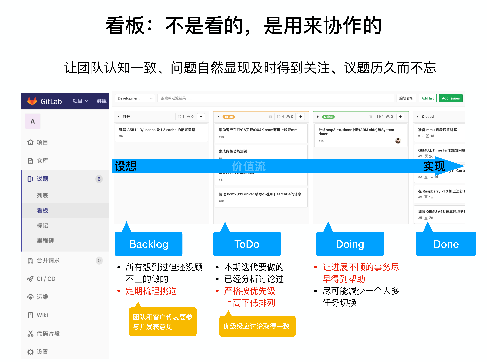
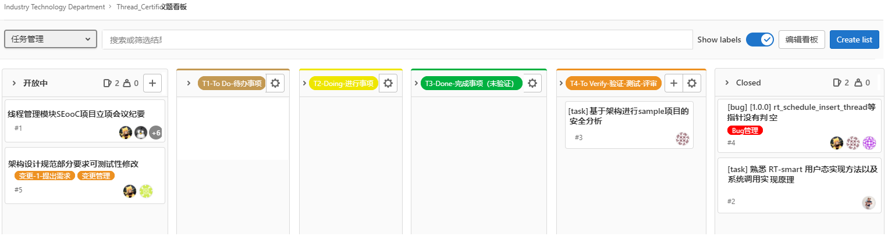
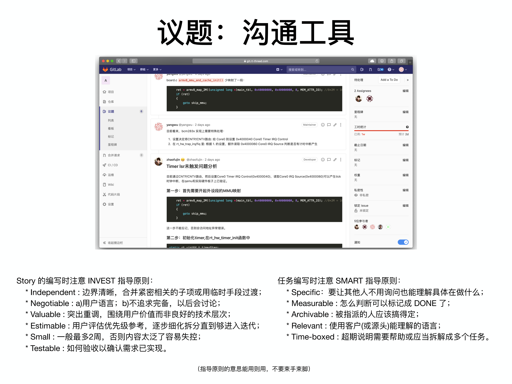
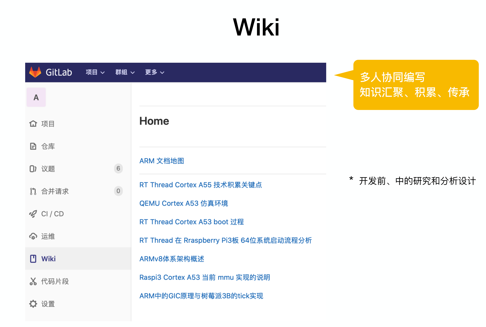
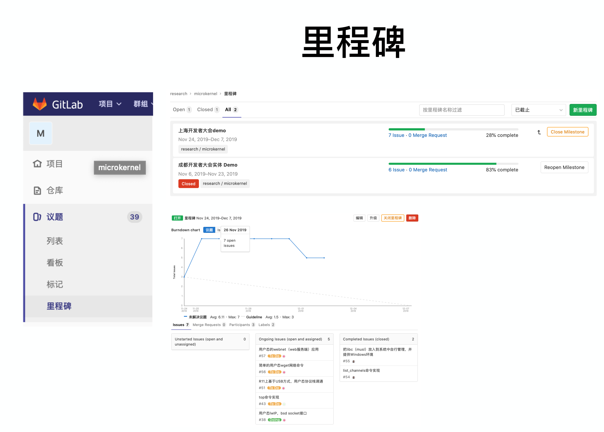
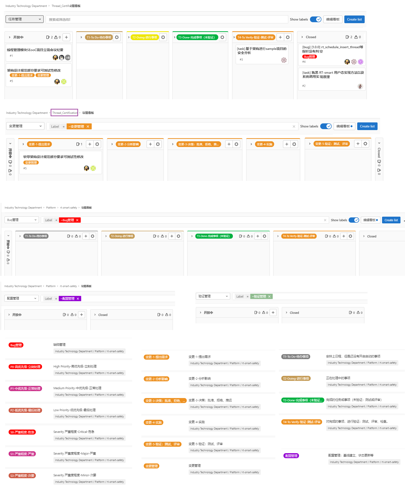
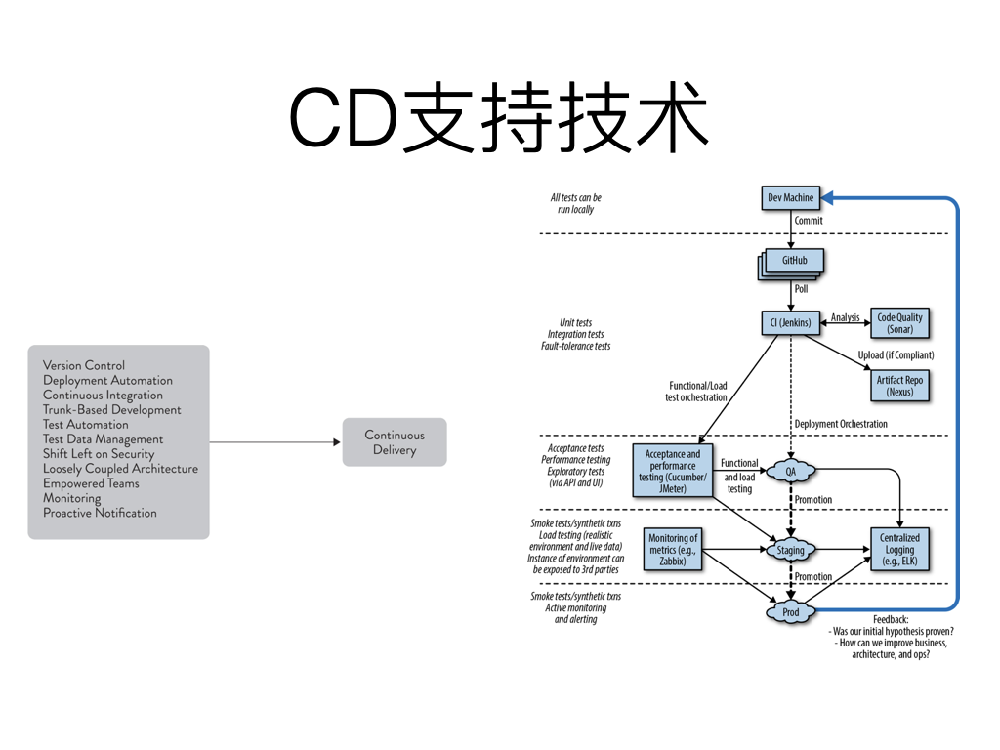

# Agile Project Management (APM) 敏捷项目管理

敏捷是创造并响应变化，从而在动荡的商业环境中创造利润的能力。

敏捷领导力的 3 个核心价值观 —— 交付价值胜过满足约束、领导团队胜过管理任务、适应变化胜过遵循计划。

敏捷三角形的 3 个基本要点 —— 价值、质量、约束。

敏捷项目管理模式的 5 个交付阶段 —— 构想-->推演-->探索-->适应-->收尾。

敏捷项目管理需要实现的 5 个关键商业目标:

- 持续创新 —— 交付现有客户的需求。
- 产品适应性 —— 交付未来客户的需求。
- 缩短上市时间 —— 满足市场窗口，提高投资回报率。
- 人员和流程适应性 —— 对产品和商业变化做出快速响应。
- 可靠的结果 —— 支持业务增长和盈利能力。

无论是产品开发，还是项目管理，这些活动的宗旨是要实现 2 个基本目标：向客户交付有价值的产品、为员工创造一个期望的工作环境。

# 敏捷开发流程+ Demo演示：Story+Task+看板+WiKi

## 敏捷开发（Agile）流程

- 后面准备按照产品规划，走 敏捷开发 流程来推进项目，把 ,再做进一步拆分成多个 Story/Sprint（“小目标”的冲刺周期）
- 每个 Story 的周期一般为 2~6 周 （我们目前，定的Story 为2 周）， 每个 Story再细分成多个Task
- 每个 Task 的工作量一般为：1 天 到 2 天
- 需要项目成员根据自己负责的模块，在每个 Story 开始之前，预估自已在这个 Story （未来 2 周）的 task，在 GitLab 仓库，列出所有的Task，每个Task，对应一个 “议题”
- 最后，通过 Task/Story/议题 的 “看板”，来追踪 每个 Story （包括每个 Task） 的状态。
- 好处：便于多个团队一起协作开发，相互了解项目整体状态。（并且每个 Task 都在 Gitlab 上有记录，方便 Review、追溯、新成员熟悉项目历史等）

## Demo 演示：Story+Task+看板

### GitLab 看板模块

- GitLab 看板_价值流__不是看的，是用来协作的

- GitLab 看板_任务 Task

  

### GitLab 议题：沟通工具+历史记录+可追溯

### GitLab WiKi 文档管理、知识管理

### GitLab 里程碑

### GitLab 看板集合

## CI/CD 支持技术

## 具体项目的操作流程（敏捷开发）

Story和 每个Task，需要形成“闭环”，如下所示：

- Step_1) 访问“看板” story-v1.1

- Step_2)根据上周Review的 Tasklist, 在Gitlab的议题里面，新建“Task”，并挂到 “story-v1.1 看板”（通过选择标记：story-v1.1、SDK组or IDE组）。
  具体可以参考 SDK 组，在Story里面，建Task的方法。

- Step_3)提前列好 此 Story （本周）要完成的Task之后，都可以在“看板界面”，通过“拖拉 Task” 来切换Task的状态。
  （即只关心story-v1.1里面的Task，不会看到其他议题，同时可以看到所有团队的进度、状态）

- Step_4)如果Task需要修改代码，则在Git里面，新建对应 branch（以“Task”的名字命名此 branch）。

      care_1: 最好从 develop 分支基础上，新建分支。（因为develop 分支包含目前最新的代码。）
      
      care_2: 如果此Task/branch 耗时比较长，请记得时不时地，把你的branch rebase到 develop 分支（以减少多人修改同一个文件的冲突） 

- Step_5)在此 branch 完成此Task的功能模块开发，完成模块功能测试+完善对应的SDD文档、测试记录。

- Step_6) Merge 此 branch到 develop 分支，在Gitlab上，提交 “Merge Request” 给相关的人员。

- Step_7) 如果 branch 有问题，则重新完成 Step_5 和 Step_6

- Step_8) 完成此Task之后，在“看板”，把 “此Task”，拖拉到 “Done 列表”

- Step_9) 打开“此Task”，在评论区，添加评论：例此Task的注意事项、还有哪些地方需要优化、测试的截图等

- Step_10)最后，Close掉此 Task。完整地结束此Task。

# 敏捷项目管理软件

## GitLab

## PingCode

- 支持 Scrum 项目管理。
- 支持产品路线图、里程碑规划、迭代、版本管理。
- 支持三级需求管理、缺陷管理、测试管理。
- 预置团队速率、燃尽图等报表，数据化展示研发项目进度。
