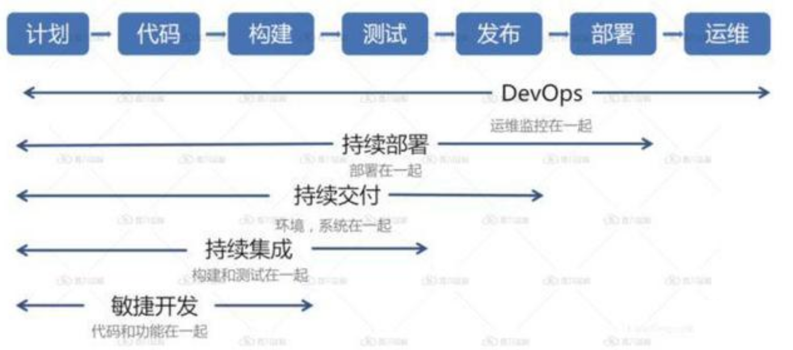
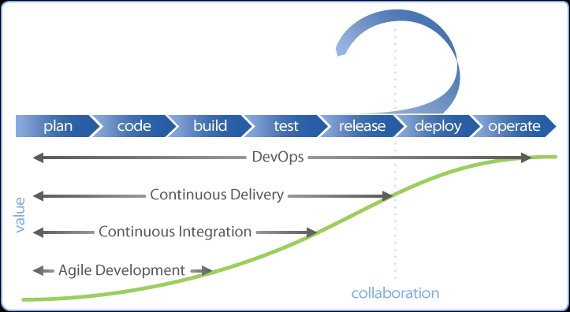

# CI CD 持续集成 持续交付 持续部署

DevOps 是依托自动化工具把开发、测试、发布、部署的过程整合，实现高度自动化与高效交付的，CI/CD就是实现这一过程的工具：持续集成（CI）、持续部署、持续发布（CD）。

# CI 持续集成（Continuous Integration）

通过持续集成，开发人员能够频繁将其代码集成到公共代码仓库的主分支中。开开发人员能够在任何时候多次向仓库提交代码或资料，而不是独立地开发每个功能模块并在开发周期结束时一一提交。

只要开发人员有提交新的代码，立刻会自动进行构建、单元测试，确保新的代码集成到原有代码，并且单元测试通过，快速集成代码。

CI 持续集成的重点是将各个开发人员的工作集合到一个代码仓库中。通常，每天都要进行几次，主要目的是尽早发现集成错误，使团队更加紧密结合，更好地协作。

重要想法是让开发人员更快，更频繁地做到这一点，从而降低集成成本。实际情况中，开发人员在集成时经常会发现新代码和已有代码存在冲突。如果集成较早并更加频繁，那么冲突将更容易解决且执行成本更低。

CI 的目标是将集成简化成一个简单、易于重复的日常开发任务，这将有助于降低总体构建成本，并在周期的早期发现缺陷。要想有效地使用 CI 必须转变开发团队的习惯，要鼓励频繁迭代构建。

# CD 持续交付（Continuous Delivery）

持续交付（Continuous Delivery）代码通过测试之后，自动部署到贴近真实运行的环境中评审验证。当新加的代码通过在相似的真实环境中运行一段时间之后，就可以持续部署（Continuous Deployment），自动部署到生产环境。

CD 持续交付的目的是最小化部署或释放过程中固有的摩擦。它的实现通常能够将构建部署的每个步骤自动化，以便任何时刻能够安全地完成代码发布（理想情况下）。

CD 集中依赖于部署流水线，团队通过流水线自动化测试和部署过程。此流水线是一个自动化系统，可以针对构建执行一组渐进的测试套件。CD 具有高度的自动化，并且在一些云计算环境中也易于配置。

在流水线的每个阶段，如果构建无法通过关键测试会向团队发出警报。否则，将继续进入下一个测试，并在连续通过测试后自动进入下一个阶段。流水线的最后一个部分会将构建部署到和生产环境等效的环境中。这是一个整体的过程，因为构建、部署和环境都是一起执行和测试的，它能让构建在实际的生产环境可部署和可验证。

# CD 持续部署（Continuous Deployment）

CD 持续部署是一种更高程度的自动化，无论何时对代码进行重大更改，都会自动进行构建/部署。

持续部署扩展了持续交付，以便软件构建，在通过所有测试时自动部署。在这样的流程中，不需要人为决定何时及如何投入生产环境。CI/CD 系统的最后一步将在构建后的组件/包退出流水线时自动部署。此类自动部署可以配置为快速向客户分发组件、功能模块或修复补丁，并准确说明当前提供的内容。

