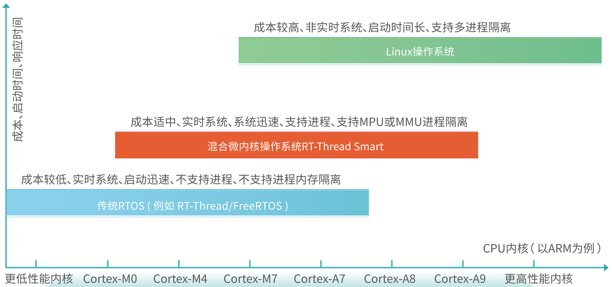
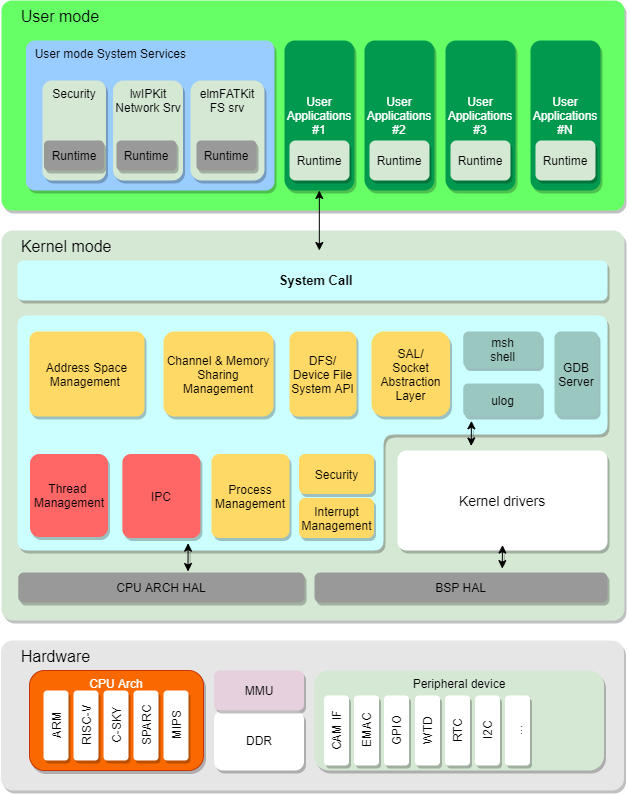
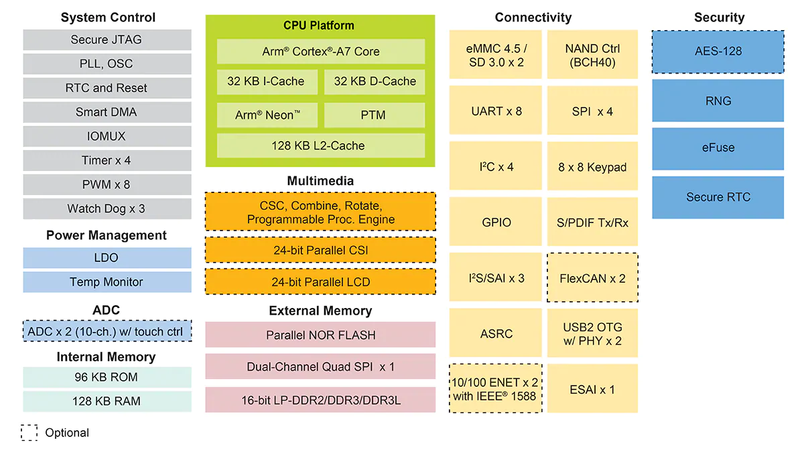
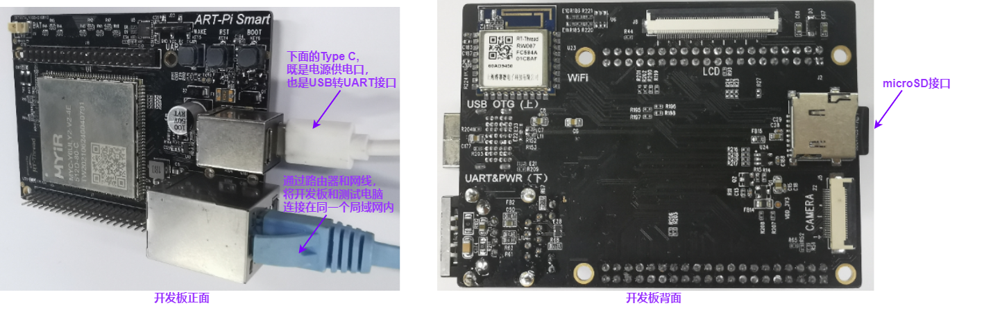
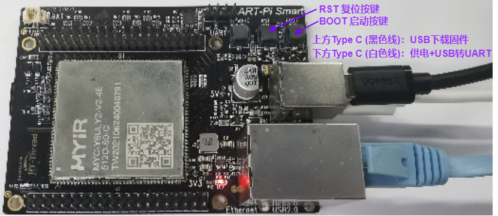

**变更历史**

| 版本 | 状态 | 内容描述           | 编制/日期                | 审核/日期 |
| :--- | ---- | :----------------- | ------------------------ | --------- |
| V0.1 | 草稿 | 初稿，创建此文档。 | Blues Lin<br/>2021-09-27 |           |
|      |      |                    |                          |           |


# 概述

## rt-smart 实时操作系统简介

- RT-Thread Smart（简称 rt-smart）嵌入式实时操作系统是基于 RT-Thread 操作系统衍生的新分支，面向带 MMU，中高端应用的芯片，例如 ARM Cortex-A 系列芯片，MIPS 芯片，带 MMU 的 RISC-V 芯片等。rt-smart 在 RT-Thread 操作系统的基础上启用独立、完整的进程方式，同时以混合微内核模式执行。
- rt-smart 是一款高性能混合微内核操作系统，在传统嵌入式操作系统划分中，rt-smart 能够填补传统 RTOS 和大型操作系统 Linux 之间的空白，在实时性、成本、安全性、启动速度等方面可以取得最佳的平衡。




- rt-smart 操作系统架构框图，如下图所示。rt-smart 操作系统主要包含内核模块和用户态运行时环境。内核模块包括虚拟地址空间管理、进程管理、线程管理、进程间通信、虚拟文件系统框架、网络接口层框架、设备驱动框架、msh 控制台、日志系统、异常中断管理和系统调用接口，设备驱动框架包含串口驱动框架和看门狗驱动框架。用户态运行时环境包括用户态 C 库。

  


**rt-smart 功能特点** 

- 快速启动
  - 相比 Linux 十几秒以上的启动时间，rt-smart 启动速度最快可达 300ms 以内，特别适合安防、汽车仪表盘、工业控制、AIOT 等领域。
- 高实时性
  - 抢占式调试内核，任务响应性能与 Linux 相比更加优秀。
  - 微秒级中断响应能力，能够第一时间对事件作出处理。
- 高安全性
  - 通过简单有效的系统设计与实现，为构建高可信环境提供坚实基础。
- 无缝对接 Linux 开发生态
  - 全面兼容支持 POSIX API 规范，极大程度降低 Linux 应用的移植成本，更快速获得全球开源社区资源。
- 丰富的组件
  - 继承 RT-Thread 十几年的软件生态积累，更易获得丰富的 RT-Thread 软件包支持。
  - 提供专业的人机交互图形组件 Persimmon UI，支持 JavaScript 等高级语言开发。
- 极低的资源占用
  - OS 占用极少的内存空间和 Flash 空间，可最大化降低物料成本。
- 开发调试便利
  - 应用与内核分离，使用 VScode、RT-Thread Studio 开发调试应用，大幅度降低应用开发门槛。

## ART-Pi Smart 开发板简介

- ART-Pi Smart 核心板使用的是 NXP 公司的 i.MX6ULL 处理器，具备单核 ARM Cortex-A7，最高运行频率可以达到 900MHz 处理器。拥有 1 路 LCD 显示、1 路数字摄像头、8 路 UART、2 路 USB OTG、2 路 CAN、2 路以太网等资源，便于客户灵活定制。  

- i.MX6ULL 核心板资源情况，如下所示：

| 名称         | 描述              |
| ------------ | ----------------- |
| 主控芯片系列 | i.MX6ULL 系列     |
| 主控芯片型号 | MCIMX6Y2CVM05AB   |
| 内存         | DDR3 SDRAM  512MB |
| 存储器       | EMMC(4GB)         |
|              |                   |

- i.MX6ULL 核心板系统框图，如下所示：


## i.MX6ULL 系列处理器简介

- i.MX 6ULL 是一个高功效、高性价比应用处的理器系列，采用单个 Arm Cortex-A7 内核，运行速度高达 900MHz。i.MX 6ULL 应用处理器包括一个集成的电源管理模块，降低了外接电源的复杂性，并简化了上电时序。这个系列的每个处理器提供多种存储器接口，其中包括 16 位 LPDDR2、DDR3、DDR3L、原始和管理的 NAND 闪存、NOR 闪存、eMMC、Quad SPI 和各种其他接口，用于连接外围设备，如 WLAN、Bluetooth、GPS、显示器和摄像头传感器。
- 相比于 i.MX6UL 系列处理器，i.MX6ULL 精简了部分加密功能，同时保持了原有的高性价比、超低功率等特点，可以将其看作 i.MX6UL 系列的成本优化版本。  
- i.MX6ULL 功能结构图，如下所示：



- i.MX6ULL 处理器主要特性：  
  - ARM® Cortex®-A7 内核，运行频率 528MHz/ 800MHz/ 900MHz
  - 并行 LCD 显示，分辨率高达 WXGA (1366x768)
  - 8/10/16/24 位并行摄像头传感器接口
  - 16 位 LP-DDR2, DDR3/DDR3L
  - 8/16 位并行 NOR FLASH / PSRAM
  - 双通道 Quad-SPI NOR FLASH
  - 两个 USB 2.0 OTG，HS/FS，器件或主机
  - 两个 10/100 以太网，支持 IEEE 1588 协议
  - 两个 MMC 4.5/SD 3.0/SDIO 端口
  - 音频接口包括 3 个 I2S/SAI, S/PDIF Tx/Rx
  - 两个 ADC 模块，支持最多 10 个输入通道，以及电阻式触摸控制器(4 线/5 线)
  - 部分 PMU 集成
  - 安全模块：TRNG，加密引擎(带 DPA 的 AES，TDES/SHA/RSA)，安全启动

# 开发环境搭建

## 硬件环境搭建

- 电源输入：5V，500 mA，通过开发板下方的 USB-TypeC 供电 （如下图所示，可以通过测试电脑的 USB 直接对开发板供电）。
- 串口连接：下方的 USB-TypeC 接口，既是用作电源供电，同时也是USB 转 UART接口，主要用于打印系统的控制台输入和输出。

| 波特率 | 数据位 | 停止位 | 校验位 | 流控 |
| :----- | ------ | ------ | ------ | ---- |
| 115200 | 8      | 1      | 无     | 无   |

- 网络接口：通过路由器和网线，将开发板和测试电脑连接在同一个局域网内。
- Micro SD卡：32GB 或 32GB 以下。可使用读卡器将编译生成的用户 APP 固件文件（.elf）复制到 SD 卡。



## rt-smart SDK 软件包资源

- 下载并解压最新的 rt-smart SDK 软件包：http://117.143.63.254:9012/www/rt-smart/
- rt-smart 采用的工具链为：arm-linux-musleabi 工具链。
- 此  SDK 包除了包括 RT-Samrt 内核源码和用户  APP 之外，同时也包含了所需要交叉工具链（包括 Linux 版和 Windows 版）。
- rt-smart SDK 软件包结构框图，如下所示。


# 快速体验 rt-smart

- 为了方便开发人员能够快速体验 rt-smart。我们分别指供了 Windows 版本（ Env 工具）和 Linux 版本开发环境。
- 因为 Linux 环境更便于移植 Linux 的应用，不需要专门去编写新的构建脚本，而直接使用原有的脚本。故我们建议使用 Linux 作为开发环境。

## 环境准备（基于 Windows 环境）

### 安装 Env 环境

- 从 RT-Thread 官网下载 Env 工具：https://www.rt-thread.org/page/download.html
- Env 用户手册（准备工具、使用方法）： https://www.rt-thread.org/document/site/#/development-tools/env/env
- Env 工具集成了编译构建环境（scons）、图形化系统配置（menuconfig）及软件包管理功能等工具。

### 设置环境变量

- 下载并解压 rt-smart 最新的 SDK 软件包：http://117.143.63.254:9012/www/rt-smart/

  

- 打开 Env 控制台，输入以下命令进行环境变量的设置：

```shell
# 进入到 rt-smart 目录
> cd rt-smart

# 设置对应的环境变量，和原 RT-Thread 相比，多了 RTT_CC_PREFIX 环境变量
> smart-env.bat

# 查看环境变量是否生效，输入下面命令，即可查看 RTT_CC_PREFIX 环境变量
> set RTT_CC_PREFIX
RTT_CC_PREFIX=arm-linux-musleabi-

# 确定工具链是否可以使用，输入下面命令，即可查看工具链相关版本信息
> arm-linux-musleabi-gcc -v
Using built-in specs.
COLLECT_GCC=arm-linux-musleabi-gcc
COLLECT_LTO_WRAPPER=c:/users/test/desktop/rtthread-smart__temp/tools/gnu_gcc/arm-linux-musleabi_for_i686-w64-mingw32/bin/../libexec/gcc/arm-linux-musleabi/7.3.0/lto-wrapper.exe
Target: arm-linux-musleabi
Configured with: ../src_gcc/configure --disable-werror --prefix= --target=arm-linux-musleabi --with-sysroot=/arm-linux-musleabi --with-build-sysroot=/builds/research/musl-toolchain/build/arm-linux-musleabi_for_i686-w64-mingw32/sysroot/ --enable-languages=c,c++ --disable-multilib --enable-tls --disable-libmudflap --disable-libsanitizer --disable-gnu-indirect-function --disable-libmpx --enable-libstdcxx-time --host=i686-w64-mingw32 --disable-bootstrap AR_FOR_TARGET=arm-linux-musleabi-ar AS_FOR_TARGET=arm-linux-musleabi-as LD_FOR_TARGET=arm-linux-musleabi-ld NM_FOR_TARGET=arm-linux-musleabi-nm OBJCOPY_FOR_TARGET=arm-linux-musleabi-objcopy OBJDUMP_FOR_TARGET=arm-linux-musleabi-objdump RANLIB_FOR_TARGET=arm-linux-musleabi-ranlib READELF_FOR_TARGET=arm-linux-musleabi-readelf STRIP_FOR_TARGET=arm-linux-musleabi-strip
Thread model: posix
gcc version 7.3.0 (GCC)
build date: Sep 18 2021 12:50:28
build sha: 62fc2c1f2f7a48e09f6fa3b067dcaffec6f220d1
build job: 165719
```

## 环境准备（基于 Linux 环境）

### Ubuntu Linux 环境搭建

此文档是基于 Ubuntu 20.04.2 ，通过 VirtualBox 虚拟机搭建 Ubuntu 系统环境，其他 Linux 版本类似。

- Ubuntu 系统起来之后，打开一个终端（可使用快捷键：Ctrl+Alt+T打开终端）
- 安装  Scons 编译构建工具，使用命令：

```shell
$ sudo apt-get install scons
```

- 下载并解压 rt-smart 最新的 SDK 软件包：

```shell
# 下载目前 rt-smart 最新的 SDK 软件包
$ wget http://117.143.63.254:9012/www/rt-smart/rt-smart-20210706.zip

# 解压 SDK 软件包
$ unzip rt-smart-20210706.zip
```

### 设置环境变量

```shell
# 进入到 rt-smart 目录
$ cd rt-smart

# 设置对应的环境变量，和原 RT-Thread 相比，多了 RTT_CC_PREFIX 环境变量
$ source smart-env.sh

Arch      => arm
CC        => gcc
PREFIX    => arm-linux-musleabi-
EXEC_PATH => /home/test/rt-smart/tools/gnu_gcc/arm-linux-musleabi_for_x86_64-pc-linux-gnu/bin

# 确定工具链是否可以使用，输入下面命令，即可查看工具链相关版本信息
$ arm-linux-musleabi-gcc -v
```

## 代码编译

### 编译 rt-smart 内核代码：Kernel

```shell
# 进入到 rt-smart 的 BSP 内核目录
cd kernel/bsp/imx6ull-artpi-smart

# 编译 rt-smart 内核
scons 
```

- 如果编译无误，会生成 rtthread.elf、rtthread.bin、rtthread.imx 内核的固件文件。
  - 生成的 rtthread.imx 固件文件，可用于 USB 方式加载至开发板运行。
  - 生成的 rtthread.bin 固件文件，可用于 Uboot + TFTP 方式加载至开发板运行。

- 如果编译代码时，想同时查看详细的编译 log，可以使用`scons --verbose`命令来编译构建。

### 编译用户应用代码：APP 

```shell
# 进入到 userapp 用户代码目录
cd userapps

# 编译用户 APP 代码
scons 
```

- 如果编译无误，“userapps” 目录下的用户应用程序，将编译成一个个“.elf” 可执行文件，存放于 userapps/root/bin 目录。
- 将这些 “.elf” 可执行固件文件复制到 SD 卡，并将 SD 卡插到 ART-Pi Smart 开发板背面的 Micro SD 卡槽。

## 内核固件下载和启动

- i.MX6ULL 系列处理器启动方式多样，启动时会首先执行芯片内部 Boot ROM 中的程序。Boot ROM 会根据 BOOT_MODE 寄存器、eFUSEs、配置管脚等状态来决定启动模式以及启动设备。

- 故在启动前，用户可根据自己需要配置 ART-Pi Smart 开发板的启动方式。

- 目前，ART-Pi Smart 提供了以下两种启动方式：

  - eMMC 模式（默认启动模式）：ART-Pi Smart 上电时，默认从 eMMC 启动，自动运行 U-Boot。

  - USB 模式：选择从 USB  启动，通过 USB 接口（上方的 USB-TypeC OTG 接口），串行下载固件。

    操作方法：开发板上电之后，先按下 "BOOT 启动按键" 不放，然后，再按下 “RST 复位键”，即可切换到 USB 固件下载模式。

### 通过 Uboot + TFTP 方式启动 rt-smart 内核

- 在测试电脑上，提前设置好 TFTP 服务器，并配置目录定位到 rtthread.bin 文件所在的目录。

- 在测试电脑上，打开串口调试终端：115200 波特率、8 位数据位、1 位停止位、无奇偶校验、无流控。

- 给开发板上电（通过 USB-TypeC 连接到电脑），上电时将默认从 eMMC 启动，自动运行 U-Boot。

- 在进入“自动启动”倒计时结束之前，按下键盘任意键，进入到手动模式。

- 输入命令，将 rt-smart 内核固件文件 rtthread.bin，通过网络加载至内存中运行。

- 命令格式：dhcp  TFTP 服务器 IP（即，测试电脑 IP 地址）:固件文件（xx.bin文件）;dcache flush;go 固件入口地址。

  ```
  dhcp 0x80001000 192.168.10.100:rtthread.bin;dcache flush;go 0x80001000
  ```

- 如果都正常的话，在串口调试终端，就可以看到 rt-smart 内核系统的启动信息。

  ```
   \ | /
  - RT -     Thread Smart Operating System
   / | \     5.0.0 build Sep 28 2021
   2006 - 2020 Copyright by rt-thread team
  lwIP-2.1.2 initialized!
  [15] E/drv.enet: emac device init success
  ```

### 通过 USB 方式启动 rt-smart 内核（仅用于 Windows 环境）

- 首先准备一台 Windows 测试电脑，打开串口调试终端：115200 波特率、8位数据位、1位停止位、无奇偶校验、无流控。

- 将用于烧录的那根 USB-TypeC（上方） 先连接到 Windows 测试电脑。

- 将另外一根 USB-TypeC（下方）也连接上 Windows 测试电脑。

- 配置 ART-Pi Smart 开发板进入到 USB 固件下载模式。

  操作方法：开发板上电之后，先按下 "BOOT 启动按键" 不放，然后，再按下 “RST 复位键”，即可切换到 USB 固件下载模式。

- Windows 测试电脑上，通过烧录工具 100ask_imx6ull_pro 将 rt-smart 内核固件文件 rtthread.imx，通过 USB 加载至内存中运行。

- 如果都正常的话，在串口调试终端，就可以看到 rt-smart 内核系统的启动信息。

  ```
   \ | /
  - RT -     Thread Smart Operating System
   / | \     5.0.0 build Sep 28 2021
   2006 - 2020 Copyright by rt-thread team
  lwIP-2.1.2 initialized!
  [15] E/drv.enet: emac device init success
  ```



## APP 示例演示

- rt-smart 的用户 APP 的启动方式与内核的启动方式完全不同。
- 需要提前将用户 APP 编译生成的 “.elf” 可执行固件文件复制到 SD 卡，并将 SD 卡插到 ART-Pi Smart 开发板背面的 Micro SD 卡槽。
- 在 rt-smart 内核跑起来之后，只需要在 MSH下 找到用户 APP 固件的存储目录，并输入对应 “xx.elf”，即可运行此 用户 APP。

### Helloword 应用示例

```
msh />/bin/hello.elf
msh />hello world!
```

### Ping/Pong 应用示例


# rt-smart 内核功能示例

外设驱动

# rt-smart 用户 APP示例

## 用户 APP：默认示例程序（scons 构建）

外设驱动

文件系统

网络通讯

Web Server （uhttp） 应用示例

## 用户 APP：ART-Pi Smart 应用程序（scons 构建）

## 用户 APP：GNU 应用程序（makefile 构建）


# 调试工具

## GDB 在线调试

可以对用户态应用程序进行源码级调试，这个相当于在内核中植入一个gdb stub来调试用户态的应用程序。

支持UART，网络（SSH）的连接方式。

## VSCocde 调试


## 内置 Shell 调试工具

方便实时查看内核运行状态，如任务信息、堆栈信息、定时器信息、内存信息等。

## Menuconfig 工具

用来对内核和组件的功能进行配置，对组件进行裁剪。

## ulog 日志系统

便于软件调试、问题追溯、性能分析、系统监控、故障预警等。


# 固件固化


# 注意事项

## 技术支持：

可以到 RT-Thread 嵌入式开源社区，提交 rt-smart 相关的问题：https://club.rt-thread.org/index.html


# 扩展资料

## rt-smart 相关资源

| 资源 / 文档            | 描述 / 链接                                                  |
| ---------------------- | ------------------------------------------------------------ |
| RT-Thread 入门指南     | https://www.rt-thread.org/document/site/#/other/novice-guide/README |
| rt-smart 入门指南       | https://www.rt-thread.org/document/site/#/rt-thread-version/rt-thread-smart/rt-smart-quickstart/rt-smart-quickstart |
| rt-smart 架构说明       | https://www.rt-thread.org/document/site/#/rt-thread-version/rt-thread-smart/architecture/architecture |
| rt-smart 进程概述      | https://www.rt-thread.org/document/site/#/rt-thread-version/rt-thread-smart/rt-smart-lwp/rt-smart-lwp |
| rt-smart 代码+工具链： | http://117.143.63.254:9012/www/rt-smart/                     |
| Env 用户手册           | https://www.rt-thread.org/document/site/#/development-tools/env/env |

## ART-Pi Smart 开发板相关资源

| 资源 / 文档                                   | 描述 / 链接                                                  |      |
| --------------------------------------------- | ------------------------------------------------------------ | ---- |
| i.MX6ULL 系列处理器详细资料，NXP 官方网页链接 | https://www.nxp.com.cn/products/processors-and-microcontrollers/arm-processors/i-mx-applications-processors/i-mx-6-processors/i-mx-6ull-single-core-processor-with-arm-cortex-a7-core:i.MX6ULL |      |
|                                               |                                                              |      |

