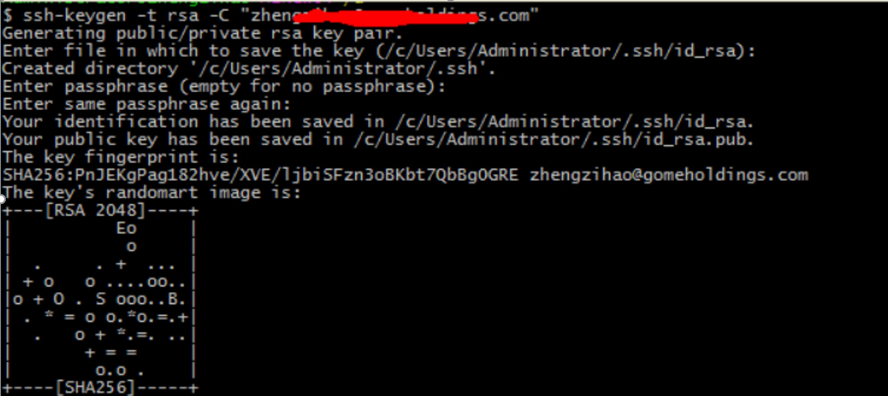
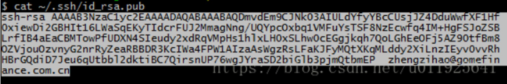
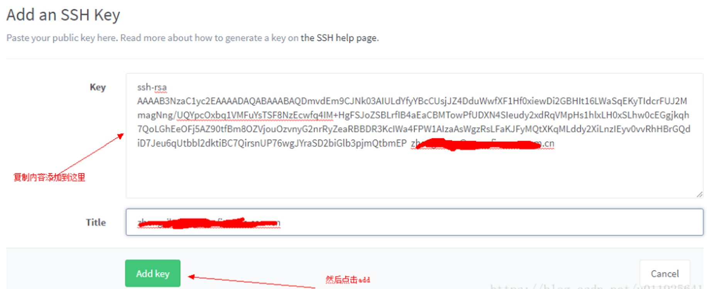
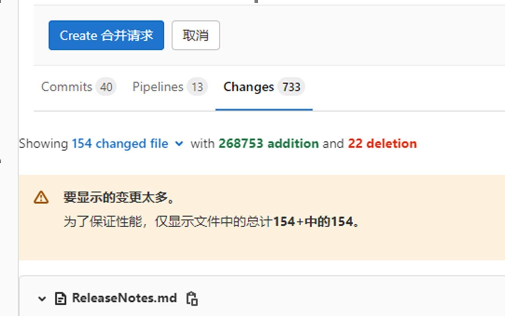
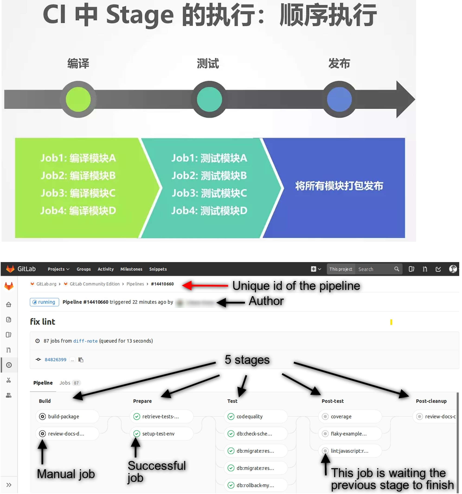
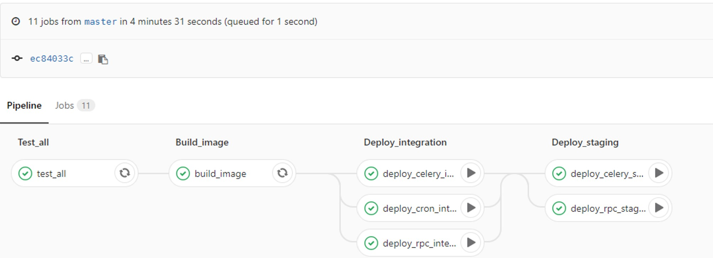

# GitLab 企业内部的仓库管理系统

GitLab  是一个用于仓库管理系统的开源项目，使用 Git 作为代码管理工具，并在此基础上搭建起来的 Web 服务。

GitLab 是一个基于 MIT 协议的开源项目，代码仓库地址是 https://github.com/gitlabhq/gitlabhq

GitLab 最初是由程序员 Dmitriy Zaporozhets 和 Valery Sizov 利用 Ruby 编写的一个基于 Git 的代码仓库托管系统，后来一些部分被 Go 重写。

最初的 GitLab 完全免费，自2013年，GitLab 被拆分为免费的社区版本和基于社区版且包含了更多高级功能的收费企业版。

2014年，GitLab 有限公司成立，GitLab己经由GitLabInc.拥有。
GitLab 能被部署到自己的服务器上，更安全可靠，适合企业级别的团队内部协作开发，已被很多大公司或组织采用，如IBM、NASA、阿里巴巴等。

现如今，GitLab 已经不完全将自己定位成代码托管工具，而是扩展并整合了项目管理、持续集成工具，由项目规划到代码版本控制，再到持续集成/持续交付的全流程覆盖的一站式项目管理工具。使之演变为完整的项目开发运维 DevOps 工具链。

2022 年 2 月消息，极狐（GitLab）正式宣布推出极狐 GitLab SaaS （JihuLab.com），为中国用户提供从源代码托管到开发运维的全栈式一体化 DevOps SaaS 平台与企业级专家咨询服务。

# GitLab 基本概念

GitLab 自带相应的 web 服务提供了良好的交互界面，并且有完善的问题追踪和 Wiki 功能。

## GitLab vs GitHub

- 同 GitHub 一样，GitLab 也是第三方基于 Git 打 造的代码托管工具。
- 现如今使用最为广泛的仓库托管平台依然是GitHub，这依赖于其强大的开发者社区。
- 搭建在自有服务器
  - GitHub只有企业版能搭建在自有服务器，但是价格高昂。
  - GitLab 除了云端托管服务，其最典型的场景是提供安装包搭建在私有服务器上，对于企业来说会更加安全可靠。而 GitLab 社区版是免费的。
- 在仓库开发管理功能上，相比于GitHub，GitLab的优势是：
  - 通过受保护的分支（protectedbranch），让项目管理者针对分支的创建、并入（merge）或者推送(push)设定权限，如设定仅维护者可以向develop分支推送代码、任何人都不能向master分支合并代码等。GitHub中仅有付费用户有受保护分支的功能。
  - 除了仅面向开发者设置的读、写权限以外，对项目成员的权限设置更加细致，有 Guest、Reporter、Developer、Maintainer和Owner等多角色设定。
  - 通过容器注册（containerregistry）功能，可以直接将仓库代码打包上传到 GitLab 的docker镜像服务器，制作自己的docker镜像。为后续的部署或持续集成做准备。
  - 提供内置的持续集成 CI 解决方案，不再需要用额外的 Jenkins 等工具打造 CI 流程，极大地方便了项目的交付集成管理。
  - GitLab 的免费私有项目没有核对合作者数量的限制，而且项目可见度除了可设置公开或私有外，还有另一选项——内部（Internal)，内部项目只对进入 GitLab 的用户可见。
- GitLab 在权限管理、持续集成整合等方面的独到之处，在企业级别的大团队协作开发项目中越来越流行。


# GitLab 云托管服务：Git 

GitLab 提供了类似于 GitHub 的免费云托管服务，打开 GitLab 的主页 https://about.gitlab.com/  后可以看到，注册步骤很简单，仅需填写用户名、邮箱就能注册成功，登录后就能看到简洁的项目托管界面。

- 可以创建项目(Project)，这里的项目是指核心的Git代码仓库外加 issue 跟踪、Wiki 等周边服务，还能创建类似于 GitHub 中组织的团体（group），并浏览查找其他开源项目。
- GitLab 项目创建好后，可以直接在web界面添加分支、编辑、提交代码等，或者将仓库克隆到本地，在本地进行开发工作。
- GitLab 为付费用户提供了更多高级功能，如代码质量扫描、更强大的 Cl pipeline 资源、安全测试检测、技术支持等。

## 分支管理：

## 代码提交：GitLab 的 MR（Merge Request）

## Review：合并代码和提交日志查看


## Git 托管常见问题及解决方法

### GitLab配置SSH密钥

SSH密钥允许你的计算机和gitlab之间建立安全连接。
 1、检查SSH秘钥是否存在。右击git bash打开终端执行命令 ：`cat ~/.ssh/id_rsa.pub`

2、若密钥不存在，则生成SSH 密钥 。在git bash上面执行命令：
 `ssh-keygen -t rsa -C "xiaoming@qq.com"`

xiaoming@qq.com是邮箱，随便填。完成后就会在`C:\Users\Administrator\.ssh`下生成两个文件：
 私钥 id_rsa.
 公钥 id_rsa.pub



3、 在GitLab上添加SSH key。执行命令查看公钥：`cat ~/.ssh/id_rsa.pub`



打开 gitlab 的找到U ser Settings 下的SSH Keys，在 Add an SSH key 中，复制 id_rsa.pub中的内容或上图中查询到的密钥到key这里，在title这里给这个key设置一个名字，点击Add key就完成了。




### 配置 GitLab，通过邮箱接收所有的的变动


### 为什么在 MR里面，只能看154个变更

原因：GitLab有个小缺陷：最多只能显示154个变更的文件

  例：超过154个文件（300个文件），也只能显示154个文件（看不到 rt-thread 文件夹 和 projects 文件夹的变化）

          

​                                             

# GitLab CI/CD

GitLab CI/CD（后简称 GitLab CI）是一套基于 GitLab 的 CI/CD 系统，需要让开发人员在仓库根目录下创建 .gitlab-ci.yml 文件在项目中配置 CI/CD 流程，并且使用Gitlab Runner执行该脚本。在提交后，系统可以自动/手动地执行任务，完成 CI/CD 操作。

而且，它的配置非常简单，CI Runner 由 Go 语言编写，最终打包成单文件，所以只需要一个 Runner 程序、以及一个用于运行 jobs 的执行平台（如裸机+SSH，Docker 或 Kubernetes 等，我推荐用 Docker，因为搭建相当容易）即可运行一套完整的 CI/CD 系统。

## CI/CD 基本概念

### 管道（pipeline）

Pipeline 即流水线，可以像流水线一样执行多个 Job. 在代码提交或 MR 被合并时，GitLab 可以在最新生成的 commit上建立一个 pipeline，在同一个 pipeline 上产生的多个任务中，所用到的代码版本是一致的。

每个推送到 Gitlab 的提交都会产生一个与该提交关联的管道(pipeline)，若一次推送包含了多个提交，则管道与最后那个提交相关联，管道(pipeline)就是一个分成不同阶段(stage)的作业(job)的集合。

### 阶段（Stage）

一般的流水线通常会分为几段；在 pipeline中，可以将多个任务划分在多个阶段中，只有当前一阶段的所有任务都执行成功后，下一阶段的任务才可被执行。

注：如果某一阶段的任务均被设定为“允许失败”，那这个阶段的任务执行情况，不会影响到下一阶段的执行。

- 以图中所示为例，整个 CI 流程包含三个 Stage：build、test 和deploy。
- build 被首先执行。如果发生错误，本次 CI 立刻失败；
- test 在 build 成功执行完毕后执行。如果发生错误，本次 CI 立刻失败；
- deploy 在 test 成功执行完毕后执行。如果发生错误，本次 CI 失败。



### 作业（Job）

Job 为任务，是 GitLab CI 系统中可以独立控制并运行的最小单位。 在提交代码后，开发者可以针对特定的 commit完成一个或多个 job，从而进行 CI/CD 操作。

 作业就是运行器(Runner)要执行的指令集合，Job 可以被关联到一个 Stage。当一个 Stage 执行的时候，与其关联的所有 Job 都会被执行。在有足够运行器的前提下,同一阶段的所有作业会并发执行。作业状态与阶段状态是一样的，实际上，阶段的状态就是继承自作业的。

作业必须包含script（由Runner执行的shell脚本），随着项目越来越大，Job 越来越多，Job 中包含的重复逻辑可能会让配置文件臃肿不堪。.gitlab-ci.yml 中提供了 before_script 和 after_script 两个全局配置项。这两个配置项在所有 Job 的 script 执行前和执行后调用。

 Job 的执行过程中往往会产生一些数据，默认情况下 GitLab Runner 会保存 Job 生成的这些数据，然后在下一个 Job 执行之前（甚至不局限于当次 CI/CD）将这些数据恢复。这样即便是不同的 Job 运行在不同的 Runner 上，它也能看到彼此生成的数据。

 在了解了 Job 配置的 script、before_script、after_script 和 cache 以后，可以将整个 Job 的执行流程用一张图概括：


整条流水线从左向右依次执行，每一列均为一个阶段，而列中的每个可操控元素均为任务。 左边两个阶段的任务是自动执行的任务，在commit提交后即可自动开始运行，执行成功或失败后，可以点击任务右边的按钮重试；而右边两个是手动触发任务，需要人工点击右边的“播放”按钮来手动运行。




## CI/CD 关键字

$CI_PROJECT_DIR  项目根目录

   cp -r $CI_PROJECT_DIR/rt-smart*.zip $CI_PROJECT_DIR/sdk_rt_smart/

不可以被用于 Job名 的保留字:

| **关键字**    | **是否必须** | **描述**                                                     |
| ------------- | ------------ | ------------------------------------------------------------ |
| image         | no           | 使用的docker镜像。[详见](https://links.jianshu.com/go?to=https%3A%2F%2Fdocs.gitlab.com%2Fce%2Fci%2Fdocker%2FREADME.html) |
| services      | no           | 使用的docker服务。[详见](https://links.jianshu.com/go?to=https%3A%2F%2Fdocs.gitlab.com%2Fce%2Fci%2Fdocker%2FREADME.html) |
| stages        | no           | 定义构建场景                                                 |
| types         | no           | stages的别名(**不赞成使用**)                                 |
| before_script | no           | 定义每个任务的脚本启动前所需执行的命令                       |
| after_script  | no           | 定义每个任务的脚本执行结束后所需执行的命令                   |
| variables     | no           | 定义构建变量                                                 |
| cache         | no           | 定义哪些文件需要缓存，让后续执行可用                         |


## .gitlab-ci.yml 文件

从7.12版本开始，GitLab CI使用YAML文件(.gitlab-ci.yml)来管理项目配置。该文件存放于项目仓库的根目录，并且包含了你的项目如何被编译的描述语句。YAML文件使用一系列约束叙述定义了Job启动时所要做的事情。

[Gialab YMAL 原文地址](https://links.jianshu.com/go?to=https%3A%2F%2Fdocs.gitlab.com%2Fce%2Fci%2Fyaml%2FREADME.html%23stages)   https://docs.gitlab.com/ee/ci/yaml/gitlab_ci_yaml.html

Gitlab CI yaml官方配置文件翻译   https://segmentfault.com/a/1190000010442764

## .gitlab-ci.yml 命令解析

### uname 的用法

```bash
$ uname --help
Usage: uname[OPTION]...
Print certain systeminformation.  With no OPTION, same as -s.

  -a, --all                print all information, in thefollowing order,
                             except omit -p and-i if unknown:
  -s, --kernel-name        print the kernel name
  -n, --nodename           print the network node hostname
  -r, --kernel-release     print the kernel release
  -v, --kernel-version     print the kernel version
  -m, --machine            print the machine hardware name
  -p, --processor          print the processor type or"unknown"
  -i, --hardware-platform  print the hardware platform or"unknown"
  -o, --operating-system   print the operating system
      --help    display this help and exit
      --version output version information and exit
```

uname -a 输出内容分析

```bash
uname -a的输出格式如下：
#uname -a
HP-UX RX1600 B.11.23 U ia64 3811068750 unlimited-user license
其中各列的含义如下：
1. HP-UX
操作系统的名称
2. RX1600
网络中，节点的名称
3. B.11.23
操作系统发行版（release）的名称
4. U
操作系统version
5. ia64
说明是安腾系列
6. 3811068750
机器的identification number
7. unlimited-user license
系统的license级别。此处说明没有最大用户数限制。

$ uname -a

Linux ubuntu3.2.0-29-generic-pae #46-Ubuntu SMP Fri Jul 27 17:25:43 UTC 2012 i686 i686 i386GNU/Linux
```

将每个参数都单独执行一次，得到：

```bash
硬件平台：
$ uname -i
i386

机器硬件（CPU）名：
$ uname -m
I686

节点名称：
$ uname -n
Ubuntu

操作系统：
$ uname -o
GNU/Linux

系统处理器的体系结构：
$ uname -p
i686

操作系统的发行版号：
$ uname -r
3.2.0-29-generic-pae

系统名：
$ uname -s
Linux

内核版本：
$ uname -v
#46-Ubuntu SMP FriJul 27 17:25:43 UTC 2012


```


## .gitlab-ci.yml 模块集

### CI脚本：检查源码中是否含有中文

```bash
# 检查源码中是否含有中文
check_chinese:
  stage: build
  only:
    - master
    - /^.*develop.*$/
    - merge_requests
    - tags
    - ci_test
    - /^test_chinese.*$/
  before_script:
    # Show system info
    - uname -a
    - cat /etc/issue
    # Install compiling software
    - apt-get update
    - apt-get install -y -qq lib32ncurses5 lib32z1 > /dev/null
    - apt-get install -y python3-pip 
    - pip3 install chardet==4.0.0
    - python3 --version
    - pip3 --version

  script:
    - pushd rt-thread/tools/
    - python3 check_chinese.py
    - mkdir -p $CI_PROJECT_DIR/chinese_report/
    - cp error.log $CI_PROJECT_DIR/chinese_report/error.log
    - popd

  artifacts:
    paths:
    - $CI_PROJECT_DIR/chinese_report/
```

```bash
# 检查源码中是否含有中文
test_chinese:
  stage: test
  only:
    - master
    - /^.*develop.*$/
    - merge_requests
    - tags
    - ci_test
    - /^test_chinese.*$/
  needs:
    - check_chinese
  before_script:
    # Show system info
    - uname -a
    - cat /etc/issue
    # Install compiling software
    - apt-get update
    - apt-get install -y -qq lib32ncurses5 lib32z1 > /dev/null

  script:
    - pushd $CI_PROJECT_DIR/chinese_report/
    - if [ -s error.log ]; then echo '---------\ Code\ Contains\ Chinese\ ---------'; cat error.err; fi
    - popd

  artifacts:
    paths:
    - $CI_PROJECT_DIR/chinese_report/
```


### CI脚本：编译文档（md转换成pdf，并统一文档格式）

### CI脚本：自动化编译代码（0 error，0 warning）

### CI脚本：自动化测试 （utest）

```bash

# check kernel+components
# check_ucase:
#   stage: build
#   only:
#     - master
#     - /^.*develop.*$/
#     - merge_requests
#     - tags
#     - ci_test
#     - /^kernel.*$/
#     - /^test_ucase.*$/
#   before_script:
#     # Show system info
#     - uname -a
#     - cat /etc/issue
#     # Install compiling software
#     - apt-get update
#     - apt-get install -y -qq lib32ncurses5 lib32z1 > /dev/null
#     - apt-get install -y git
#     - apt-get install -y scons
#     - apt-get install -y python
#     - apt-get install -y python-pip
#     - apt-get install -y qemu
#     - apt-get --no-install-recommends --allow-unauthenticated --fix-broken -y install lcov
#     # Configure gitlub account
#     - echo machine git.rt-thread.com login $CI_REGISTRY_USER password $CI_REGISTRY_PASSWORD >> ~/.netrc
#     - echo machine github.com login $CI_REGISTRY_USER password $CI_REGISTRY_PASSWORD >> ~/.netrc
#     - git config --global http.sslVerify false
#     - sync
#     # Configure GCC toolchain
#     - curl -s http://download.lan.rt-thread.com/download/gcc-arm-none-eabi-5_4-2016q3-20160926-linux.tar.bz2 | tar -xjf - -C /opt
#     - export RTT_EXEC_PATH=/opt/gcc-arm-none-eabi-5_4-2016q3/bin
#     - $RTT_EXEC_PATH/arm-none-eabi-gcc --version
#     - export CPUS=$(cat /proc/cpuinfo | grep "processor" | sort | uniq | wc -l)

#   script:
#     - pushd projects/qemu-vexpress-a9/testcase_machine
#     - scons -j$CPUS
#     - python3 ci_script/qemu_runner.py --elf rtthread.elf --sd sd.bin
#     - mkdir -p $CI_PROJECT_DIR/utest_report/
#     - cp -R report.csv $CI_PROJECT_DIR/utest_report/
#     - cp -R rtt_console.log $CI_PROJECT_DIR/utest_report/
#     - popd

#   artifacts:
#     paths:
#     - $CI_PROJECT_DIR/utest_report/

# # test kernel+components
# test_ucase:
#   stage: test
#   only:
#     - master
#     - /^.*develop.*$/
#     - merge_requests
#     - tags
#     - ci_test
#     - /^test_ucase.*$/
#   needs:
#     - check_ucase
#   before_script:
#     # Show system info
#     - uname -a
#     - cat /etc/issue
#     # Install compiling software
#     - apt-get update
#     - apt-get install -y -qq lib32ncurses5 lib32z1 > /dev/null

#   script:
#     - pushd $CI_PROJECT_DIR/utest_report/
#     - set +e
#     - fail_str=$(grep "FAIL" $CI_PROJECT_DIR/utest_report/report.csv)
#     - set -e
#     - if [ "$fail_str" ]; then echo '---------\ UTest\ Contains\ Failed Case\ ---------'; cat error.err; fi
#     - popd

#   artifacts:
#     paths:
#     - $CI_PROJECT_DIR/utest_report/

```

### CI脚本：自动执行静态代码分析


## CI 常见问题及解决方法

### ★“/”导致 CI 编译文档失败

选择固件 rtthread.elf 文件路径（\workspace\loongson-2k1000\Debug）

解决方法：选择固件 rtthread.elf 文件路径（workspace-->loongson-2k1000-->Debug）

### ★CI中常用错误：与图片相关

- 文档中的图片不能用绝对路径，不然CI编译报错。
- 有插入图片，但根据路径，找不到图片，也会报错。
- 　还有文档里面，有斜杠“/”“\”时，也会报错（CI认为是个路径）
- 插入图片时，不能用斜杠“\”（CI 编译不通过），都要改成用斜杠“/”。
  -    例如，figures\User_Manual\XXXX, 都要改成 figures/User_Manual/xx


