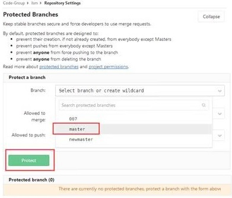
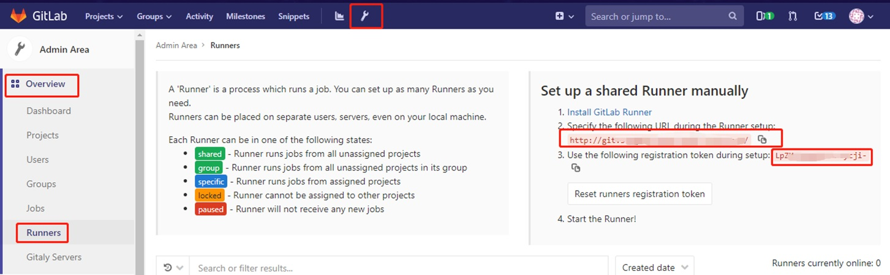
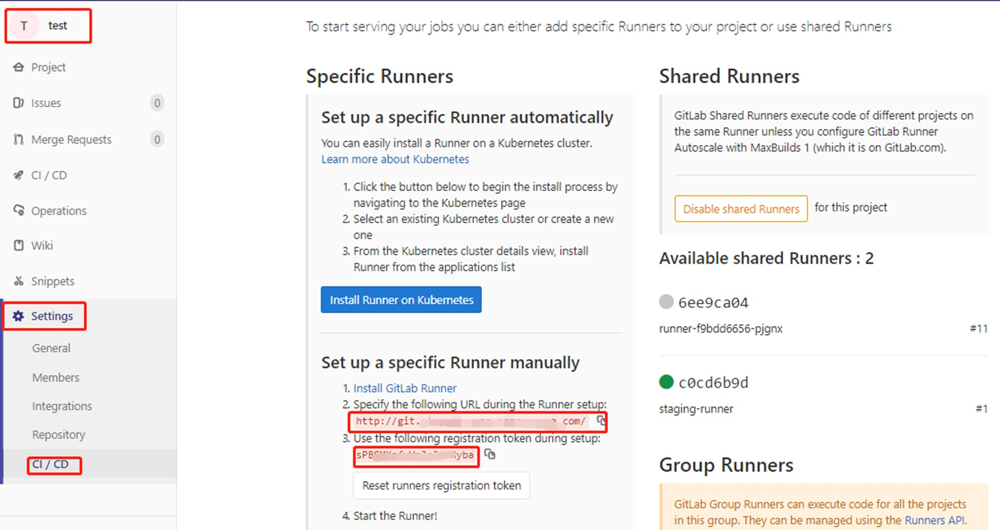
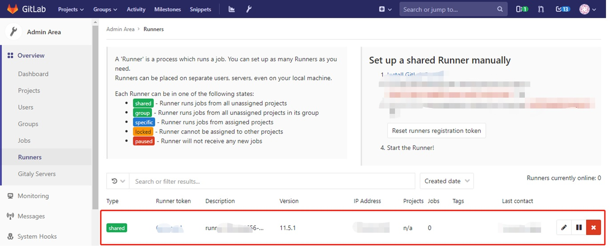
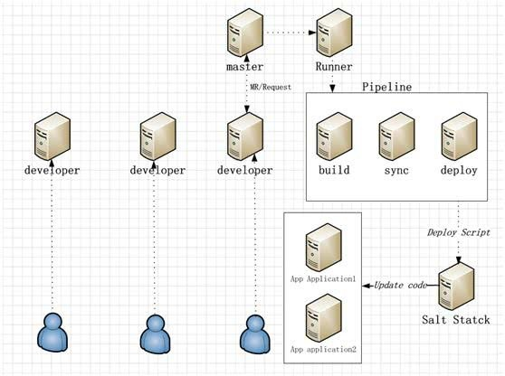
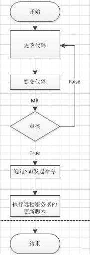

# GitLab 企业内部的仓库管理系统

GitLab  是一个用于仓库管理系统的开源项目，使用 Git 作为代码管理工具，并在此基础上搭建起来的 Web 服务。

GitLab 是一个基于 MIT 协议的开源项目，代码仓库地址是 https://github.com/gitlabhq/gitlabhq

GitLab 最初是由程序员 Dmitriy Zaporozhets 和 Valery Sizov 利用 Ruby 编写的一个基于 Git 的代码仓库托管系统，后来一些部分被 Go 重写。

最初的 GitLab 完全免费，自2013年，GitLab 被拆分为免费的社区版本和基于社区版且包含了更多高级功能的收费企业版。

2014年，GitLab 有限公司成立，GitLab己经由GitLabInc.拥有。
GitLab 能被部署到自己的服务器上，更安全可靠，适合企业级别的团队内部协作开发，已被很多大公司或组织采用，如IBM、NASA、阿里巴巴等。

现如今，GitLab 已经不完全将自己定位成代码托管工具，而是扩展并整合了项目管理、持续集成工具，由项目规划到代码版本控制，再到持续集成/持续交付的全流程覆盖的一站式项目管理工具。使之演变为完整的项目开发运维 DevOps 工具链。

2022 年 2 月消息，极狐（GitLab）正式宣布推出极狐 GitLab SaaS （JihuLab.com），为中国用户提供从源代码托管到开发运维的全栈式一体化 DevOps SaaS 平台与企业级专家咨询服务。


# GitLab 基本概念

GitLab 自带相应的 web 服务提供了良好的交互界面，并且有完善的问题追踪和 Wiki 功能。

## GitLab vs GitHub

- 同 GitHub 一样，GitLab 也是第三方基于 Git 打 造的代码托管工具。
- 现如今使用最为广泛的仓库托管平台依然是GitHub，这依赖于其强大的开发者社区。
- 搭建在自有服务器
  - GitHub只有企业版能搭建在自有服务器，但是价格高昂。
  - GitLab 除了云端托管服务，其最典型的场景是提供安装包搭建在私有服务器上，对于企业来说会更加安全可靠。而 GitLab 社区版是免费的。
- 在仓库开发管理功能上，相比于GitHub，GitLab的优势是：
  - 通过受保护的分支（protectedbranch），让项目管理者针对分支的创建、并入（merge）或者推送(push)设定权限，如设定仅维护者可以向develop分支推送代码、任何人都不能向master分支合并代码等。GitHub中仅有付费用户有受保护分支的功能。
  - 除了仅面向开发者设置的读、写权限以外，对项目成员的权限设置更加细致，有 Guest、Reporter、Developer、Maintainer和Owner等多角色设定。
  - 通过容器注册（containerregistry）功能，可以直接将仓库代码打包上传到 GitLab 的docker镜像服务器，制作自己的docker镜像。为后续的部署或持续集成做准备。
  - 提供内置的持续集成 CI 解决方案，不再需要用额外的 Jenkins 等工具打造 CI 流程，极大地方便了项目的交付集成管理。
  - GitLab 的免费私有项目没有核对合作者数量的限制，而且项目可见度除了可设置公开或私有外，还有另一选项——内部（Internal)，内部项目只对进入 GitLab 的用户可见。
- GitLab 在权限管理、持续集成整合等方面的独到之处，在企业级别的大团队协作开发项目中越来越流行。


# GitLab 云托管服务：Git 

GitLab 提供了类似于 GitHub 的免费云托管服务，打开 GitLab 的主页 https://about.gitlab.com/  后可以看到，注册步骤很简单，仅需填写用户名、邮箱就能注册成功，登录后就能看到简洁的项目托管界面。

- 可以创建项目(Project)，这里的项目是指核心的Git代码仓库外加 issue 跟踪、Wiki 等周边服务，还能创建类似于 GitHub 中组织的团体（group），并浏览查找其他开源项目。
- GitLab 项目创建好后，可以直接在web界面添加分支、编辑、提交代码等，或者将仓库克隆到本地，在本地进行开发工作。
- GitLab 为付费用户提供了更多高级功能，如代码质量扫描、更强大的 Cl pipeline 资源、安全测试检测、技术支持等。

## 分支管理：

## 代码提交：GitLab 的 MR（Merge Request）

## Review：合并代码和提交日志查看

## GitLab 权限控制

### 分支保护

选择master分支受保护。

作用：防止开发用户直接push到master分支代码。



### 用户权限

额外补充一点，开发分支所提交上来的代码可以在Pipelines构建中查看是那个用户提交上来的，默认在每个分支都会进行编译，所以都能查到是谁提交过来的代码。

## Git ：常见问题、解决方法、Tips

### GitLab配置SSH密钥

SSH密钥允许你的计算机和gitlab之间建立安全连接。
 1、检查SSH秘钥是否存在。右击git bash打开终端执行命令 ：`cat ~/.ssh/id_rsa.pub`

2、若密钥不存在，则生成SSH 密钥 。在git bash上面执行命令：
 `ssh-keygen -t rsa -C "xiaoming@qq.com"`

xiaoming@qq.com是邮箱，随便填。完成后就会在`C:\Users\Administrator\.ssh`下生成两个文件：
 私钥 id_rsa.
 公钥 id_rsa.pub


3、 在GitLab上添加SSH key。执行命令查看公钥：`cat ~/.ssh/id_rsa.pub`


打开 gitlab 的找到U ser Settings 下的SSH Keys，在 Add an SSH key 中，复制 id_rsa.pub中的内容或上图中查询到的密钥到key这里，在title这里给这个key设置一个名字，点击Add key就完成了。


### 配置 GitLab，通过邮箱接收所有的的变动


### 为什么在 MR里面，只能看154个变更

原因：GitLab有个小缺陷：最多只能显示154个变更的文件

  例：超过154个文件（300个文件），也只能显示154个文件（看不到 rt-thread 文件夹 和 projects 文件夹的变化）

          

​                    

# GitLab 的 Wiki 功能

https://gitlab.com/larryli/gitlab/-/wikis/home
https://docs.gitlab.com/ee/user/project/wiki/
https://docs.gitlab.com/ee/api/wikis.html
https://docs.gitlab.com/ee/user/markdown.html#table-of-contents

## Wiki 目录

Create a table of contents    [[_TOC_]]
To generate a table of contents from a wiki page’s subheadings, use the [[_TOC_]] tag. For an example, read Table of contents.

## Wiki 进行多级分类

https://git.rt-thread.com/help/user/project/wiki/index#creating-a-new-wiki-page

https://docs.gitlab.com/ee/user/markdown.html#table-of-contents

Move a wiki page     **/**
You need Developer permissions or higher to move a wiki page:

1.	Go to the page for your project or group.
2.	In the left sidebar, select Wiki, and go to the page you want to move.
3.	Select the edit icon ().
4.	Add the new path to the Title field. For example, if you have a wiki page called about under company and you want to move it to the wiki’s root, change the Title from about to /about.
5.	Select Save changes.


自己写的Gitlab Wiki 目录生成工具, 可能会帮到你:https://github.com/fengxuway/gitlab-wiki-toc另: 注意列表缩进两个空格不够, gitlab的wiki需要4个空格才能分级:

```
- 1
    - 1.1
    - 1.2
        - 1.2.1
        - 1.2.2
- 2
```


## GitLab Wiki 内容恢复、版本管理

gitlab的Wiki是用git管理的从此再也不用为误删担心了

选择一个目录克隆wiki

在gitlab网站wiki/Git Access页面内找项目连接地址

git clone git @git.xxxxxxx.org:xxxx/name.wiki.git

最后将修改push到服务器上就ok了.从此以后可以和代码一样在本地写wiki后再推到服务器了


## wiki 使用梳理

  https://blog.csdn.net/wangying202/article/details/115404593?utm_medium=distribute.pc_aggpage_search_result.none-task-blog-2~aggregatepage~first_rank_v2~rank_aggregation-4-115404593.pc_agg_rank_aggregation&utm_term=gitlab%E4%B8%ADwiki%E7%9A%84%E4%BD%BF%E7%94%A8&spm=1000.2123.3001.4430  


# GitLab 的 issue 跟踪


​                        

# GitLab 的 CI/CD

GitLab CI/CD（后简称 GitLab CI）是一套基于 GitLab 的 CI/CD 系统，需要让开发人员在仓库根目录下创建 .gitlab-ci.yml 文件在项目中配置 CI/CD 流程，并且使用Gitlab Runner执行该脚本。在提交后，系统可以自动/手动地执行任务，完成 CI/CD 操作。

而且，它的配置非常简单，CI Runner 由 Go 语言编写，最终打包成单文件，所以只需要一个 Runner 程序、以及一个用于运行 jobs 的执行平台（如裸机+SSH，Docker 或 Kubernetes 等，我推荐用 Docker，因为搭建相当容易）即可运行一套完整的 CI/CD 系统。

## CI/CD 基本概念

### 管道（pipeline）

Pipeline 即流水线，可以像流水线一样执行多个 Job. 在代码提交或 MR 被合并时，GitLab 可以在最新生成的 commit上建立一个 pipeline，在同一个 pipeline 上产生的多个任务中，所用到的代码版本是一致的。

每个推送到 Gitlab 的提交都会产生一个与该提交关联的管道(pipeline)，若一次推送包含了多个提交，则管道与最后那个提交相关联，管道(pipeline)就是一个分成不同阶段(stage)的作业(job)的集合。

### 阶段（Stage）

用于定义所有作业(job)可以使用的全局阶段，gitlab-ci.yml允许灵活定义多个阶段，stages元素的顺序定义了作业执行的顺序。Job关联的stage名相同时，该多个Job将并行执行（在拥有足够Runner情况下）。

一般的流水线通常会分为几段；在 pipeline中，可以将多个任务划分在多个阶段中，只有当前一阶段的所有任务都执行成功后，下一阶段的任务才可被执行。

注：如果某一阶段的任务均被设定为“允许失败”，那这个阶段的任务执行情况，不会影响到下一阶段的执行。

- 以图中所示为例，整个 CI 流程包含三个 Stage：build、test 和deploy。
- build 被首先执行。如果发生错误，本次 CI 立刻失败；
- test 在 build 成功执行完毕后执行。如果发生错误，本次 CI 立刻失败；
- deploy 在 test 成功执行完毕后执行。如果发生错误，本次 CI 失败。


### 作业（Job）

Job是.gitlab-ci.yml文件中最基本的元素，由一系列参数定义了任务启动时所要做的事情，用户可以创建任意个任务；每个任务必须有一个独一无二的名字，但有一些保留keywords不能用于Job名称，image，services，stages，types，before_script，after_script，variables，cache。

Job 为任务，是 GitLab CI 系统中可以独立控制并运行的最小单位。 在提交代码后，开发者可以针对特定的 commit完成一个或多个 job，从而进行 CI/CD 操作。

Job被定义为顶级元素，并且至少包括一条script语句，如果一个 Job 没有显式地关联某个 Stage，则会被默认关联到 test Stage。

```bash
job1:
# 关联到bulid阶段
stage: build
# 所需执行的脚本
script:

```

 作业就是运行器(Runner)要执行的指令集合，Job 可以被关联到一个 Stage。当一个 Stage 执行的时候，与其关联的所有 Job 都会被执行。在有足够运行器的前提下,同一阶段的所有作业会并发执行。作业状态与阶段状态是一样的，实际上，阶段的状态就是继承自作业的。

作业必须包含script（由Runner执行的shell脚本），随着项目越来越大，Job 越来越多，Job 中包含的重复逻辑可能会让配置文件臃肿不堪。.gitlab-ci.yml 中提供了 before_script 和 after_script 两个全局配置项。这两个配置项在所有 Job 的 script 执行前和执行后调用。

 Job 的执行过程中往往会产生一些数据，默认情况下 GitLab Runner 会保存 Job 生成的这些数据，然后在下一个 Job 执行之前（甚至不局限于当次 CI/CD）将这些数据恢复。这样即便是不同的 Job 运行在不同的 Runner 上，它也能看到彼此生成的数据。

 在了解了 Job 配置的 script、before_script、after_script 和 cache 以后，可以将整个 Job 的执行流程用一张图概括：


整条流水线从左向右依次执行，每一列均为一个阶段，而列中的每个可操控元素均为任务。 左边两个阶段的任务是自动执行的任务，在commit提交后即可自动开始运行，执行成功或失败后，可以点击任务右边的按钮重试；而右边两个是手动触发任务，需要人工点击右边的“播放”按钮来手动运行。


## CI/CD 关键字

$CI_PROJECT_DIR  项目根目录

   cp -r $CI_PROJECT_DIR/rt-smart*.zip $CI_PROJECT_DIR/sdk_rt_smart/

不可以被用于 Job名 的保留字:

| **关键字**    | **是否必须** | **描述**                                                     |
| ------------- | ------------ | ------------------------------------------------------------ |
| image         | no           | 使用的docker镜像。[详见](https://links.jianshu.com/go?to=https%3A%2F%2Fdocs.gitlab.com%2Fce%2Fci%2Fdocker%2FREADME.html) |
| services      | no           | 使用的docker服务。[详见](https://links.jianshu.com/go?to=https%3A%2F%2Fdocs.gitlab.com%2Fce%2Fci%2Fdocker%2FREADME.html) |
| stages        | no           | 定义构建场景                                                 |
| types         | no           | stages的别名(**不赞成使用**)                                 |
| before_script | no           | 定义每个任务的脚本启动前所需执行的命令                       |
| after_script  | no           | 定义每个任务的脚本执行结束后所需执行的命令                   |
| variables     | no           | 定义构建变量                                                 |
| cache         | no           | 定义哪些文件需要缓存，让后续执行可用                         |


## .gitlab-ci.yml 文件

从7.12版本开始，GitLab CI使用YAML文件(.gitlab-ci.yml)来管理项目配置。该文件存放于项目仓库的根目录，并且包含了你的项目如何被编译的描述语句。YAML文件使用一系列约束叙述定义了Job启动时所要做的事情。

[Gialab YMAL 原文地址](https://links.jianshu.com/go?to=https%3A%2F%2Fdocs.gitlab.com%2Fce%2Fci%2Fyaml%2FREADME.html%23stages)   https://docs.gitlab.com/ee/ci/yaml/gitlab_ci_yaml.html

Gitlab CI yaml官方配置文件翻译   https://segmentfault.com/a/1190000010442764

## .gitlab-ci.yml 命令解析

### uname 的用法

```bash
$ uname --help
Usage: uname[OPTION]...
Print certain systeminformation.  With no OPTION, same as -s.

  -a, --all                print all information, in thefollowing order,
                             except omit -p and-i if unknown:
  -s, --kernel-name        print the kernel name
  -n, --nodename           print the network node hostname
  -r, --kernel-release     print the kernel release
  -v, --kernel-version     print the kernel version
  -m, --machine            print the machine hardware name
  -p, --processor          print the processor type or"unknown"
  -i, --hardware-platform  print the hardware platform or"unknown"
  -o, --operating-system   print the operating system
      --help    display this help and exit
      --version output version information and exit
```

uname -a 输出内容分析

```bash
uname -a的输出格式如下：
#uname -a
HP-UX RX1600 B.11.23 U ia64 3811068750 unlimited-user license
其中各列的含义如下：
1. HP-UX
操作系统的名称
2. RX1600
网络中，节点的名称
3. B.11.23
操作系统发行版（release）的名称
4. U
操作系统version
5. ia64
说明是安腾系列
6. 3811068750
机器的identification number
7. unlimited-user license
系统的license级别。此处说明没有最大用户数限制。

$ uname -a

Linux ubuntu3.2.0-29-generic-pae #46-Ubuntu SMP Fri Jul 27 17:25:43 UTC 2012 i686 i686 i386GNU/Linux
```

将每个参数都单独执行一次，得到：

```bash
硬件平台：
$ uname -i
i386

机器硬件（CPU）名：
$ uname -m
I686

节点名称：
$ uname -n
Ubuntu

操作系统：
$ uname -o
GNU/Linux

系统处理器的体系结构：
$ uname -p
i686

操作系统的发行版号：
$ uname -r
3.2.0-29-generic-pae

系统名：
$ uname -s
Linux

内核版本：
$ uname -v
#46-Ubuntu SMP FriJul 27 17:25:43 UTC 2012


```

### before_script和after_script

before_script是用于定义一些在所有任务执行前所需执行的命令, 包括部署工作，可以接受一个数组或者多行字符串。after_script用于定义所有job执行过后需要执行的命令，可以接受一个数组或者多行字符串。

示例：

```bash
#定义全局 before_script:
default:
  before_script:
    - global before script

#覆盖全局before_script
job:
  before_script:
    - execute this instead of global before script
  script:
    - my command
  after_script:
    - execute this after my script
```

### only and except

- only和except两个参数说明了job什么时候将会被创建。

- only定义了job需要执行的所在分支或者标签。

- except定义了job不会执行的所在分支或者标签。

- 以下是这两个参数的几条用法规则：

  - only和except如果都存在在一个job声明中，则所需引用将会被only和except所定义的分支过滤
  - only和except允许使用正则
  - only和except允许使用指定仓库地址，但是不forks仓库

- 此外，only和except允许使用以下一些特殊关键字：

  | **值**    | **描述**                                                     |
  | --------- | ------------------------------------------------------------ |
  | branches  | 当一个分支被push上来                                         |
  | tags      | 当一个打了tag的分支被push上来                                |
  | api       | 当一个pipline被piplines api所触发调起，详见piplines  api（https://docs.gitlab.com/ce/api/pipelines.html） |
  | external  | 当使用了GitLab以外的CI服务                                   |
  | pipelines | 针对多项目触发器而言，当使用CI_JOB_TOKEN并使用gitlab所提供的api创建多个pipelines的时候 |
  | pushes    | 当pipeline被用户的git push操作所触发的时候                   |
  | schedules | 针对预定好的pipline而言（每日构建一类~，具体请看https://docs.gitlab.com/ce/user/project/pipelines/schedules.html） |
  | triggers  | 用token创建piplines的时候                                    |
  | web       | 在GitLab页面上Pipelines标签页下，你按了run  pipline的时候    |

- 下面的例子，job将会只在issue-开头的refs下执行，反之则其他所有分支被跳过：

  ```bash
  job:
    # use regexp
    only:
      - /^issue-.*$/
    # use special keyword
    except:
      - branches
  ```

  


## .gitlab-ci.yml 模块集

### CI脚本：检查源码中是否含有中文

```bash
# 检查源码中是否含有中文
check_chinese:
  stage: build
  only:
    - master
    - /^.*develop.*$/
    - merge_requests
    - tags
    - ci_test
    - /^test_chinese.*$/
  before_script:
    # Show system info
    - uname -a
    - cat /etc/issue
    # Install compiling software
    - apt-get update
    - apt-get install -y -qq lib32ncurses5 lib32z1 > /dev/null
    - apt-get install -y python3-pip 
    - pip3 install chardet==4.0.0
    - python3 --version
    - pip3 --version

  script:
    - pushd rt-thread/tools/
    - python3 check_chinese.py
    - mkdir -p $CI_PROJECT_DIR/chinese_report/
    - cp error.log $CI_PROJECT_DIR/chinese_report/error.log
    - popd

  artifacts:
    paths:
    - $CI_PROJECT_DIR/chinese_report/
```

```bash
# 检查源码中是否含有中文
test_chinese:
  stage: test
  only:
    - master
    - /^.*develop.*$/
    - merge_requests
    - tags
    - ci_test
    - /^test_chinese.*$/
  needs:
    - check_chinese
  before_script:
    # Show system info
    - uname -a
    - cat /etc/issue
    # Install compiling software
    - apt-get update
    - apt-get install -y -qq lib32ncurses5 lib32z1 > /dev/null

  script:
    - pushd $CI_PROJECT_DIR/chinese_report/
    - if [ -s error.log ]; then echo '---------\ Code\ Contains\ Chinese\ ---------'; cat error.err; fi
    - popd

  artifacts:
    paths:
    - $CI_PROJECT_DIR/chinese_report/
```


### CI脚本：编译文档（md转换成pdf，并统一文档格式）

### CI脚本：自动化编译代码（0 error，0 warning）

### CI脚本：自动化测试 （utest）

```bash

# check kernel+components
# check_ucase:
#   stage: build
#   only:
#     - master
#     - /^.*develop.*$/
#     - merge_requests
#     - tags
#     - ci_test
#     - /^kernel.*$/
#     - /^test_ucase.*$/
#   before_script:
#     # Show system info
#     - uname -a
#     - cat /etc/issue
#     # Install compiling software
#     - apt-get update
#     - apt-get install -y -qq lib32ncurses5 lib32z1 > /dev/null
#     - apt-get install -y git
#     - apt-get install -y scons
#     - apt-get install -y python
#     - apt-get install -y python-pip
#     - apt-get install -y qemu
#     - apt-get --no-install-recommends --allow-unauthenticated --fix-broken -y install lcov
#     # Configure gitlub account
#     - echo machine git.rt-thread.com login $CI_REGISTRY_USER password $CI_REGISTRY_PASSWORD >> ~/.netrc
#     - echo machine github.com login $CI_REGISTRY_USER password $CI_REGISTRY_PASSWORD >> ~/.netrc
#     - git config --global http.sslVerify false
#     - sync
#     # Configure GCC toolchain
#     - curl -s http://download.lan.rt-thread.com/download/gcc-arm-none-eabi-5_4-2016q3-20160926-linux.tar.bz2 | tar -xjf - -C /opt
#     - export RTT_EXEC_PATH=/opt/gcc-arm-none-eabi-5_4-2016q3/bin
#     - $RTT_EXEC_PATH/arm-none-eabi-gcc --version
#     - export CPUS=$(cat /proc/cpuinfo | grep "processor" | sort | uniq | wc -l)

#   script:
#     - pushd projects/qemu-vexpress-a9/testcase_machine
#     - scons -j$CPUS
#     - python3 ci_script/qemu_runner.py --elf rtthread.elf --sd sd.bin
#     - mkdir -p $CI_PROJECT_DIR/utest_report/
#     - cp -R report.csv $CI_PROJECT_DIR/utest_report/
#     - cp -R rtt_console.log $CI_PROJECT_DIR/utest_report/
#     - popd

#   artifacts:
#     paths:
#     - $CI_PROJECT_DIR/utest_report/

# # test kernel+components
# test_ucase:
#   stage: test
#   only:
#     - master
#     - /^.*develop.*$/
#     - merge_requests
#     - tags
#     - ci_test
#     - /^test_ucase.*$/
#   needs:
#     - check_ucase
#   before_script:
#     # Show system info
#     - uname -a
#     - cat /etc/issue
#     # Install compiling software
#     - apt-get update
#     - apt-get install -y -qq lib32ncurses5 lib32z1 > /dev/null

#   script:
#     - pushd $CI_PROJECT_DIR/utest_report/
#     - set +e
#     - fail_str=$(grep "FAIL" $CI_PROJECT_DIR/utest_report/report.csv)
#     - set -e
#     - if [ "$fail_str" ]; then echo '---------\ UTest\ Contains\ Failed Case\ ---------'; cat error.err; fi
#     - popd

#   artifacts:
#     paths:
#     - $CI_PROJECT_DIR/utest_report/

```

### CI 脚本：自动执行静态代码分析


## CI CD：常见问题、解决方法、Tips

### ★仅限特定分支上的GitLab CI管道

我们有两个一般分支： `master` （仅限 生产环境 ）和 `develop` . 对于开发，我们从 `develop` 分支创建 `feature/some-feature` 分支 . 开发完成后，我们创建从 `feature/some-feature` 到 `develop` 的合并请求 . 当合并请求被批准并合并到 `develop` 分支时，我想运行管道以构建应用程序并在某些环境中部署构建 .

```bash
image: node:7.5-configured

stages:
    - build
    - deploy

build_job:
    stage: build
    only:
        - develop
    script:
        - /bin/bash <some script here>

...
```

### ★如何在gitlab-ci中指定子模块分支

如何在gitlab-ci中指定子模块分支 How to specify the submodule branch in gitlab-ci?

```bash
#您在要构建的项目的.gitmodule文件中指定它。
#You specify it in the .gitmodules file of the project you are building. 
[submodule "MyRepo"]
    path = MyRepo
    url = https://github.com/vendor/MyRepo.git
    branch = master

```

### ★ gitlab-CI中使用tag作为版本号硬编译进程序中

在使用gitlab过程中,我发现如果能直接将gitlab的tag与自动生成的软件版本做成一致的话,在后续的维护上会更加方便.于是研究了一番如何将tag作为版本号硬编译进程序中的方法.主要是一下几个方面:

- 在gitlab-ci.yml中，指定只对tag生效

  ```bash
  # gitlab-ci.yml中内置 $CI_COMMIT_REF_NAME 得到当前的tag
  only:
  	- tags
  ```

- 使用c++。生成version.h文件,在gitlab-ci.yml中

  ```bash
  # 在代码中通过 #include "version.h" 并使用 __VERSION__ 宏来操作版本号
  	- echo "#pragma once" > inc/version.h
  	- echo "#define __VERSION__  \"$CI_COMMIT_REF_NAME\"" >> inc/version.h
  ```

- 使用go。可以使用类似c++的方式,生成version.go文件来实现,也可以编译命令中直接修改源文件中指定的值,比如:

  ```bash
  # version.go中:
  package version
  var Version = "unknown"
  
  # 那么在gitlab-ci.yml中就可以
  go build -ldflags "-X version.Version '$CI_COMMIT_REF_NAME\'"
  # 即可将Version修改为当前tag
  ```

  

### ★“/”导致 CI 编译文档失败

选择固件 rtthread.elf 文件路径（\workspace\loongson-2k1000\Debug）

解决方法：选择固件 rtthread.elf 文件路径（workspace-->loongson-2k1000-->Debug）

### ★CI中常用错误：与图片相关

- 文档中的图片不能用绝对路径，不然CI编译报错。
- 有插入图片，但根据路径，找不到图片，也会报错。
- 　还有文档里面，有斜杠“/”“\”时，也会报错（CI认为是个路径）
- 插入图片时，不能用斜杠“\”（CI 编译不通过），都要改成用斜杠“/”。
  -    例如，figures\User_Manual\XXXX, 都要改成 figures/User_Manual/xx

# GitLab Runner

GitLab Runner 就是一个用来执行 .gitlab-ci.yml 脚本的工具。可以理解成，Runner 就像认真工作的工人，GitLab-CI 就是管理工人的中心，所有工人都要在 GitLab-CI 里面注册，并且表明自己是为哪个项目服务。当相应的项目发生变化时，GitLab-CI 就会通知相应的工人执行对应的脚本。

GitLab-Runner可以分类两种类型：Shared Runner（共享型）和Specific Runner（指定型）。

- l Shared Runner：所有工程都能够用的，且只有系统管理员能够创建。
- Specific Runner：只有特定的项目可以使用。

## Runner 安装

以Linux为例：其他系统请参考官网文档:https://docs.gitlab.com/runner/install/

- For Debian/Ubuntu 

  curl -L https://packages.gitlab.com/install/repositories/runner/gitlab-ci-multi-runner/script.deb.sh | sudo bash 

- For RHEL/CentOS 

  curl -L https://packages.gitlab.com/install/repositories/runner/gitlab-ci-multi-runner/script.rpm.sh | sudo bash


## 获取 Runner 注册 Token

安装好Runner之后，需要向Gitlab进行注册，注册Runner需要GitLab-CI的url和token。可根据需求注册选择所需类型Runner。

 获取Shared Runner 注册 Token： 使用管理员用户登录，进入Admin Area->OverView->Runners 界面。



获取Specific Runner注册Token： 进行项目仓库->settings->CI/CD界面



## 注册 Runner

执行 gitlab-ci-multi-runner register 命令进行 Runner 注册，期间会用到前期获取的 url 及 token；注册完成之后，GitLab-CI 就会多出一条 Runner 记录。

更多系统注册，请参考阅读官方文档：https://docs.gitlab.com/runner/register/




# GitLab 自建私有的托管服务器

GitLab 除了云端托管服务，其最为流行的功能是可以将服务搭建在私有服务器，

- 对于企业来说会更加安全可靠。
- 可安装在自有服务器支持物理机或者云环境。
- 支持 Ubuntu、Cent0S、Debian等多种操作系统。
- 支持多种安装方式，如安装包 Image、docker 镜像、Kubernetes Helm Repository 等。
- GitLab 自建托管服务也分为免费的社区版和付费的企业版。
- GitLab 社区版是免费的。
- 企业版分为 Starter、Perminum、Ultimate 三种计划。
- 安装方法是参考 GitLab 在 GitHub 上的 Wiki 页面。


## 采用 docker 容器镜像安装公司GitLab

1. 先保护你的服务器环境中，已经安装了 docker，具有网络保证能从 dockerhub 上拉取相关的镜像。

2. 用 docker 镜像部署 GitLab 非常简单，仅需执行以下命令。

```bash
$ sudo docker run --detach
  --publish 443:443 --publish 80:80 --publish 22:22
  --name gitlab
  --restart always
  --volume /srv/gitlab/config:/etc/gitlab
  --volume /srv/gitlab/logs:/var/log/gitlab
  --volume /srv/gitlab/data:/var/opt/gitlab
  gitlab/gitlab—ce:11.5.1-ce.0
```

注意: 

- 这里指定的是 GitLab 社区版 11.5.1-ce.0 镜像，可以到 dockerHub 找历史版本。
- 安装时仅需改成相应的 Tag，gitlab/gitlab-ce:latest 指最新版本。
- publish 参数将容器的端口映射到主机，保证网络内的其他机器可以访问GitLab，80 是 http 协议所用端口，443 是 https 协议所用端口，22 是 ssh 协议所用端口。
- volume 参数将容器内的路径映射到主机文件系统，使GitLab的持久化数据能保存在主机上。
- 容器内的 /var/opt/gitlab 存储 GitLab 应用数据，/var/log/gitlab 存储日志，/etc/gitlab 存储 GitLab 相关的配置文件。
- detach 参数能使容器一直运行在后台。
- restart 参数指定容器由于某种原因退出时是否重启。
- gitlab 是此容器的名字。该命令会先将指定镜像拉取到本地，然后创建一个名为 gitlab 的容器，并将其启动运行在后台。

3. 命令执行后，会返回一个容器的 ID。执行以下命令查看gitlab容器状态：

   ```bash
   $ sudod docker container ls -f name=gitlab
   ```

   容器状态为“healthy"时，证明容器己启动目、正常运行。

4. 此时，登入容器修改配置文件：

   ```bash
   $ sudod docker exec -it gitlab vi /etc/gitlab/gitlab.rb
   ```

   通过更改 external_url 的值指定 GitLab 服务的 url，一般将 url 设为宿主机机器名或 IP 地址，这里配置使用的是 http 地址。

   external_url 'http://host234.XX.corp'

5. 如果 GitLab 默认的端口号（80，443、22）在主机端己经被占用了，就需要在创建容器时用 publish 参数更改所映射的主机监听端口。例如，以下命令就将容器内的 80 端口映射到主机端的 8080，将容器的 443 端口映射为主机端的 543。

   ```bash
   $ sudo docker run --detach
     --publish 543:443 --publish 8080:80 --publish 33:22
     --name gitlab
     --restart always
     --volume /srv/gitlab/config:/etc/gitlab
     --volume /srv/gitlab/logs:/var/log/gitlab
     --volume /srv/gitlab/data:/var/opt/gitlab
     gitlab/gitlab—ce:11.5.1-ce.0
   ```

   

6. 此外，还需要对配置文件/etc/gitlab/gitlab.rb 做相应更改：

   - 一是修改 external_url 地址：

     ```bash
     external_url 'http://host234.XX.corp:8080'   #for http
     或者
     external_url 'https://host234.XX.corp:543'  #for https
     ```

   - 二是修改ssh端口：

     ```bash
     gitlab_rails ['gitlab_shell_ssh_port'] = 2289
     ```

7. GitLab 配置完毕，即可通过浏览器打开 external_url 指定的网址，第一次登录跳出的网页，需要为 root 用户设置密码。

- root 用户拥有最高权限，可以进入管理员界面，通过一个简单报表对运行情况、负载、系统状态等进行实时监控。
- 同时，还能对 GitLab 的注册限制、账号配额、安全策略等进行配置。
- 其他用户可以正常注册使用仓库托管服务，你可以创建仓库或者fork仓库，也可以创建小组等，和 GitLab.com 的云托管服务没什么差别。


# GitLab 整体部署

## 自动更新图

1、开发分支提交代码到远程master分支

2、审核者通过并合并代码到远程master分支；开发分支构建成功才会合并到master分支，否则，及时是不能合并到主分支master

3、触发master分支的runner进行pipeline构建

4、构建过程：传送脚本到Salt Stack管理机，通过Salt Stack发起指令去触发游戏服更新代码



## 回滚流程图



概述：

1、回滚请求是由审核者发起

2、查看commit日志

3、回滚到特定的版本

4、新建一个回滚分支并切到这个分支

5、将本地的回滚分支推送到远程分支

6、设置master分支不受保护和非默认分支（必须条件）

7、删除本地和远程的master分支

8、创建本地的master分支并切到这个master分支

9、推送代码到远程的master分支

10、设置master分支受保护和设置为默认分支

11、开发分支需要重新发起MR请求去触发更新构建到游戏服上面的代码


