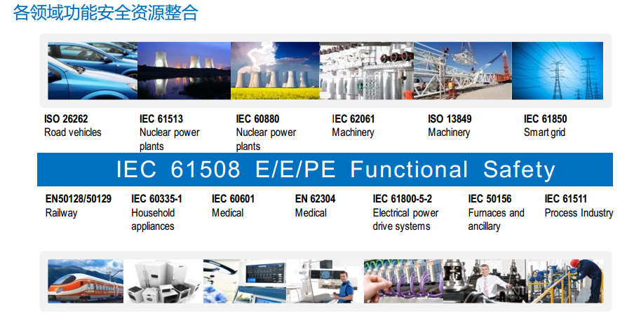
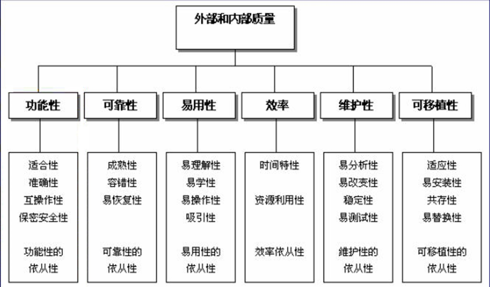

# Certification 认证、标准

## IEC 61508 《电气/电子/可编程电子安全系统的功能安全》

- IEC 61508 2010	
- 相对应的国标为：GB∕T 20438.3-2017 《电气/电子/可编程电子安全系统的功能安全》标准

## EN 50128《铁路控制和防护系统的软件》

- EN 50128  2011	《铁路控制和防护系统的软件》标准。

## ISO 26262 Functional Satety 《道路车辆 功能安全》

- ISO 26262 道路车辆功能安全标准是从 IEC 61508 中派生出来的。
- 相对应的国标为：GBT34590-2017 《道路车辆 功能安全》标准。
- ISO 26262 主要定位在汽车行业中特定的电气器件、电子设备、可编程电子器件等专门用于汽车领域的部件。	
- ISO 26262为汽车安全提供一个生命周期（管理、开发、生产、经营、运行、报废）理念，并在这些生命周期阶段中提供必要的支持。
- 标准涵盖功能性安全方面的整体开发过程，包括需求定义、设计、实施、集成、验证、确认和配置。

## ISO 21448 Safety of the Intended Functionality 《预期功能安全》

- 预期功能安全：自动驾驶，AI相关    ISO PAS 21448 SOTIF

## ISO 21434 Cyber Security 《网络安全》

## ISO/IEC 33000

## CMMI

## AUTOSAR 汽车开放系统架构

AUTOSAR  Automotive Open System Architecture  汽车开放系统架构。

它是由全球各家汽车制造商、零部件供应商以及各种研究、服务机构共同参与的一种汽车电子系统的合作开发框架，并建立了一个开放的汽车控制器（ECU）标准软件架构。

## ASPICE

ASPICE 汽车过程改进及能力评定，是汽车行业用于评价软件开发团队的研发能力水平的模型架构。

ASPICE 国内外多数汽车企业使用的软件开发流程，与ISO 26262 要求具有很多相似与借鉴处。

故，在建立 ISO 26262 开发流程前，优先建立 ASPICE 流程，或者同时实施符合 ASPICE 与 ISO 26262 的开发流程，已成为当前多数企业的实施方向。

## ISO9001 质量保证体系

## ISO-IEC-IEEE 12207 系统和软件工程.软件生命周期过程

## ISO 9126  《软件质量模型是评价软件质量的国际标准》

### 一、功能性：	

​	1、适合性：提供了相应的功能
​	2、准确性：正确（用户需要的）
​	3、互操作性：产品与产品之间交互数据的能力
​	4、保密安全性：允许经过授权的用户和系统能够正常的访问相应的数据和信息，禁止未授权的用户访问.......
​	5、功能性的依从性：国际/国家/行业/企业 标准规范一致性

### 二、可靠性：

产品在规定的条件下，在规定的时间内完成规定功能的能力。	
	1、成熟性：防止内部错误导致软件失效的能力
	2、容错性：软件出现故障，自我处理能力
	3、易恢复性：失效情况下的恢复能力
	4、可靠性的依从性

### 三、易用性：

在指定使用条件下，产品被理解、 学习、使用和吸引用户的能力。
	1、易理解性：
	2、易学性：
	3、易操作性：
	4、吸引性：
	5、易用性的依从性：

### 四、效率性：

在规定台条件下，相对于所用资源的数量，软件产品可提供适当性能的能力。
	1、时间特性：平均事务响应时间，吞吐率，TPS（每秒事务数）
	2、资源利用性：CPU 内存 磁盘 IO 网络带宽 队列 共享内存
	3、效率依从性：

### 五、软件维护性：

"四规"， 在规定条件下，规定的时间内，使用规定的工具或方法修复规定功能的能力。
	1、易分析性：分析定位问题的难易程度
	2、易改变性：软件产品使指定的修改可以被实现的能力
	3、稳定性：防止意外修改导致程序失效
	4、易 测试性：使已修改软件能被确认的能力
	5、维护性的依从性

### 六、软件可移植性：

从一种环境迁移到另一种环境的能力。	
	1、适应性：适应不同平台
	2、易安装性：被安装的能力
	3、共存性
	4、易替换性
	5、可移植性的依从性

# AA

## BB
