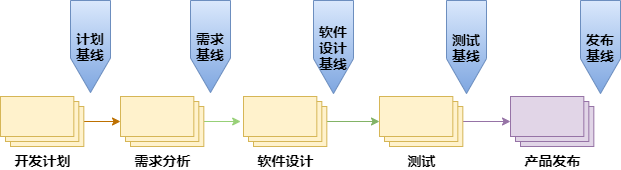
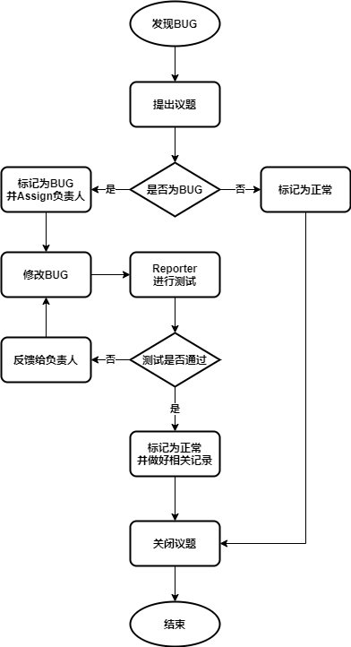

# Configuration Management 配置管理

- 配置管理是功能安全行业的一种成熟做法，可根据ISO 10007、ISO/IEC 33000系列标准、ISO/IEC/IEEE 15288和ISO/IEC/IEEE 12207等标准进行应用。ISO 26262、IEC 61508、EN 50128系列标准的每个工作产品都要进行配置管理。

- 配置管理（CM）是指一套管理软件开发和维护过程中所产生的各种中间软件产品的方法和规则。主要软件配置管理过程包括版本控制、系统构建、配制管理库的管理、基线管理、变更管理以及发布版本管理等，并且包括支持这些过程的软件工具。
- ISO 26262 《道路车辆 功能安全》标准文档。
- ISO/IEC/IEEE 12207 《系统和软件工程 软件生命周期过程》标准文档。

## 配置管理的目标

- 记录软件产品的演化过程；

- 确保软件开发者在软件生命周期中的各个阶段都能得到精确的软件配置；

- 确保工作成果、相关项、要素及其创造的原则和一般条件能够在任何时候以受控的方式得到唯一的识别和复制；

- 最终保证软件产品的完整性、一致性、可追溯性。

## 配置管理活动

- 识别所选工作产品的配置，其在给定的时间点上组成基线；

- 控制对配置项的变更；

- 提供配置管理相关文档说明，以便从配置管理系统构建工作产品；

- 向开发人员、最终用户与客户提供准确的状态与当前的配置数据；

- 配置状态统计，生成配置报告；

- 配置审核。

# ■■■■■■■■■■■■■■■■■■■■■■

# 实际项目的配置管理执行过程

## 配置管理计划

- 准入条件：项目负责人发布项目开发计划；

- 配置管理员根据项目负责人提交的项目开发计划，并按照《配制管理流程》，编写《配置管理计划》；

- 配置管理计划的主要内容包括人员及职责、用于配置管理的软硬件资源、配置管理环境、配置项管理、基线管理和配置库管理等。

- 配置管理计划的编写，可参考《配置管理计划》模板；

- 对配置管理计划进行验证评审，填写《配置管理评审检查表》；

- 结束条件：完成《配置管理计划》和《配置管理评审检查表》。

## 配置管理环境的创建

- 准入条件：配置管理员发布《配置管理计划》；

- 建立配置管理系统：分配角色、角色的职责、角色的权限、以及为实现配置管理而使用的计算环境和软件工具；

- 结束条件：配置管理环境已建立。

## 配置项的识别

- 准入条件：配置管理环境已建立；

- 根据具体的项目，识别配置项；

- 对配置项进行分类，并为配置项指定唯一性的标识代号；

- 确定每个配置项的重要特征。配置项的特征主要包括作者、文档类型、代码文档的程序设计语言；

- 确定每个配置项的负责人；

- 填写《配置项管理列表》；

- 审批配置管理表；

- 结束条件：配置项已识别。

## 配置项的管理

- 准入条件：配置项已识别；
- 每个配置项都需要列入《配置项管理列表》，并实时更新每个配置项的状态；
- 当更新《配置项管理列表》，需要保证管理者和开发人员都可以被通知到，如果需要，可以对重要的变更进行评估；
- 结束条件：项目结束。

## 配置库的建立和管理

- 准入条件：配置项已识别；
- 公司采用工具（GitLab、Git）和本地服务器，来构建完整的配置库；
- 每个项目都会有相应的配置库，并通过GitLab和Git 来管理；
- 可参考模板《配置库》；
- 结束条件：配置库已建立。

## 基线的管理

- 准入条件：配置库已建立；
- 基线的管理包括：基线的创建、基线标识、基线比较、基线控制和基线查询等；
- 可参考模板《基线管理表》；
- 开发按 V 模型，规划好每个阶段的基线种类
- 结束条件：项目结束。
- 

## 配置状态统计及发布

- 准入条件：配置库已建立；

- 配置状态报告是配置管理的一个组成部分，其任务是有效地记录和报告管理配置所需要的信息；

- 目的是及时、准确地给出软件配置的当前状况，供相关人员了解，以加强配置管理工作；

- 配置管理员需要定期更新配置状态报告。并且通过邮件或周报的方式通知项目组成员；
  - 例如，2 周更新 1 次；
  - 配置管理状态报告发布的范围：全体项目组成员；
  - 发布内容：配置管理状态报告，例如包括基线发布、配置项的变更等。

- 结束条件：项目结束。

## 配置审核

- 准入条件：基线已确立；

- 配置审核一般采用技术评审和配置规范评审；

- 技术评审关注的是配置项在修改后的技术正确性，是否有遗漏，是否具有潜在的副作用；

- 配置规范评审是用来保证项目开发过程配置管理的流程和计划符合规范；
- 配置审核计划如下所示：
  - 步骤 1：配置审核将由项目组成员（主要由配置经理）进行；
  - 步骤 2：对配置审核项逐一进行审核，配置审核项一般包括：
    - 配置项是否正确标识、命名？
    - 配置项的版本号是否根据软件配置管理计划规定？
    - 所有配置项（包括基线内、基线外的配置项）是否都及时、准确地放置到配制库中？保证配置项（CI）按版本集成到特定的配置库里面；
    - 基线是否按计划建立？
    - 基线是否包含相应的配置项，是否有缺失？
    - 基线建立是否经过审核和批准？
    - 基线发生变更时，是否严格走变更流程？
    - 配置库是否作了备份？是否有适当的保密或授权制度来保证只有经过授权的团队成员才能做检入和检出操作；
    - 发布审核：发行文档是否有缺失？发行的产品是否从配置库取出的、合适的版本？所有已经发现的缺陷是否都有跟踪记录？
  - 步骤 3：对项目配置管理进行审核，记录审核结果，并生成《配置管理审核报告》；
  - 步骤 4：对配置管理审核报告进行验证评审，填写《配置管理评审检查表》；
  - 步骤 5：完成配置审核之后，配置经理（CM）需要通过邮件方式通知项目组所有成员。

- 结束条件：项目配置管理已审核，并且所有的配置项都已审核通过。

# ■■■■■■■■■■■■■■■■■■■■■■

# 配置管理规范

配置管理规范包括：

- 配置管理计划
- 配置管理（CM）系统及权限： 访问权限、项目仓库管理；

- 软件工具的配置；

- 配置项（CI）：识别、原则、状态、控制级别、状态；   

- 非源码文件管理：文档管理、文件状态、非源码命名规则； 

- 源码文件管理：源码命名规则；

- 建立配置库；

- 检入检出，分支策略：检入检出策略、分支管、版本控制；

- 缺陷（Bug）跟踪流程；

- 基线控制；

- 变更管理；

- 发布管理；

- 系统构建；

- 备份与恢复策略。

# 配置管理计划

- 配置管理计划定义了软件开发中的配置管理策略和全生命周期配置管理活动，以确保项目所有阶段的工作产品的完整性和一致性，并且不受破坏性的不受控变更的影响。

- 配置管理计划的目标是规划整个项目的配置管理活动，例如配置项的管理、基线管理和发布管理等问题；
- 配置管理计划的主要内容包括人员及职责、用于配置管理的软硬件资源、配置管理环境、配置项管理、基线管理和配置库管理等。

# 配置管理系统（GitLab ）及权限

配置管理（CM）系统是根据配置管理策略，对安全计划所需的工作产品和重要物项和要素所需的工作产品进行基线化和配置管理。配置管理系统用于管理配置项（如GitLab、GIT等）的存储库。

公司实际运作时，主要采用 GitLab 仓库管理系统，进行项目代码管理，使用Git作为版本控制工具，并在此基础上搭建起来的Web服务。

系统构建和持续集成，通过CI 服务器和GitLab配合实现。

## Git

Git是一个开源的分布式版本控制系统，用于敏捷高效地处理任何或小或大的项目。

## GitLab

GitLab 是一个用于仓库管理系统的开源项目，使用Git作为代码管理工具，并在此基础上搭建起来的Web服务。

## 访问权限

- 项目中所有成员的权限，都是通过GitLab工具来管理。

- GitLab 权限管理，包括五种权限：

  - Guest：访客；
  - Reporter：报告者；
  - Developer：开发人员；
  - Maintainer：项目负责人；
  - Owner：项目持有者。

- GitLab 成员的权限

  | **权限项**               | **Guest** | **Reporter** | **Developer** | **Maintainer** | **Owner** |
  | ------------------------ | --------- | ------------ | ------------- | -------------- | --------- |
  | 创建议题                 | ●         | ●            | ●             | ●              | ●         |
  | 发表评论                 | ●         | ●            | ●             | ●              | ●         |
  | Pull项目代码             |           | ●            | ●             | ●              | ●         |
  | 下载项目                 |           | ●            | ●             | ●              | ●         |
  | 创建代码片段             |           | ●            | ●             | ●              | ●         |
  | 创建分支合并请求         |           |              | ●             | ●              | ●         |
  | Push改动到不受保护的分支 |           |              | ●             | ●              | ●         |
  | 移除不受保护的分支       |           |              | ●             | ●              | ●         |
  | 添加标签                 |           |              | ●             | ●              | ●         |
  | 编写Wiki                 |           |              | ●             | ●              | ●         |
  | 管理议题                 |           |              | ●             | ●              | ●         |
  | 添加小组成员             |           |              |               | ●              | ●         |
  | Push改动到受保护的分支   |           |              |               | ●              | ●         |
  | 管理分支权限             |           |              |               | ●              | ●         |
  | 管理标签                 |           |              |               | ●              | ●         |
  | 编辑项目                 |           |              |               | ●              | ●         |

- GitLab 中项目组权限有三种访问权限

  - Private：私有；
  - Internal：内部；
  - Public：公共。

- GitLab 中项目组权限

  | **权限项**     | **Private** | **Internal** | **Public** |
  | -------------- | ----------- | ------------ | ---------- |
  | 对组员可见     | ●           | ●            | ●          |
  | 对登录用户可见 |             | ●            | ●          |
  | 对所有人可见   |             |              | ●          |

# 配置的工具列表

根据 ISO 26262 标准，需要确保产品开发过程中所使用软件工具是安全可靠的，例编译器、测试工具。

该工作的第一步是对工具进行分类以确定所考虑的工具是否是关键的。例如，编译器。如果是关键的，则需要对该工具进行资质确认，评估所使用软件工具的置信度。

| **工具**   | **描述**                                                     |
| ---------- | ------------------------------------------------------------ |
| GitLab     | 仓库管理系统，使用Git作为代码管理工具，用于管理配置库； 这类工具属于配置管理工具，不需要进行工具置信度水平的评估。 |
| Git        | 分布式版本控制系统； 这类工具属于配置管理工具，不需要进行工具置信度水平的评估。 |
| 编译工具链 | 编译工具链属于软件开发中关键的工具； 这类工具需要做置信度水平的评估； 例如，交叉编译工具采用ARM公司的ARM Compiler 6.6。该款工具拥有SIL4和ASILD证书。 |
| 测试工具   | 代码单元、集成测试工具，并输出测试用例运行结果，代码覆盖率等信息； 测试工具属于软件开发中关键的工具； 这类工具需要做置信度水平的评估； 例如，LDRA_Toolsuite  测试工具，可用于单元测试和集成测试，此工具的置信度为 TCL2，ASIL等级为 ASIL D。 |

# 配置项（CI）

## 配置项（CI）的识别

- Configuration Item 配置项。
- 配置项组成部分的主要工作产品有过程描述、需求、设计、测试计划和规范、测试报告、代码/模块、工具(如编译器)、接口描述等。

- 配置项的识别是软件生命周期中划分各类配置项，定义配置项的种类、隶属的基线，并为配置项分配标识符的过程。
- 常用的配置项包括需求规格说明书、设计规格说明书、源代码、测试计划、测试用例、用户手册等相关的工作产品的集合，被认为是一个独立的实体并置于配置控制之下。

## 配置项（CI）的原则

- 唯一性：每个配置项必须具有唯一的名称和配置项编号；

- 可追溯性；每个配置项的状态都需要进行管理和版本控制；

- 同类配置项的标识方法需要统一；

- 配置项的命名：通过名字和配置项编号，使用者可以很快地识别此配置项具体属于哪个模块和基线类；

## 配置项（CI）的控制级别

| 控制级别 | 描述                                                         | 权限                                                         |
| -------- | ------------------------------------------------------------ | ------------------------------------------------------------ |
| 基线项   | 纳入基线管理的配置项是指变化时要走严格变更手续的配置项。     | 只有配置管理员有写的权限，项目组全员开放读的权限。           |
| 受控项   | 不需要基线控制，但变更后需要得到相关人员确认或通知到相关人员的配置项。 | PM、SM或配置管理员有读写权限，项目组全员或相关人员开放读的权限。 |
| 非受控项 | 对变更不做控制的配置项。                                     | PM、SM、配置管理员或开发小组开放读写权限，项目组全员开放读的权限。 |

## 配置项（CI）的状态

| 配置项的状态 | 描述                                                         |
| ------------ | ------------------------------------------------------------ |
| 草稿         | 在创建配置项时，它的状态为草稿。                             |
| 修改         | 配置项的状态变为发布后，若需要修改必须依照变更流程进行，此阶段的状态为修改。 |
| 发布         | 通过评审之后，状态变为发布。                                 |

### 配置项（CI）的管理

- 根据具体的项目，识别配置项；

- 对配置项进行分类，并为配置项指定唯一性的标识代号；

- 配置项编号规则：CI-主模块-子模块-流水号，例如，CI-RQ-SW-001；

  - CI：Configuration Item 配置项；
  - 主模块，包括：
    - PM：Project Management 项目管理类
    - CM：Configuration Management 配置管理
    - SM：Safety Management 功能安全：管理流程
    - SP：Supporting Process 功能安全：支持过程
    - PL：Plan 计划类（例，项目计划、安全计划）
    - RQ：Requirement 需求类（例，SEooC需求、软件需求）
    - AT：Architecture 架构类（例，系统架构、软件架构）
    - DS：Design 设计类
    - TS：Test 测试类（例，软硬件单元测试、集成测试、系统测试）
    - RL：Release 发布类 
  - 子模块，包括：
    - PD：Product 产品相关
    - HW：Hardware 硬件相关
    - SW：Software 软件相关
    - IT：Integration Test 集成测试
    - UT：Unit Test 单元测试
    - ST：System Test 系统测试
  - 流水号：例，001、002、……；

- 确定每个配置项的重要特征。配置项的特征主要包括作者、文档类型、代码文档的程序设计语言；

- 确定每个配置项的负责人；

- 填写《配置项管理列表》；

- 审批配置管理表。

  

# 文件管理

## 非源码文件管理

### 文档管理

根据 ISO26262 要求，所有文档都是需要进行管控的，并且需要包含编号、作者、评审者、批准者在内等特定信息。

具体规范，参考以下文档：

- 《文档管理计划》；

- 《文档模板-Word》；

- 《文档模板-Excel》。

### 文档状态

| 文件状态 | 描述                                                         |
| -------- | ------------------------------------------------------------ |
| 草稿     | 在创建文件时，它的状态为草稿。                               |
| 修改     | 文件的状态变为发布后，若需要修改必须依照变更流程进行，此阶段的状态为修改。 |
| 发布     | 通过评审之后，状态变为发布。                                 |

### 文档命名规则和编号

文件编号具体请查阅《文档管理计划》。

## 源码文件管理

### 源码命名规则

## 源码文件出库入库规则

# 检入检出，Git 分支策略

## 检入检出

- 配置管理（CM）过程应对软件配置项的检入和检出进行控制，以保证受控库的正确性和完整性。检入和检出控制应包括：验证更改是否得到授权；建立更改日志；维护一份更改副本；更新受控库的内容等。

- 公司统一用GitLab和Git管理工具来管理项目。

## 分支策略

- 分支管理主要是通过Git配置管理工具来实现。

  | 分支                | 描                                                           |
  | ------------------- | ------------------------------------------------------------ |
  | feature  (短期分支) | feature 分支，为功能分支，用于开发各个模块功能； feature 分支，一般都是从 develop 分支克隆出来的，主要用于多人协助开发场景或探索性功能验证场景，功能开发完毕后合并到 develop 分支； feature 分支可创建多个，属于临时分支，目的实现后可删除分支； 根据产品软件需求，新建一个 “Task” 的 feature 分支； feature 分支命名：一般以功能命名（例 wi-fi-rw007）或开发人员名字命名；  完成此 feature 的代码和功能开发，即在此 feature 分支完成 单元测试，以及相关文档； 单元测试通过，文档也准备好，就可以 Merge 到 develop 分支。 |
  | develop  (长期分支) | develop 分支，代码库应该有一个、且仅有一个 develop 主分支； develop 分支为开发主分支。开发人员每天都要拉取/提交最新代码的分支； 模块功能开发，都会在各个 feature 分支上进行，开发完成后，再 merge 合并到 develop 分支，即功能开发一般不直接在 develop 分支上开发； 如果项目比较大，多人一起开发，则需要专门的人负责管理 develop 分支，并且 Merge  到 develop 分支时，需要在 GitLab 上提 PR/MR（Merge Request）给相关人员进行 Review；  如果项目比较小，参与成员比较少，则无需专门的人管理 develop 分支； 当有代码或文档 commit/merge 到 develop 分支时，自动触发：代码静态扫描、CI编译代码、CI编译文档。 |
  | master  (长期分支)  | master 分支，代码库应该有一个、且仅有一个 master 主分支； master 分支，主要用于 Release 和 Review； 当需要 Release 时，需要在 GitLab 上提 Merge Request，merge 当前面 develop 分支到 master 分支； 当有代码或文档 commit/merge  到 master 分支时，自动触发：代码静态扫描、CI 编译代码、CI 编译文档。 |
  | tag 标签            | 每次发布或建立基线时，必须从 master 分支上，建一个Tag； Tag 命名：以软件版本号或基线版本号命名。 |

## Git Flow 流程

# 版本控制

随着项目的进展，每个工作产物都可能有很多版本，配制管理库必须能保存所有的版本，以便有效地管理产品发布，并允许开发者在测试和调试过程中返回到早先的版本。版本控制具体要求，如下所示：

- 版本控制，采用相应的流程和工具（例，GIT），对软件开发过程中产生的各种文件的版本进行管理；

- 在版本控制过程中，需要采取一些措施或工具（例，GIT）来防止版本的冲突，确保不同开发者对配置库的变更不会相互干扰；

- 每一个版本都需要进行维护和管理；

- 凡已经进入受控库的配置项，如果发生更改，配置管理应更新其版本号；

- 公司版本控制一般通过 Git 配置管理工具来实现，每次 Release 时，必须从 master 分支上，建一个 Tag。Tag 命名：以软件版本号命名。

- 在完成产品规划的 V1.0，Release 的版本号（一个基线）为：V1.0.0。后面有升级的话，V1.0.1、V1.0.2、……；

- 在完成产品规划的 V1.0 和 V1.1 之前，可以采用上述的方法 （即中间，用 V1.0.1 \ V1.0.2 只升级第 3 段的版本号）；

- 当完成产品规划的 V1.1 的 Task 时，就可以升级成 V1.1.0（即升级中间 第2段的版本号）。

# 缺陷（Bug）跟踪流程

缺陷（Bug）跟踪主要目的是为用户报告Bug和其他问题提供支持，并为开发人员修复Bug等提供支持，确保可溯及每个缺陷的源头。目前主要通过GitLab里面的议题来实现缺陷（Bug）的跟踪。

## Bug 跟踪流程图

## Bug 跟踪管理

| 步骤  | 描述                                                         |
| ----- | ------------------------------------------------------------ |
| 步骤1 | 任何人发现一个 Bug，都可以在项目 GitLab 的 “议题”模块，新建一个 Issue/Bug。 |
| 步骤2 | 标题以[bug] [模块]，例如发现 IDE 的 Bug，则标题为[bug] [IDE]xxx问题； Type：选择 “Issue  (议题)”； Description: 需要包括以下内容：  1. 测试环境（软件版本、固件版本、硬件平台）  2. 测试步骤  3. 问题描述（现象，以及在哪个步骤才出现的问题）  4. 期望结果（正常情况下的测试结果） Assignee：选择 “Issue/Bug 负责人”； Labels 标记：选择 “Bug”。 |
| 步骤3 | 负责人修完此 Bug 之后，需要做以下事情：  在对应的 Issue/Bug 页面，简单描述 Issue/Bug 的根本原因、怎么修等；  通知 “Reporter（提此Issue/Bug的人）”，并提供新的环境（软硬件）；  将此 Issue/Bug，Assign 回 Reporter，做验证测试。 |
| 步骤4 | Reporter 收到之后，开始做验证测试； 验证测试通过，则可以“关掉”此 Issue/Bug； 验证测试失败，则 Assign 回 “Issue/Bug负责人”，重新修改并重新验证。 |

# 基线控制

- 基线的定义：是指已经通过正式评审和批准的规格说明书或产品，它可以作为进一步开发的基础，并且只有通过正式的变更控制规程才能修改它；

- 在软件配置项成为基线之前，可以较快地且非正规地进行变更；

- 每个阶段都有对应的基线；

- 基线是软件开发中的里程碑，其标志是在正式技术评审中已经获得批准的一个或多个软件配置项的交付；

- 每一个基线都是下一步开发的出发点和参考点。一般情况下，基线一般在指定的里程碑处创建，并与项目中的里程碑保持同步；

- 基线的主要属性包括：名称、标签、版本、日期等。

# 变更管理

参考《变更管理计划》、《变更管理表》。

# 发布管理

- 发布管理主要包括产品的发布版本，持续跟踪已经发布给客户使用的产品版本，跟踪 Bug 以及跟踪变更提议等。

- 产品的发布版本，可能包括以下内容：
  - 源代码；
  - 配置文件；
  - 数据文件；
  - 电子和书面文档；
  - 包装和相关的宣传等。

- 具体发布报告，请查阅《生产发布报告》。

- 由于要管理的大量信息以及配置项之间的关系，故一般采用配置管理工具（例 GitLab、Git、CI/CD）来统一管理。 

# 备份与恢复策略

- 配置管理（CM）过程应采取必要的措施，以控制不同访问权限的人员访问受控库。同时，配置管理员制定配置库备份计划，指明“何人”在“何时”（频度）将配置库备份到“何处”。

- 实际操作过程中，通过配置库，以及配置管理工具（例 GitLab、Git）来实现存储和备份控制。

# ■■■■■■■■■■■■■■■■■■■■■■

# 配置库

## 建立配置库

- 配置库，是配置管理环境的核心，使用配置管理工具建立；

- 配置库一般包括：项目管理库、配置管理库、文档库、代码库、基线库和发布库等，各个管理库的详细内容，可以查阅模板《配置库》；

- 配置库存储配置项（CI）、修改请求、变更记录等，并提供对库中所存储文件的版本控制；

- 为不同的人员（如开发人员、测试人员等）分配不同的访问配置库的权限；

- 配置库通常以增量方式存储配置项的各个版本，以减少空间消耗并增加版本处理的灵活性；

- 实际搭建中，公司主要通过 GitLab 和 Git 配置工具，以及本地服务器来建立每个项目的配置库。

## 配置库的使用说明

- 正确标识：例将文件入库时，注意提交到服务器中配置库里正确的位置，并且正确命名，以免给配置管理造成一定的工作量，产生不必要的浪费；

- 及时提交：将自己的工作产物放到对应的目录下，请及时提交或者更新到服务器上，让相关人员能够看到最新的文件；

- 及时更新：每次要对某个文件进行修改时，请先“Update” 这个文件，从服务器上更新到最新版本，以免在旧版本基础上修改，造成冲突，无法提交等；

- 提交规范：文件提交到服务器上时，有 “Enter the log message”  之类的对话框，请大家一定要填写，尤其是进入编码和测试阶段，要求每个文件的提交必须填写 “Log Message”。主要填写以下几个方面的内容：修改的目的、修改的主要内容、修改后可能造成的影响；

- 配置管理信息发布：配置库各个模块中的配置项，在列入基线后或者配置项变更后，都需要通过邮件通知到项目组的成员；

## 配置库的结构

### 项目管理库

- 项目管理库主要包括项目策划、项目管理、质量保证、培训、会议记录、邮件、风险及问题管理、项目总结等；
- 项目管理库主要由项目经理、安全经理进行维护和管理；
- 项目管理库存于 GitLab 的 GIT 仓库；
- 项目管理相关议题，还会通过 GitLab 论题工具进行记录和追踪。

### 配置管理库

- 依据配置管理计划，创建项目配置存储结构；
- 配置管理库主要包括《配置管理计划》、《配置库》、《配置项管理列表》、《基线管理表》、《配置管理审核报告》、《配置管理评审检查表》；
- 配置管理库存于 GitLab 的 GIT 仓库，并通过 GitLab 论题工具进行相关记录和追踪。

### 文档库

- 文档库由配置管理员创建主要目录，项目成员可以在目录下创建子目录及文件。文件/目录的创建者本人拥有该文件/目录的完全控制权限，而项目其他成员缺省情况下是只读权限；
- 文档库主要用于存放开发过程中需要保留的各种信息，供项目组成员使用，文档库内容主要包括：功能安全管理文档、支持过程文档、计划（例，安全计划）、需求（例，产品需求、SEooC 需求规范、软件需求）、软件架构设计、软件单元设计、软件单元测试、软件集成测试、软件系统测试等；
- 文档库存于 GitLab 的 GIT 仓库，并通过 GitLab 论题工具进行相关记录和追踪。

### 代码库

- 代码库由配置管理员创建主要目录，项目成员可以在目录下创建子目录及文件；
- 代码库内容主要包括：源代码、可执行代码、测试代码、系统构建脚本、自动化测试脚本等；
- 代码库存于 GitLab 的 GIT 仓库，并通过 GitLab 论题工具进行相关记录和追踪。

### 基线库

- 基线库由配置管理员建立并维护，并对产品的变更进行严格的控制；
- 基线建立准则，包括基线建立步骤、基线命名、基线类型等信息。
- 基线建立步骤：
  - 步骤1：配置经理（CM）被通知可以建立某基线；
  - 步骤2：CM 获得该基线相关的工作产物；
  - 步骤3：CM 实施配置评审，检查基线内容的完整性、一致性，并确认满足基线建立条件；
  - 步骤4：获得安全经理批准之后，才可以建立基线；
  - 步骤5：CM 通过配置工具（例，GIT）建立基线，并打上基线对应的Tag；
  - 步骤6：基线建立之后，CM需要更新《基线管理表》，并通过邮件方式通知项目组所有成员。
- 基线命名：BL-基线类型（阶段）-版本号。例如：BL-RQ-V1.0
  - BL：表示基线 Baseline；
  - 基线类型（阶段）：计划（PL）、需求（RQ）、软件设计（DS，包括：软件架构、软件单元测试、代码等）、测试（TS，包括：单元测试、集成测试、验证测试）、发布（RL）；
  - 版本号：例，V1.0。
- 当基线库配置项需要变更时，一定要实施变更流程：变更实施前必须填写配置项变更申请，经变更评审组评审通过后，才能从基线库中提出需变更的配置项并实施变更。变更实施完成后，必须通过评审才能重新进入基线库；
- 基线库变更后，需要以邮件方式通知项目组所有成员；
- 主要通过《基线管理表》来管理。
- 基线库存于GitLab的GIT仓库，并通过GitLab论题工具进行相关记录和追踪。

### 发布库

- 在产品经过正式审批后形成相应的产品基线，执行基线发布流程，保证产品的完整性和正确性；
- 发布库保存的是发布基线的配置项，作为最终产品，等待客户使用；
- 发布库由配置管理员建立并维护，在项目发布产品基线或整个项目结束时，配置管理员从基线库里把所有的文档复制到发布库；
- 发布库变更后，需要以邮件方式通过项目组所有成员；
- 发布库存于GitLab的GIT仓库，并通过GitLab论题工具进行相关记录和追踪。

## 系统构建 CI/CD 

- 系统构建是通过把软件构件、外部库、配置文件和其他信息编译和链接在一起，创建一个完整、可执行系统的过程。通过集成系统构建工具和版本控制工具，从版本控制管理的存储库（配置库）中获取构件版本。

- 实际的系统构建，公司主要是通过 CI 服务器和 GitLab 配合来实现。CI 具体的功能包括：
  - CI 自动编译文档（md 文件，转成 pdf）；
  - CI 自动搭建编译环境，编译代码；
  - CI 自动运行 Testcase 和覆盖率统计； 
  - CI 自动运行代码静态分析；
  - CI 自动打包输出最后要发布的软件包（SDK）；
  - 同时上述每个阶段，CI 都会有对应的报告。
