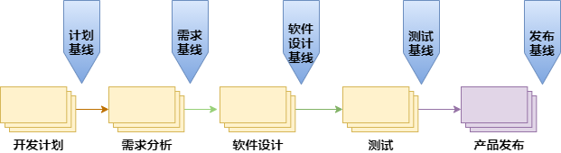

# Configuration Management 配置管理

配置管理是功能安全行业的一种成熟做法，可根据ISO 10007、ISO/IEC 33000系列标准、ISO/IEC/IEEE 15288和ISO/IEC/IEEE 12207等标准进行应用。ISO 26262、IEC 61508、EN 50128系列标准的每个工作产品都要进行配置管理。

配置管理（CM）是指一套管理软件开发和维护过程中所产生的各种中间软件产品的方法和规则。主要软件配置管理过程包括版本控制、系统构建、配制管理库的管理、基线管理、变更管理以及发布版本管理等，并且包括支持这些过程的软件工具。

## 配置管理的目标

- 记录软件产品的演化过程；

- 确保软件开发者在软件生命周期中的各个阶段都能得到精确的软件配置；

- 确保工作成果、相关项、要素及其创造的原则和一般条件能够在任何时候以受控的方式得到唯一的识别和复制；

- 最终保证软件产品的完整性、一致性、可追溯性。

## 配置管理活动

- 识别所选工作产品的配置，其在给定的时间点上组成基线；

- 控制对配置项的变更；

- 提供配置管理相关文档说明，以便从配置管理系统构建工作产品；

- 向开发人员、最终用户与客户提供准确的状态与当前的配置数据；

- 配置状态统计，生成配置报告；

- 配置审核。

# 配置管理规范

配置管理规范包括：

- 配置管理（CM）系统及权限： 访问权限、项目仓库管理；

- 软件工具的配置；

- 配置项（CI）：识别、原则、状态、控制级别、状态；   

- 非源码文件管理：文档管理、文件状态、非源码命名规则； 

- 源码文件管理：源码命名规则；

- 建立配置库；

- 检入检出，分支策略：检入检出策略、分支管、版本控制；

- 缺陷（Bug）跟踪流程；

- 基线控制；

- 变更管理；

- 发布管理；

- 系统构建；

- 备份与恢复策略。

# 配置管理系统（GitLab ）及权限

配置管理（CM）系统是根据配置管理策略，对安全计划所需的工作产品和重要物项和要素所需的工作产品进行基线化和配置管理。配置管理系统用于管理配置项（如GitLab、GIT等）的存储库。

公司实际运作时，主要采用 GitLab 仓库管理系统，进行项目代码管理，使用Git作为版本控制工具，并在此基础上搭建起来的Web服务。

系统构建和持续集成，通过CI 服务器和GitLab配合实现。

## Git

Git是一个开源的分布式版本控制系统，用于敏捷高效地处理任何或小或大的项目。

## GitLab

GitLab 是一个用于仓库管理系统的开源项目，使用Git作为代码管理工具，并在此基础上搭建起来的Web服务。

## 访问权限

- 项目中所有成员的权限，都是通过GitLab工具来管理。

- GitLab 权限管理，包括五种权限：

  - Guest：访客；
  - Reporter：报告者；
  - Developer：开发人员；
  - Maintainer：项目负责人；
  - Owner：项目持有者。

- GitLab 成员的权限

  | **权限项**               | **Guest** | **Reporter** | **Developer** | **Maintainer** | **Owner** |
  | ------------------------ | --------- | ------------ | ------------- | -------------- | --------- |
  | 创建议题                 | ●         | ●            | ●             | ●              | ●         |
  | 发表评论                 | ●         | ●            | ●             | ●              | ●         |
  | Pull项目代码             |           | ●            | ●             | ●              | ●         |
  | 下载项目                 |           | ●            | ●             | ●              | ●         |
  | 创建代码片段             |           | ●            | ●             | ●              | ●         |
  | 创建分支合并请求         |           |              | ●             | ●              | ●         |
  | Push改动到不受保护的分支 |           |              | ●             | ●              | ●         |
  | 移除不受保护的分支       |           |              | ●             | ●              | ●         |
  | 添加标签                 |           |              | ●             | ●              | ●         |
  | 编写Wiki                 |           |              | ●             | ●              | ●         |
  | 管理议题                 |           |              | ●             | ●              | ●         |
  | 添加小组成员             |           |              |               | ●              | ●         |
  | Push改动到受保护的分支   |           |              |               | ●              | ●         |
  | 管理分支权限             |           |              |               | ●              | ●         |
  | 管理标签                 |           |              |               | ●              | ●         |
  | 编辑项目                 |           |              |               | ●              | ●         |

- GitLab 中项目组权限有三种访问权限

  - Private：私有；
  - Internal：内部；
  - Public：公共。

- GitLab 中项目组权限

  | **权限项**     | **Private** | **Internal** | **Public** |
  | -------------- | ----------- | ------------ | ---------- |
  | 对组员可见     | ●           | ●            | ●          |
  | 对登录用户可见 |             | ●            | ●          |
  | 对所有人可见   |             |              | ●          |

# 配置的工具列表

根据 ISO 26262 标准，需要确保产品开发过程中所使用软件工具是安全可靠的，例编译器、测试工具。

该工作的第一步是对工具进行分类以确定所考虑的工具是否是关键的。例如，编译器。如果是关键的，则需要对该工具进行资质确认，评估所使用软件工具的置信度。

| **工具**   | **描述**                                                     |
| ---------- | ------------------------------------------------------------ |
| GitLab     | 仓库管理系统，使用Git作为代码管理工具，用于管理配置库； 这类工具属于配置管理工具，不需要进行工具置信度水平的评估。 |
| Git        | 分布式版本控制系统； 这类工具属于配置管理工具，不需要进行工具置信度水平的评估。 |
| 编译工具链 | 编译工具链属于软件开发中关键的工具； 这类工具需要做置信度水平的评估； 例如，交叉编译工具采用ARM公司的ARM Compiler 6.6。该款工具拥有SIL4和ASILD证书。 |
| 测试工具   | 代码单元、集成测试工具，并输出测试用例运行结果，代码覆盖率等信息； 测试工具属于软件开发中关键的工具； 这类工具需要做置信度水平的评估； 例如，LDRA_Toolsuite  测试工具，可用于单元测试和集成测试，此工具的置信度为 TCL2，ASIL等级为 ASIL D。 |

# 配置项（CI）

## 配置项（CI）的识别

- 配置项组成部分的主要工作产品有过程描述、需求、设计、测试计划和规范、测试报告、代码/模块、工具(如编译器)、接口描述等。

- 配置项的识别是软件生命周期中划分各类配置项，定义配置项的种类、隶属的基线，并为配置项分配标识符的过程。

## 配置项（CI）的原则

- 唯一性：每个配置项必须具有唯一的名称和配置项编号；

- 可追溯性；每个配置项的状态都需要进行管理和版本控制；

- 同类配置项的标识方法需要统一；

- 配置项的命名：通过名字和配置项编号，使用者可以很快地识别此配置项具体属于哪个模块和基线类；

## 配置项（CI）的控制级别

| 控制级别 | 描述                                                         | 权限                                                         |
| -------- | ------------------------------------------------------------ | ------------------------------------------------------------ |
| 基线项   | 纳入基线管理的配置项是指变化时要走严格变更手续的配置项。     | 只有配置管理员有写的权限，项目组全员开放读的权限。           |
| 受控项   | 不需要基线控制，但变更后需要得到相关人员确认或通知到相关人员的配置项。 | PM、SM或配置管理员有读写权限，项目组全员或相关人员开放读的权限。 |
| 非受控项 | 对变更不做控制的配置项。                                     | PM、SM、配置管理员或开发小组开放读写权限，项目组全员开放读的权限。 |

## 配置项（CI）的状态

| 配置项的状态 | 描述                                                         |
| ------------ | ------------------------------------------------------------ |
| 草稿         | 在创建配置项时，它的状态为草稿。                             |
| 修改         | 配置项的状态变为发布后，若需要修改必须依照变更流程进行，此阶段的状态为修改。 |
| 发布         | 通过评审之后，状态变为发布。                                 |

# 实际项目的配置管理执行过程

## 配置管理计划

- 准入条件：项目负责人发布项目开发计划；

- 配置管理员根据项目负责人提交的项目开发计划，并按照《配制管理流程》，编写《配置管理计划》；

- 配置管理计划的主要内容包括人员及职责、用于配置管理的软硬件资源、配置管理环境、配置项管理、基线管理和配置库管理等。

- 配置管理计划的编写，可参考《配置管理计划》模板；

- 对配置管理计划进行验证评审，填写《配置管理评审检查表》；

- 结束条件：完成《配置管理计划》和《配置管理评审检查表》。

## 配置管理环境的创建

- 准入条件：配置管理员发布《配置管理计划》；

- 建立配置管理系统：分配角色、角色的职责、角色的权限、以及为实现配置管理而使用的计算环境和软件工具；

- 结束条件：配置管理环境已建立。

## 配置项的识别

- 准入条件：配置管理环境已建立；

- 根据具体的项目，识别配置项；

- 对配置项进行分类，并为配置项指定唯一性的标识代号；

- 确定每个配置项的重要特征。配置项的特征主要包括作者、文档类型、代码文档的程序设计语言；

- 确定每个配置项的负责人；

- 填写《配置项管理列表》；

- 审批配置管理表；

- 结束条件：配置项已识别。

## 配置项的管理

- 准入条件：配置项已识别；
- 每个配置项都需要列入《配置项管理列表》，并实时更新每个配置项的状态；
- 当更新《配置项管理列表》，需要保证管理者和开发人员都可以被通知到，如果需要，可以对重要的变更进行评估；
- 结束条件：项目结束。

## 配置库的建立和管理

- 准入条件：配置项已识别；
- 公司采用工具（GitLab、Git）和本地服务器，来构建完整的配置库；
- 每个项目都会有相应的配置库，并通过GitLab和Git 来管理；
- 可参考模板《配置库》；
- 结束条件：配置库已建立。

## 基线的管理

- 准入条件：配置库已建立；
- 基线的管理包括：基线的创建、基线标识、基线比较、基线控制和基线查询等；
- 可参考模板《基线管理表》；
- 开发按 V 模型，规划好每个阶段的基线种类
- 结束条件：项目结束。
- 

## 配置状态统计及发布

- 准入条件：配置库已建立；

- 配置状态报告是配置管理的一个组成部分，其任务是有效地记录和报告管理配置所需要的信息；

- 目的是及时、准确地给出软件配置的当前状况，供相关人员了解，以加强配置管理工作；

- 配置管理员需要定期更新配置状态报告。并且通过邮件或周报的方式通知项目组成员；

- 结束条件：项目结束。

## 配置审核

- 准入条件：基线已确立；

- 配置审核一般采用技术评审和配置规范评审；

- 技术评审关注的是配置项在修改后的技术正确性，是否有遗漏，是否具有潜在的副作用；

- 配置规范评审是用来保证项目开发过程配置管理的流程和计划符合规范；

- 配置审核将由项目组成员（主要由配置管理员）进行，保证配置项（CI）按版本集成到特定的配置库里面；

- 对项目配置管理进行审核，记录审核结果，并生成《配置管理审核报告》；

- 对配置管理审核报告进行验证评审，填写《配置管理评审检查表》；

- 结束条件：项目配置管理已审核，并且所有的配置项都已审核通过。

