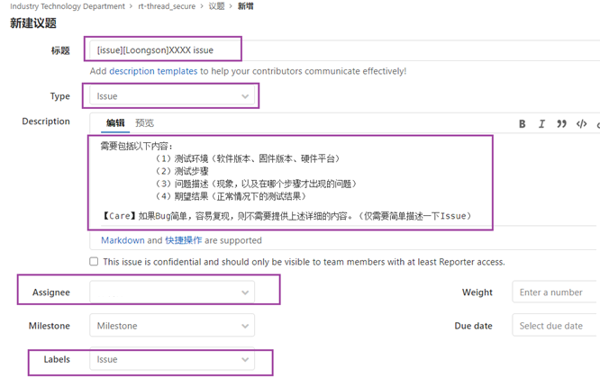
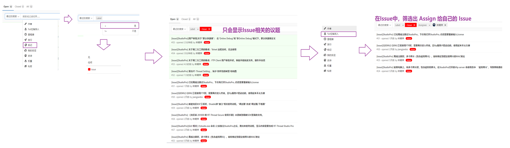

# Bug 管理-记录-追踪

# issue/bug 具体项目的管理流程

基本过程与 JIRA 工具的 issue/bug 处理过程一样。

## issue/bug 上报流程

### Step_01）Gitlab 的“议题”，上报 issue/bug

任何人（Reporter）发现一个 issue/bug。都可以在项目 Gitlab 的“议题”上，新建一个 issue/bug。

### Step_02）Gitlab 的“议题”，填写要求

如果提交的议题是 bug 的话，则
01.标题以[bug] [模块]，例如，发现了一个龙芯的Issue，则标题为：  [bug] [Loonson] XXXX问题

02.Type： 选择 "Issue (议题)"

03.Description: 需要包括以下内容：【Care】如果Bug简单，容易复现，则不需要提供下面的内容

（1）测试环境（软件版本、固件版本、硬件平台）    

（2）测试步骤 

（3）问题描述（现象，以及在哪个步骤才出现的问题）

（4）期望结果（正常情况下的测试结果）

04.Assignee： 选择 "Issue/Bug 负责人 "

05.Labels 标记： 选择“BUG”

### Step_03）负责人修完此Bug之后，需要做以下事情 

（1）在对应的 issue/bug 网页：简单描述issue/bug的 Root Cause、怎么修等   

（2）通知“Reporter （提此issue/bug 的人）” ，并提供新的环境（软硬件）   

（3）将此 issue/bug，Assign回Reporter，做验证测试。

### Step_04）Reporter 收到之后，开始做验证测试：

​    （1）验证测试通过，则可以 “关掉” 此 issue/bug

​    （2）验证测试失败，则 Assign 回 “issue/bug 负责人”，重修 issue/bug、重新验证"

## issue/bug Status

Status:   Open / Reject / Ongoing / Fixed /  Reopen 

## issue/bug Checklist

## issue/bug Checklist

| issue/bug Num. | issue/bug 描述                                   | Status | Assignee /Owner | Reporter | Issue Link |
| -------------- | ------------------------------------------------ | ------ | ------------------- | -------- | ---------- |
|                | [bug] [StudioPro] 龙芯 通过StudioPro下载固件失败 | Open   |                     |          |            |
|                |                                                  |        |                     |          |            |
|                |                                                  |        |                     |          |            |
|                |                                                  |        |                     |          |            |

## Gitlab Issue 使用 Tips

- 添加“过滤项”，只查看 `BUG` 相关议题，即 "Lables = BUG" 

  

