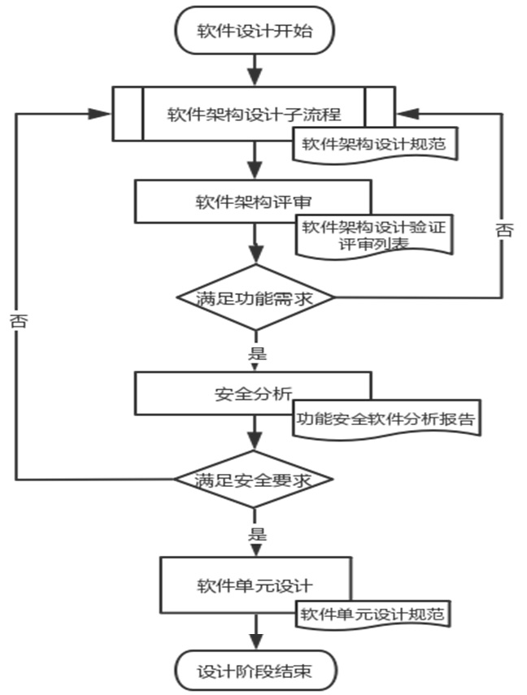
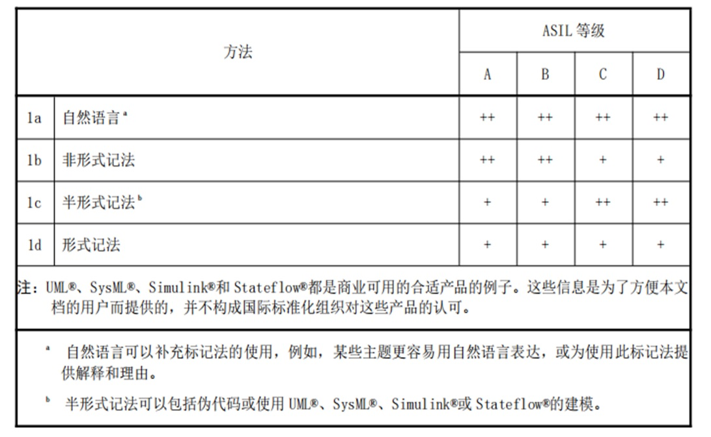
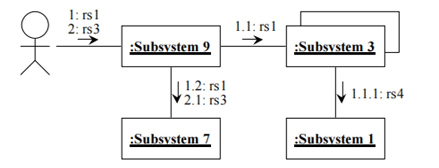

# 变更历史

| 版本 | 内容描述                                                     | 编制/日期             |
| :--- | ------------------------------------------------------------ | :-------------------- |
| v0.1 | 初稿。                                                       | Blues Lin  2022-05-17 |
| v0.2 | [add] 关键数据结构定义 [add]设计思路（降低系统的复杂度，提升可复用性、可维护性、可靠性、可测试性） [update] 架构设计原则、资源分配 | Blues Lin  2022-05-20 |

# 目录

[toc]

# ■■■■■■■■■■■■■■■■■■■■■■■■■■■■

# Architecture Guideline 软件架构指南

- 架构 architecture 用于识别结构模块及其边界和接口，并包括将要求分配给结构模块。

- 安全架构 safety architecture 用来实现安全要求的一系列要素以及它们之间的交互。

- 软件单元 software unit 是软件架构中的最低层级且可被独立测试的软件组件。

- 描述系统设计中的相关考虑，包括重要问题的思考、决策及其理由，注意图文并茂。

# ■■■■■■■■■■■■■■■■■■■■■■■■■■■■

# 架构概述

- 此部分简要描述架构，可放入系统架构图，内容主要是应用场景，功能概述等，描述与需求文档（或 SEooC） 中保持一致。

- 开发全新的功能安全软件产品或对现有产品进行重构，需要进行完善的软件系统功能安全设计。
- 对整个软件产品在多个层级进行设计，包括系统架构设计、组件设计、单元设计等。

## 软件架构设计阶段子流程

软件架构设计阶段子流程如下图所示：

## 功能安全软件设计流程

设计功能安全软件需要遵循功能安全软件设计流程，确保如下图所示：

## 架构表示方法

- 架构设计应当采用合适的表达方法，为了清晰的表达架构设计的意图，推荐使用下表中所列出的表达方法：

- 文案的表述原则是从简、有效，可遵循如下表达方法：
  - 适合用图形表达清楚的，就不要用长篇累牍的文字 （图形即文档），推荐使用 UML 来进行系统建模；
  - 图形不能完整表达关键意图的，一定要有补充文字说明；
  - 文案文本格式的要求如下：
  - 框图设计图、时序图等使用 UML 表达的设计推荐采用 Drawio 工具编辑，存档文件格式为 *.drawio.png；
  - API 和数据结构设计等其它文档，采用 WPS 工具编辑。
- 

## 架构设计原则

- 遵循 ISO26262:2018 标准 ASIL D 等级的软件架构设计原则，在架构设计过程中应当遵循下表中列出的原则：

  1. 软件组件的适当分层结构；

  2. 限制软件组件的规模和复杂度；

  3. 限制接口的规模；

  4. 每个组件内强内聚；
  5. 软件组件间松耦合；
  6. 恰当调度的特性；
  7. 限制中断的使用；
     - 例如，不允许用户进程直接使用中断，限制操作系统内核和HAL层使用中断
     - 使用中断时，需注册中断处理服务并使能该中断号
     - 只使用和使能最小必要中断（如：时钟节拍中断）
  8. 软件组件的适当空间隔离；
  9. 共享资源的适当管理。

## 架构的要求和建议

- 架构设计过程从整体系统开始描述，逐步细化到软件单元，设计良好的架构应该具有如下特征：
  - 可理解性；
  - 一致性；
  - 简单性；
  - 可验证性；
  - 模块化；
  - 抽象性；
  - 封装性；
  - 可维护性。
- 架构设计时应当避免过高的复杂度，避免设计难于理解和实施，过高的复杂度指的是如下情况：
  - 高度分支化的控制流或数据流； 
  - 分配给单个设计要素的要求过多； 
  - 某个设计要素的接口过多或设计要素之间的交互性过多； 
  - 参数类型复杂或过多； 
  - 全局变量过多； 
  - 难以为错误探测和处理的合适性和完整性提供证据； 
  - 难以达到要求的测试覆盖率；
  - 只有少数专家或项目参与者能够理解。

## 设计思路

为了降低系统的复杂度，提升可复用性、可维护性、可靠性、**可测试性**，采用如下设计思想和原则：

- 机制和策略分离。
  - 通过 “隔离变化”，将不易变的部分和易变的部分分离。
  - 机制是不易变的部分，表示实现某一功能的具体执行方式，为更上层提供各种服务。例如，常用基础组件。
  - 策略是易变的部分，通过机制的参数化将易变部分由用户来决定，以实现功能的优化或变化。例如，软件包。
- 模块化。
  - 采用 “分而治之” 的思想，将系统分解为一系列模块（或子系统），模块之间通过明确定义的接口进行交互。
  - 每个模块完成操作系统的一部分功能，组合起来完成操作系统的全部功能。
  - 模块的分解需遵循高内聚、低耦合的原则，使得模块具有独立性。
  - 每个模块负责单一职责，对应一个业务概念或业务领域，如果模块功能较为复杂，必须拆解成多个子模块。

- 抽象和封装。
  - 在模块化的基础上，将接口与内部实现分离。
  - 从而使得模块之间只需通过抽象的接口进行相互调用，而无须关心各个模块的内部实现。
- 分层。
  - 将模块按照一定的原则进行层次的划分，约束每层内部模块间的交互方式与跨层次模块的交互方式，从而有效地减少模块之间的交互。
  - 通常情况下，一个模块只能和同层模块以及相邻的上层或下层模块进行交互，而不能跨一层和再上一层或再下一层的模块进行交互（如有必要，使用回调函数）。
- 层级。
  - 将一些功能相近的模块组成一个具有清晰接口的自包含子系统。
  - 然后，再将这些子系统聚合组成一个具有清晰接口的更大子系统。

- 鲁棒性
  - 函数形参须进行必要检查。
  - 函数调用返回结果需进行判断和处理。
  - 多使用断言和跟踪点等手段对执行流程进行检查。
- 采用防御式编程方法。
  - 在函数入口处检查输入参数的类型和取值范围。
  - 调用有返回值的函数时都需检查其返回值。
- 应用失效断言编程方法
  - 在所有可能的位置，访问重要数据前，检查重要数据是否有不可修复的错误。
  - 检测到不可修复错误时，采用失效断言，尽可能收集和保存故障现场信息，然后使系统进入安全状态。
- 采用面向对象的设计方法
  - 设备驱动
- 采用编译的代码编程规则、软件编程指南、统一的编程风格。
- 可测试性
  - 可测试性，函数体单进单出，没有无条件跳转，无隐藏数据流。

- 可维护性
  - 可维护性，具有良好且统一的编码风格，代码嵌套不应超过三层，单个函数体不应超过屏幕的一屏，避免重复代码。

# ■■■■■■■■■■■■■■■■■■■■■■■■■■■■

# 软件架构设计

- 软件架构设计使得软件需求的实现过程以一种完整的、正确的同时尽可能简单、可理解和可验证的方式展现，从而在软件需求的实现过程中，尽可能降低由于设计错误造成违反功能安全需求的可能性。

- 在软件架构设计过程中要时刻关注两个问题：
  - 软件架构中每个软件模块与对应的软件需求之间的关系。
  - 软件架构中与同一条或者一组需求的相关软件模块的集合在一起是否完整、正确地执行了对应的软件需求，这些模块之间有没有内在矛盾、重复、需求执行的遗漏等。这样才能保证对需求执行的完整性和正确性。

- 为了在软件架构设计过程中能够充分考虑上述两个问题，需要从静态和动态两个维度去考虑软件架构设计。

## 静态架构设计

### 软件架构的静态设计内容

- 软件架构的层次结构；
- 软件需求在各个模块上的分配；
- 各个层次的软件模块之间的接口以及系统外部接口；
- 接口的 ASIL 等级和模块的 ASIL 等级；
- 明确各模块是新开发、全部复用，修改的复用；
- 必须的全局变量与关键数据结构。（架构阶段不应该有全局变量和一些数据结构）。

- 架构的静态结构可以从多个角度，使用多种图示来表达，将在后续内容中详细描述。

### 系统组成示图

- 系统组成图描述了系统如何由子系统组成，可以使用高亮来突出新的子系统或者复用的子系统；

- 除表达组合关系之外的图，最好在单独的图中表示；

- 使用 UML 类图将系统、域和子系统建模为特定的类。如下图所示：

  

- 还可以使用框图来表达系统架构，如下图所示：

  

### 子系统示图

- 子系统原理图用于描述子系统之间以及子系统和域之间的关系；

- 可以使用多个单独示图给出系统的不同视图；

- 使用 UML 类图表示法将系统、域和子系统建模为特定的类；

- 使用动词来表示关系，名词来表示角色，每个关联行至少具有关联标识符或角色标识符。

  

### 子系统依赖关系图

- 子系统依赖关系图显示了子系统之间、子系统和域之间、以及域之间的依赖关系；

- 每个单独的图可以关注系统的不同视角；

- 使用 UML 类图表示法将系统、域和子系统建模为特定类。

  

## 关键数据结构定义

使用统一的编程风格。使用统一的数据结构。

### 基础数据结构

- 常用的数据类型
  - 常用的数据类型，最好再重新封装一遍，以防移植到不同架构的处理器，出现数据类型转换的问题。
  - 例如，typedef unsigned int  u32;  

### 关键的数据结构

- 例如，定时器结构 struct s_timer

### 全局变量

- 模块化设计，尽量少用全局变量。
- 如果需要全局变量，最好分类，放到同一类的结构体里面。（这样做的好处，代码就是注释！）

### 宏定义

- 特别是全局的宏、模块使能宏、状态值的宏，可以先定义出来。

- 例如，状态值的宏或枚举，后续所有的模块，可以共用同样的状态。

- | **标识**       | **数值** | **含义**     |
  | -------------- | -------- | ------------ |
  | STATUS_UNINIT  | 0x00U    | 未初始化状态 |
  | STATUS_INIT    | 0x01U    | 已初始化状态 |
  | STATUS_READY   | 0x02U    | 准备就绪状态 |
  | STATUS_RUNNING | 0x03U    | 正在运行状态 |
  | STATUS_ERROR   | 0xFFU    | 错误状态     |

## 架构接口定义

此部分详细描述架构设计中的接口信息，主要包括如下内容：

1. 系统对外的接口设计与说明；

2. 内部子系统之间的说明；

3. 接口所处的位置，明确调用者和实现者；

4. 接口对外的方法和数据。

### 接口示图

- 接口图显示一组接口，每个接口包含一组提供相关服务的接口操作。这些操作在界面操作表中进行了描述（必要时由活动图补充）。

- 在架构层面需要详细描述系统对外的接口以及子系统之间的交互接口。

- 根据实际情况描述系统接口，对于接口还应提供文字描述。

  

  

## 动态架构设计

### 软件架构的动态设计内容

- 软件模块间的调度顺序和调度时间，以及完整功能链路在运行时间上的符合程度；

- 根据架构设计实际情况，本着使架构描述更清晰的原则，描述软件模块间的数据流和控制流，确保其以及完整功能链路数据流的正确性和完整性；
- 外部资源依赖关系，比如 CPU Load、ROM、RAM 等资源的占有率和分配，以及存储空间分配等。

### 子系统协作图

- 示意图应当包含参与者实例、子系统实例以及其链接；

- 显示每个用例所涉及的子系统以及调用顺序；

- 将两个子系统之间的关联显示为序列中下一个相关子系统的责任；

- 可以使用对事件流的文本解释来补充说明；

- 由 UML 交互图表示（最好是协作图），应用于子系统的实例（被建模为特定的类）。

  

### 子系统交互图

- 在架构设计层面，以序列图的形式描述用户使用场景，显示出用户与各子系统所有可能重要的或复杂的交互场景。

- 图中展示了用户如何与子系统进行交互，使用了哪些操作，传递了哪些数据与消息，最终实现了哪个需求所要求的功能。

  

### 子系统状态图

可以使用状态图来描述子系统根据不同的动作来进行的状态转换。

### 子系统流程图

可以使用流程图来表示系统运行的逻辑流程，如顺序、分支、循环等。

## 执行与更新

架构文档的落地执行与迭代更新应遵循如下要求：

- 架构设计工作与落地实施（编码）之间，需要平衡各种情况，互相修正；
- 实施时有细微调整的，需及时反馈到设计文档；
- 实施时有疑似需要重大调整的，需进行架构评审，通过后方能更改架构并继续实施。

## 关键控制点

- 软件架构设计要能确保涵盖所有功能安全要求，如果软件架构没有完全涵盖功能安全需求，将导致最终的产品不能达到目标ASIL等级。

- 对架构设计要进行详尽的安全分析，识别所有失效模式及风险点，并采用合理的安全机制，保证架构的可靠性。

# ■■■■■■■■■■■■■■■■■■■■■■■■■■■■

# 安全分析方法

- 下图展示了安全分析与软件架构的关系，初步架构设计完成后，对架构进行安全分析，找出架构设计中可能导致功能安全无法被满足的缺点，进而完善架构，使其可以完整地满足安全需求。

- 详细安全分析方法可参考《[软件架构的安全分析_FMEA_FTA_DFA.md](doc/软件架构的安全分析_FMEA_FTA_DFA/软件架构的安全分析_FMEA_FTA_DFA.md)》。

- 安全分析与架构关系图

  

# ■■■■■■■■■■■■■■■■■■■■■■■■■■■■

# 模块（子系统）详细设计

在子系统的设计中，更加关注与子系统内部的功能及实现，同样可使用上述架构的静态设计和动态设计的表示方法，但在子系统详细设计中会给出该子系统更加细节的描述。例如模块内的静态动态设计，模块内使用的 API 等内容。

## 模块（子系统）编号规则

- 模块（子系统）编号规则

- 注意：具体项目可根据具体情况，修改（重命名、新增、删除）“模块属性”和“子模块属性”。

- 编号实例

  | 类别          | 功能属性         | 模块属性/子模块属性   | 流水号 | 编号实例                                                     |
  | ------------- | ---------------- | --------------------- | ------ | ------------------------------------------------------------ |
  | 软件架构  AT- | 非功能安全  NSR- | 应用层  APP-          | 001    | AT-NSR-APP-001                                               |
  | 软件架构  AT- | 功能安全  SR-    | 内核-线程  OS-Thread- | 001    | AT-SR-OS-Thread-001  AT：软件架构设计 SR: 属于功能安全类  OS-Thread：属于OS（模块） 001：流水号 |
  | 软件架构  AT- | 功能安全  SR-    | 安全目标  SafetyGoal- | 001    | AT-SR-SafetyGoal-001 AT：软件架构设计 SR: 属于功能安全类 SafetyGoal：属于安全目标 001：流水号 |

## Xxx 模块设计

### 模块功能

#### 功能模块 01

#### 功能模块 02

### 模块静态设计

可参考设计流程中的静态设计示例。

### 模块动态设计

可参考设计流程中的动态设计示例。

### 模块接口设计

## Yyy 模块设计

### 模块功能

#### 功能模块 01

#### 功能模块 02

### 模块静态设计

可参考设计流程中的静态设计示例。

### 模块动态设计

可参考设计流程中的动态设计示例。

### 模块接口设计

# ■■■■■■■■■■■■■■■■■■■■■■■■■■■■

# 架构的验证

架构的验证使用评审的方式，主要由架构师、软件工程师、项目经理以及安全经理参与，验证过程遵循验证流程，验证活动后需出具相应的评审报告。

# ■■■■■■■■■■■■■■■■■■■■■■■■■■■■

# 资源分配

- 此部分描述系统的资源使用和分配情况。

- 架构设计应当对时间资源（FTTI）、空间资源、资源使用等方面进行仔细考虑，给出合理的资源使用情况说明。

- 例如，

  | 资源项         | 占用情况                           | 备注 / 注意事项 |
  | -------------- | ---------------------------------- | --------------- |
  | CPU 利用率     | 小于 x% 的 CPU 利用率              |                 |
  | RAM            | 小于 x MB 或 Bytes                 | RAM 分配表      |
  | Flash          | 小于 x MB 或 Bytes                 | Flash 分配表    |
  | 定时器         | 使用 x 个 Timer，各用于什么用途    |                 |
  | 看门狗         | 是否使用                           |                 |
  | 通信接口：UART | 参数配置，用到哪些中断，是否用 DMA |                 |
  | 通信接口：SPI  | 参数配置，用到哪些中断，是否用 DMA |                 |
  | 通信接口：I2C  | 参数配置，用到哪些中断，是否用 DMA |                 |

  

# ■■■■■■■■■■■■■■■■■■■■■■■■■■■■

# 软件开发环境

如果软件是被放在一个特定的系统里面执行，则需要对系统进行描述。例如，硬件平台说明，软件开发的系统环境、开发工具、编译工具链，以及测试相关的环境和工具等。

# ■■■■■■■■■■■■■■■■■■■■■■■■■■■■

# 追溯表

- 向前追溯到上一级：软件需求（每个具体需求对应的编号）
- 当前模块：软件架构（每个架构设计模块，也有相应的编号）
- 向后追溯到下一级：软件单元设计（每个软件单元设计，同样有相应的编号）

| **软件需求编号**     | **软件需求简述** | **架构设计模块编号** |
| -------------------- | ---------------- | -------------------- |
| SRS-SR-OS-Thread-001 | XXX              | AT-SR-OS-Thread-001  |
| SRS-SR-OS-Thread-002 | XXX              |                      |
| SRS-SR-OS-Task-001   | XXX              | AT-SR-OS-Task-001    |
|                      |                  |                      |

- 软件生命周期中，完整的追溯链：产品需求（或 SEooC 需求）-->软件需求-->架构设计-->单元设计-->单元测试-->集成测试-->系统测试。
- 完整的追溯链，可以通过以下两种方法进行查阅。
  - 方法一：通过线下的文档来追溯：例如，可通过《需求跟踪矩阵表》类似的 excel 文档。
  - 方法二：通过线上的配置管理工具来追溯（图形化展示）：例如，DOORS、Polarion、CollabNet、Jama Contour、LDRA 等。

# ■■■■■■■■■■■■■■■■■■■■■■■■■■■■

# 扩展阅读

- 《[软件架构的安全分析_FMEA_FTA_DFA.md](doc/软件架构的安全分析_FMEA_FTA_DFA/软件架构的安全分析_FMEA_FTA_DFA.md)》
- 
