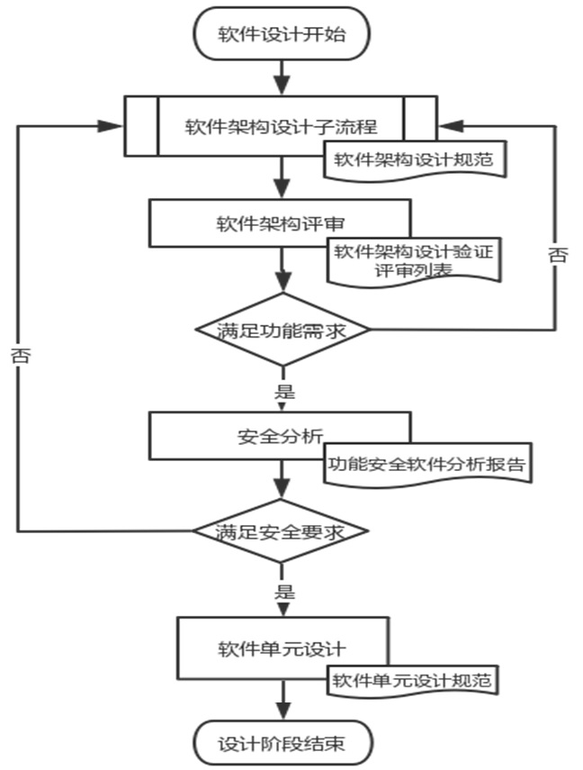
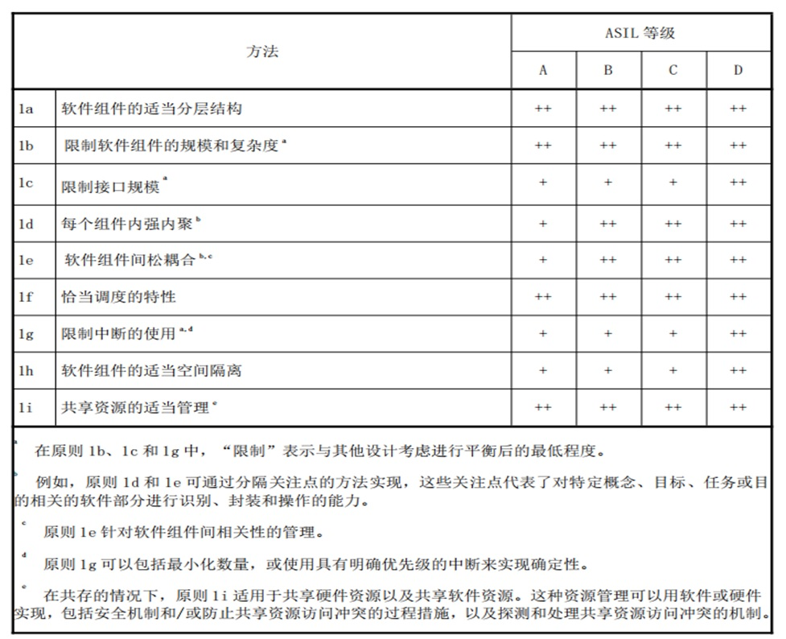
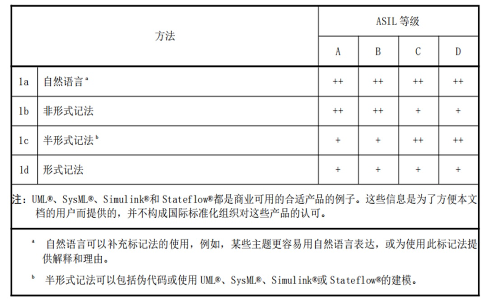

# Software Architecture 软件架构

架构 architecture 用于识别结构模块及其边界和接口，并包括将要求分配给结构模块。

安全架构 safety architecture 用来实现安全要求的一系列要素以及它们之间的交互。

软件单元software unit 是软件架构中的最低层级且可被独立测试的软件组件。

描述系统设计中的相关考虑，包括重要问题的思考、决策及其理由，注意图文并茂。

# 架构概述

此部分简要描述架构，可放入系统架构图，内容主要是应用场景，功能概述等，描述与 SEooC 中保持一致。

开发全新的功能安全软件产品或对现有产品进行重构，需要进行完善的软件系统功能安全设计。对整个软件产品在多个层级进行设计，包括系统架构设计、组件设计、单元设计等。

## 功能安全软件设计流程

设计功能安全软件需要遵循功能安全软件设计流程，确保如下图所示：

## 软件架构设计阶段子流程

软件架构设计阶段子流程如下图所示：

# 软件架构设计

- 软件架构设计使得软件需求的实现过程以一种完整的、正确的同时尽可能简单、可理解和可验证的方式展现，从而在软件需求的实现过程中，尽可能降低由于设计错误造成违反功能安全需求的可能性。

- 在软件架构设计过程中要时刻关注两个问题：
  - 软件架构中每个软件模块与对应的软件需求之间的关系。
  - 软件架构中与同一条或者一组需求的相关软件模块的集合在一起是否完整、正确地执行了对应的软件需求，这些模块之间有没有内在矛盾、重复、需求执行的遗漏等。这样才能保证对需求执行的完整性和正确性。

- 为了在软件架构设计过程中能够充分考虑上述两个问题，需要从静态和动态两个维度去考虑软件架构设计。

## 架构设计原则

- 为了保证系统的可靠性，在架构设计过程中应当遵循下表中列出的原则：

  

## 架构的要求和建议

- 架构设计过程从整体系统开始描述，逐步细化到软件单元，设计良好的架构应该具有如下特征：
  - 可理解性；
  - 一致性；
  - 简单性；
  - 可验证性；
  - 模块化；
  - 抽象性；
  - 封装性；
  - 可维护性。
- 架构设计时应当避免过高的复杂度，避免设计难于理解和实施，过高的复杂度指的是如下情况：
  - 高度分支化的控制流或数据流； 
  - 分配给单个设计要素的要求过多； 
  - 某个设计要素的接口过多或设计要素之间的交互性过多； 
  - 参数类型复杂或过多； 
  - 全局变量过多； 
  - 难以为错误探测和处理的合适性和完整性提供证据； 
  - 难以达到要求的测试覆盖率；
  - 只有少数专家或项目参与者能够理解。

## 架构表示方法

- 架构设计应当采用合适的表达方法，为了清晰的表达架构设计的意图，推荐使用下表中所列出的表达方法：

- 文案的表述原则是从简、有效，可遵循如下表达方法：
  - 适合用图形表达清楚的，就不要用长篇累牍的文字 （图形即文档），推荐使用 UML 来进行系统建模；
  - 图形不能完整表达关键意图的，一定要有补充文字说明；
  - 文案文本格式的要求如下：
  - 框图设计图、时序图等使用 UML 表达的设计推荐采用 Drawio 工具编辑，存档文件格式为 *.drawio.png；
  - API 和数据结构设计等其它文档，采用 WPS 工具编辑。
- 

