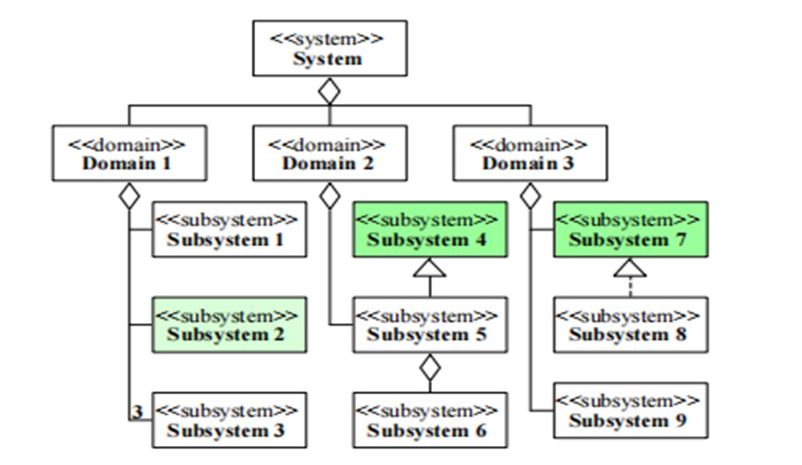
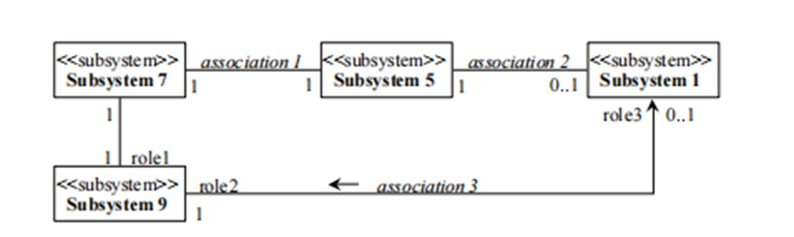
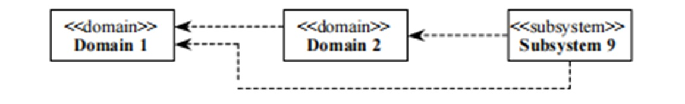
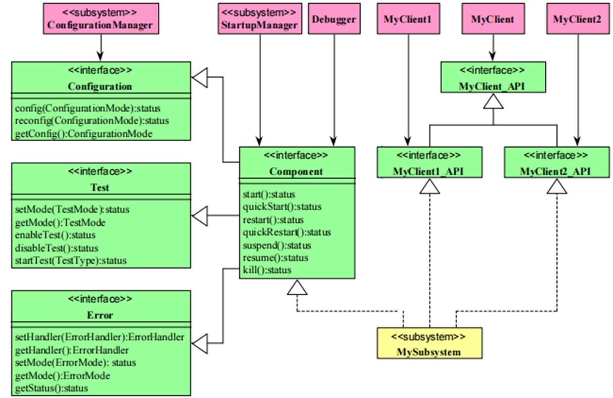

# Software Architecture 软件架构

架构 architecture 用于识别结构模块及其边界和接口，并包括将要求分配给结构模块。

安全架构 safety architecture 用来实现安全要求的一系列要素以及它们之间的交互。

软件单元software unit 是软件架构中的最低层级且可被独立测试的软件组件。

描述系统设计中的相关考虑，包括重要问题的思考、决策及其理由，注意图文并茂。

# 架构概述

此部分简要描述架构，可放入系统架构图，内容主要是应用场景，功能概述等，描述与 SEooC 中保持一致。

开发全新的功能安全软件产品或对现有产品进行重构，需要进行完善的软件系统功能安全设计。对整个软件产品在多个层级进行设计，包括系统架构设计、组件设计、单元设计等。

## 功能安全软件设计流程

设计功能安全软件需要遵循功能安全软件设计流程，确保如下图所示：

## 软件架构设计阶段子流程

软件架构设计阶段子流程如下图所示：

# 软件架构设计

- 软件架构设计使得软件需求的实现过程以一种完整的、正确的同时尽可能简单、可理解和可验证的方式展现，从而在软件需求的实现过程中，尽可能降低由于设计错误造成违反功能安全需求的可能性。

- 在软件架构设计过程中要时刻关注两个问题：
  - 软件架构中每个软件模块与对应的软件需求之间的关系。
  - 软件架构中与同一条或者一组需求的相关软件模块的集合在一起是否完整、正确地执行了对应的软件需求，这些模块之间有没有内在矛盾、重复、需求执行的遗漏等。这样才能保证对需求执行的完整性和正确性。

- 为了在软件架构设计过程中能够充分考虑上述两个问题，需要从静态和动态两个维度去考虑软件架构设计。

## 架构设计原则

- 为了保证系统的可靠性，在架构设计过程中应当遵循下表中列出的原则：

  

## 架构的要求和建议

- 架构设计过程从整体系统开始描述，逐步细化到软件单元，设计良好的架构应该具有如下特征：
  - 可理解性；
  - 一致性；
  - 简单性；
  - 可验证性；
  - 模块化；
  - 抽象性；
  - 封装性；
  - 可维护性。
- 架构设计时应当避免过高的复杂度，避免设计难于理解和实施，过高的复杂度指的是如下情况：
  - 高度分支化的控制流或数据流； 
  - 分配给单个设计要素的要求过多； 
  - 某个设计要素的接口过多或设计要素之间的交互性过多； 
  - 参数类型复杂或过多； 
  - 全局变量过多； 
  - 难以为错误探测和处理的合适性和完整性提供证据； 
  - 难以达到要求的测试覆盖率；
  - 只有少数专家或项目参与者能够理解。

## 架构表示方法

- 架构设计应当采用合适的表达方法，为了清晰的表达架构设计的意图，推荐使用下表中所列出的表达方法：

- 文案的表述原则是从简、有效，可遵循如下表达方法：
  - 适合用图形表达清楚的，就不要用长篇累牍的文字 （图形即文档），推荐使用 UML 来进行系统建模；
  - 图形不能完整表达关键意图的，一定要有补充文字说明；
  - 文案文本格式的要求如下：
  - 框图设计图、时序图等使用 UML 表达的设计推荐采用 Drawio 工具编辑，存档文件格式为 *.drawio.png；
  - API 和数据结构设计等其它文档，采用 WPS 工具编辑。
- 

## 静态架构设计

### 软件架构的静态设计内容

- 软件架构的层次结构；
- 软件需求在各个模块上的分配；
- 各个层次的软件模块之间的接口以及系统外部接口；
- 接口的ASIL等级和模块的ASIL等级；
- 明确各模块是新开发、全部复用，修改的复用；
- 必须的全局变量与关键数据结构。（架构阶段不应该有全局变量和一些数据结构）。

- 架构的静态结构可以从多个角度，使用多种图示来表达，将在后续内容中详细描述。

### 系统组成示图

- 系统组成图描述了系统如何由子系统组成，可以使用高亮来突出新的子系统或者复用的子系统；

- 除表达组合关系之外的图，最好在单独的图中表示；

- 使用 UML 类图将系统、域和子系统建模为特定的类。如下图所示：

  

- 还可以使用框图来表达系统架构，如下图所示：

  

### 子系统示图

- 子系统原理图用于描述子系统之间以及子系统和域之间的关系；

- 可以使用多个单独示图给出系统的不同视图；

- 使用 UML 类图表示法将系统、域和子系统建模为特定的类；

- 使用动词来表示关系，名词来表示角色，每个关联行至少具有关联标识符或角色标识符。

  

### 子系统依赖关系图

- 子系统依赖关系图显示了子系统之间、子系统和域之间、以及域之间的依赖关系；

- 每个单独的图可以关注系统的不同视角；

- 使用 UML 类图表示法将系统、域和子系统建模为特定类。

  

## 架构接口定义

此部分详细描述架构设计中的接口信息，主要包括如下内容：

1. 系统对外的接口设计与说明；

2. 内部子系统之间的说明；

3. 接口所处的位置，明确调用者和实现者；

4. 接口对外的方法和数据。

### 接口示图

- 接口图显示一组接口，每个接口包含一组提供相关服务的接口操作。这些操作在界面操作表中进行了描述（必要时由活动图补充）。

- 在架构层面需要详细描述系统对外的接口以及子系统之间的交互接口。

- 根据实际情况描述系统接口，对于接口还应提供文字描述。

  

  

## 动态架构设计

### 软件架构的动态设计内容

- 软件模块间的调度顺序和调度时间，以及完整功能链路在运行时间上的符合程度；

- 根据架构设计实际情况，本着使架构描述更清晰的原则，描述软件模块间的数据流和控制流，确保其以及完整功能链路数据流的正确性和完整性；
- 外部资源依赖关系，比如 CPU Load、ROM、RAM 等资源的占有率和分配，以及存储空间分配等。

### 子系统协作图

- 示意图应当包含参与者实例、子系统实例以及其链接；

- 显示每个用例所涉及的子系统以及调用顺序；

- 将两个子系统之间的关联显示为序列中下一个相关子系统的责任；

- 可以使用对事件流的文本解释来补充说明；

- 由 UML 交互图表示（最好是协作图），应用于子系统的实例（被建模为特定的类）。

  

### 子系统交互图

- 在架构设计层面，以序列图的形式描述用户使用场景，显示出用户与各子系统所有可能重要的或复杂的交互场景。

- 图中展示了用户如何与子系统进行交互，使用了哪些操作，传递了哪些数据与消息，最终实现了哪个需求所要求的功能。

  

### 子系统状态图

可以使用状态图来描述子系统根据不同的动作来进行的状态转换，例如下图描述了一个子系统的状态转换情况：

### 子系统流程图

可以使用流程图来表示系统运行的逻辑流程，如顺序、分支、循环等。

