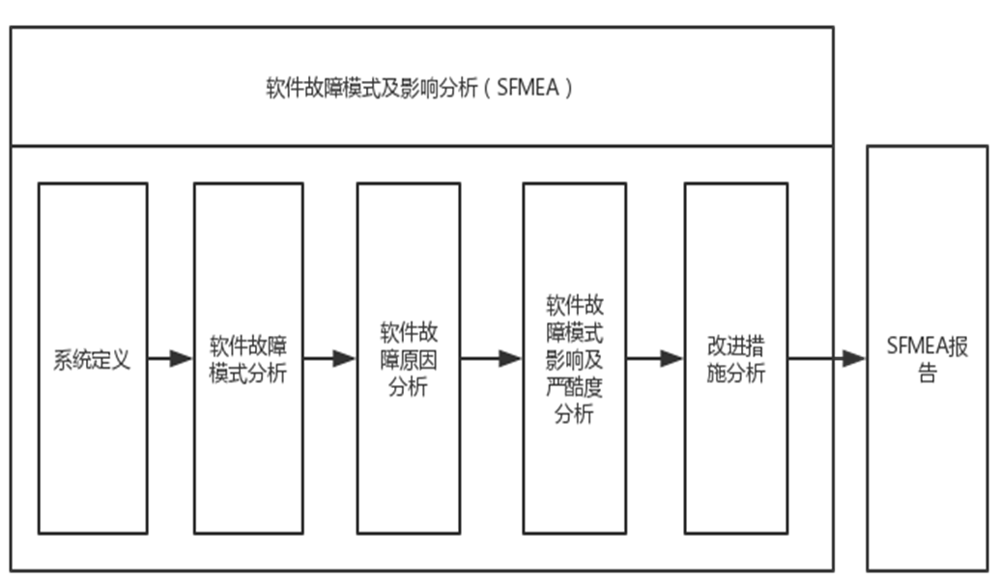
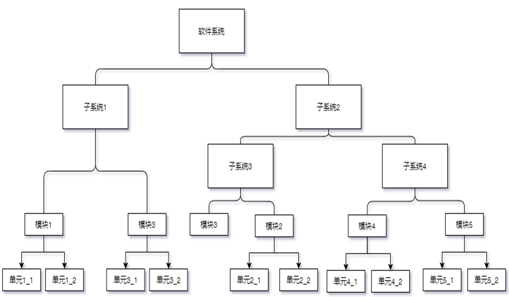
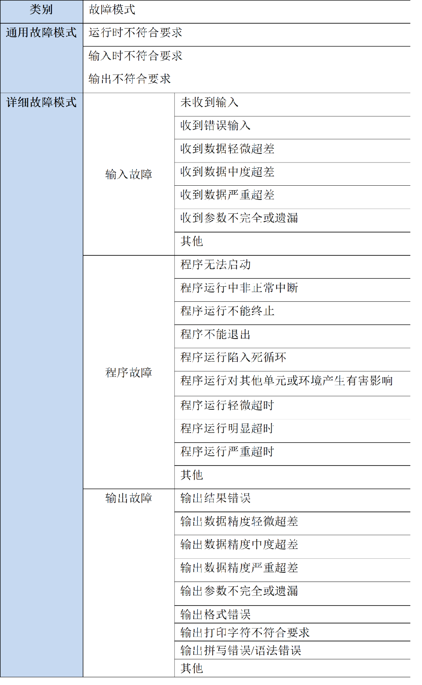
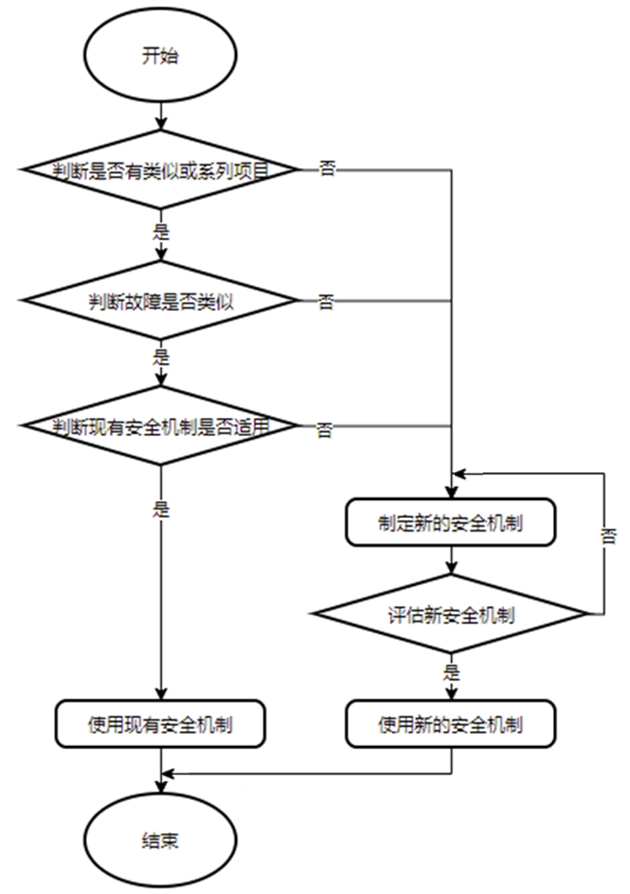

# 目录

[toc]

# ■■■■■■■■■■■■■■■■■■■■■■■■■■■■

# 软件架构的安全分析_FMEA_FTA_DFA

## 安全分析

- 软件架构安全分析是指通过使用安全分析的方法，如 FMEA 或 FTA，对实现安全需求的软件架构的可靠性及功能逻辑进行分析。

- 判断是否有某些原因导致安全需求及功能逻辑无法实现，针对各个原因制定相应的安全机制/措施。

- 检验架构设计需求及其安全目标，确定违背安全目标的条件和原因，制定对应的安全机制，确定这些机制是否满足功能安全要求。

## 安全分析方法

- 通过使用软件故障模型的方式，来实现对软件架构的安全分析和相关失效分析。
- 软件故障模型的方式包括：定性分析方法 FMEA 和定性/定量分析法 FTA。
- DFA 的全称为 Dependent Failure Analysis（相关失效分析），属于软件架构安全分析方法的一种。相较于 FMEA 和 FTA 这两种安全分析方法，DFA 更侧重于从宏观层面上分析系统中不同模块失效模式的关联关系。

# ■■■■■■■■■■■■■■■■■■■■■■■■■■■■

# FMEA 安全分析方法

- FMEA 失效模式与影响分析 Failure Mode and Effects Analysis 

- FMEA 是针对技术风险，对产品开发和生产流程中进行预防性质量管理的一种分析方法。

  FMEA 有助于及时识别和评估系统或产品使用过程中所有可能的风险，并制定和实施适当的措施以优化产品开发和生产环节的质量控制以降低故障可能性和成本。

- 软件上的 FMEA 是指在软件开发阶段的早期，通过识别软件故障模式，研究分析各种故障模式产生的原因及其造成的后果，寻找消除和减少其有害后果的方法，以尽早发现潜在的问题，并采取相应的措施，从而提高软件的可靠性和安全性。

- SFMEA 软件失效模式与影响分析 Software Failure Mode and Effects Analysis 

- 软件 SFMEA 实施步骤

  

## 系统定义

- 系统定义分为两部分：绘制软件功能框架图和定义软件约定层次结构。

- 绘制软件需求框架图

  - 在进行软件架构设计时，需要把安全需求和实现该安全需求的系统或子系统的对应关系通过框图表现出来。
  - 这样有利于软件故障影响的分析，具体可以参考软件架构设计的对应关系。

- 定义软件约定层次结构

  - 软件由系统、子系统、模块和单元组成。

  - 定义软件约定层次结构就是通过一种方式将软件的结构形式表示出来。

  - 在这个结构中，需要定义最低约定层次，FMEA 的分析对象就是最低约定层次。

  - 现在假设有一个软件系统，其约定层次如图所示，该图中将最低的约定层次结构定义为每个模块的相关单元。

  - 软件层次结构

    

## 软件故障模式分析

- 软件故障模式是软件故障的表现形式。

- 软件故障模式分析的目的是通过对软件最低约定层次分析，找出所有可能的故障模式。

- 在这个阶段，故障模式既可以自己定义，也可以通过以前的故障数据得来。

- 软件故障模式分类

  

  

## 软件故障原因分析

- 对每个软件故障模式分析其所有可能的原因。

- 软件的故障原因往往是软件开发过程中形成的各类缺陷所引起的。

- 软件故障原因可以按缺陷进行分类，如表所示，大概的分类有 6 种。

  | 软件缺陷类型       | 详细的软件缺陷                                               | 备注                        |
  | ------------------ | ------------------------------------------------------------ | --------------------------- |
  | 需求缺陷           | 软件需求指定不合理或不正确； 需求不完全； 有逻辑错误； 需求分析文档有误。 |                             |
  | 功能和性能缺陷     | 功能和性能规定有误； 遗漏功能或有冗余功能； 为用户提供信息有错或不确切； 对异常情况处理有误； 功能无法实现或性能不达标 。 | 属最普遍、最值 得重视的缺陷 |
  | 软件结构缺陷       | 程序控制或控制顺序有误； 处理过程有误； 结构设计不完全。 | 同第  2 项                  |
  | 数据缺陷           | 数据定义或数据结构有误； 数据存取或操作有误； 变量缩放比率或单位不正确； 数据范围不正确； 数据错误或丢失； 寄存器故障； 总线错误。 | 同第  2 项                  |
  | 软件实现和编码缺陷 | 编码或按键有误； 违背编码风格要求或标准； 语法错误； 数据名错； 局部变量与全局变量混淆。 |                             |
  | 软/硬件接口缺陷    | 软件内部接口、外部接口有误； 软件各相关部分在时间配合或数据吞吐等方面不协调； I/O 时序错误导致数据丢失。 |                             |

## 软件故障影响及严重度分析

- 该阶段分为两部分，一部分是对故障造成的影响进行分析，另一部分是确定该影响的严重度。

- 影响分析

  - 必须分析每个软件故障模式对系统的安全需求影响，考虑软件系统自身的复杂性，其故障可以分为局部影响、高一层次影响和最终影响。
  - 基于软件的特殊性，在分析影响时可直接分析最终影响，去掉高一层次影响。

- 严重度分析

  - 根据每个软件故障模式影响的严重度划分其严重度等级。

  - 具体的严重度分级参考表格：

  - 

  - | **软件故障模式影响发生的可能性** | **软件故障模式影响的严重程度**                               | **评分等级** |
    | -------------------------------- | ------------------------------------------------------------ | ------------ |
    | 极高且无警告提示                 | 影响系统运行的安全性，或不符合功能安全要求，且不能发出警告。 | 10           |
    | 极高但有警告提示                 | 影响系统运行的安全性，或不符合功能安全要求，但能发出警告。   | 9            |
    | 非常高                           | 影响系统丧失主要功能而不能运行。                             | 8            |
    | 高                               | 系统仍能运行，但运行水平降级，用户不满意。                   | 7            |
    | 中等                             | 系统仍能运行，但丧失使用的方便与舒适性。                     | 6            |
    | 低                               | 系统仍能运行，但影响使用的方便与舒适性。                     | 5            |
    | 较低                             | 影响轻度。                                                   | 4            |
    | 非常次要的                       | 影响轻微。                                                   | 3            |
    | 极次要的                         | 影响极小。                                                   | 2            |
    | 无                               | 无影响。                                                     | 1            |

## 安全机制评估

- 分析出软件故障模式的原因、影响及严重度等级之后，需要根据实际情况提出有针对性的安全机制。

- 安全机制评估流程图

  

  - 判断项目
    - 判断项目是全新项目还是系列项目，或者以前是否做过类似项目；
    - 如果是新项目，重新制定安全机制；
    - 如果是系列项目或有类似项目，则可以判断故障模式。

  - 判断故障模式
    - 建立在系列项目或之前有类似项目的基础上，判断两个项目之间的故障模式的形成原因，影响力度等是否类似或相同；
    - 如果否定，需要重新制定安全机制；
    - 如果肯定，则需要对现有安全机制进行判断。
  - 判断现有安全机制
    - 需要判断现有的安全机制是否能约束当前项目的故障；
    - 如果不行，需要重新制定安全机制；
    - 如果可以，则可以直接使用现有的安全机制。
  - 评估新安全机制
    - 需要评估新制定的安全机制；
    - 如果评估通过则使用新的安全机制；
    - 否定则需要重新制定安全机制在来评审，直到新安全机制通过。

## 生成文档及评审

生成安全分析报告。

# ■■■■■■■■■■■■■■■■■■■■■■■■■■■■

# FTA 安全分析方法

- FTA 故障树分析 Fault Tree Analysis 
- FTA 的分析过程从软件功能安全需求出发，从软件架构设计中所有软件模块和软件接口故障模式中去寻找和当前软件功能安全需求相关的故障模式，并且识别出这些故障模式和当前软件功能安全需求的相关性。
- FTA 是以一个不希望的系统故障事件作为分析的目标，通过由上向下的严格按层次的故障因果逻辑分析，逐层找出故障事件必要而充分的直接原因，最终找出导致事件发生的所有原因和原因组合。在具有基础数据时计算出顶事件发生概率和底事件重要度等定量指标。

## 故障树

- 故障树是一种特殊的倒立树状逻辑因果关系图，用事件符号、逻辑符号和转移符号描述了系统中各个事件之间的因果关系。
- 树的种类有很多种：
  - 两状态故障树：故障树的底事件描述一种状态，其逆事件也只描述一种状态，则称为两状态故障树。
  - 多状态故障树：底事件描述一种状态，其逆事件包含两种或两种以上互不相容的状态，并且在故障树中出现了上述的两种或两种以上状态的底事件，则称为多状态故障树。
  - 规范化故障树：将画好的故障树中的各种特殊事件和特殊门进行转换或删减，变成仅含底事件、结果事件以及与或非三种逻辑门的故障树，这种就是规范化故障树。

## 故障树分析

- 故障树分析：基于安全目标和假定的失效事件用 FTA 方法来做安全分析。

# ■■■■■■■■■■■■■■■■■■■■■■■■■■■■

# DFA 安全分析方法

- DFA 相关失效分析 Dependent Failure Analysis 
- DFA 属于软件架构安全分析方法的一种。相较于 FMEA 和 FTA 这两种安全分析方法，DFA 更侧重于从宏观层面上分析系统中不同模块失效模式的关联关系。
  - 例如，在设计一个真实的系统时，我们不仅需要对单个组件进行失效模式分析，还需要考虑该组件的失效模式对其他单个或多个组件的影响。

- DFA 的主要目的是通过识别引起相关失效的潜在原因及相关失效的触发因素（DFI），确认在软件架构中，各个组件之间满足功能安全所需的独立性或免于干扰的要求。如果不能满足，则需定义安全措施，以减轻或避免可能的相关失效。
  - DFA 可以对软件架构进行验证。
  - DFA 可以作为证据，证明用于避免相关失效的安全措施的有效性。
- 相关失效归结为两大类：
  - 共因失效（Common cause failure）
    - 共因失效是指不同的模块采用相同的且存在缺陷的设计，该设计由于某一特定事件或根本原因引发异常，从而导致引用该设计的多个模块失效。
  - 级联失效（Cascading failure）
    - 级联失效是指不同的模块之间相互影响，一个模块的失效可能会引发另一个或多个模块失效。级联失效具有方向性。
- 当按照不同层级对系统组件进行 ASIL 等级分解时，需要保证所有参与分解的组件之间相互独立。组件的独立性，是 ASIL 等级分解的前提。为了证明组件之间的独立性，需要提供组件之间不存在共因失效和级联失效的证明。
- 如果在一个层级下存在多个不同 ASIL 等级的组件，则必须保证它们之间不存在干扰，并且提供组件之间不存在干扰的证明。

